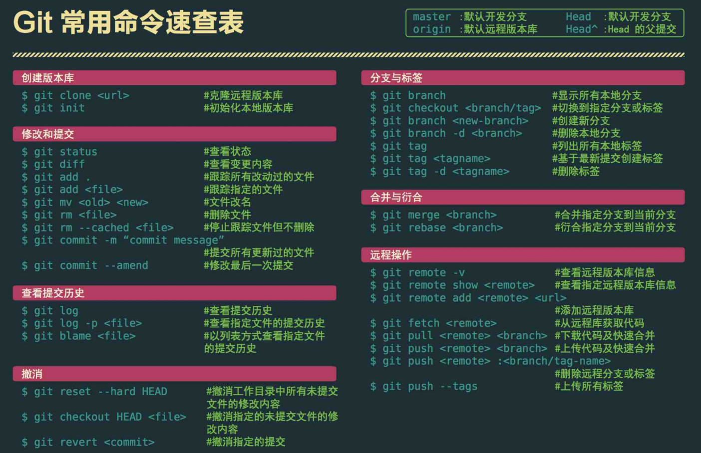
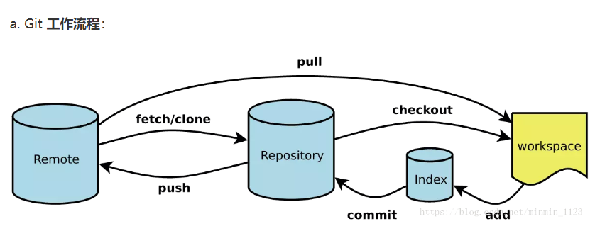

# 一些命令行

## 参考资料

- [Git飞行规则](https://github.com/k88hudson/git-flight-rules/blob/master/README_zh-CN.md)

- [My blog](http://blog.dangosky.com/2019/09/03/Git%E5%B8%B8%E7%94%A8%E5%91%BD%E4%BB%A4/)

- [用动图解释 Git 工作原理这还是头一回](https://mp.weixin.qq.com/s/FQPM_oSU5qU53y_SfdDG-A)

## git diff

`git diff origin/master` 用于和远端某个分支做 diff。当团队合作在一个远端分支开发时，通常 push 前需要将本地分支和远端分支 diff 一下，看看有没有冲突啥的。

## git checkout

- `git checkout -b <branchName> <hashID>` 恢复已经删除了的分支。

- `git checkout --filename`  放弃某个文件的修改（未暂存，即还没 git add）。

- `git checkout .` 放弃所有未暂存文件的修改。

- 注：`git add` 使用 * 的话，比如使用 `git add test/*` 暂存 test 文件夹下的所有文件，* 会默认忽略掉隐藏的文件夹比如 `.gitignore` 等，如果也想暂存这些隐藏文件的话，需要使用 `git add test/.`。

- `git checkout -b <本地新分支名> origin/远程分支名` 把远端某个分支拉到本地并新建分支

## git branch

- `git branch | grep -v 'master' | xargs git branch -D` 删除除了 master 外的所有本地分支。

## git cherry-pick

`git cherry-pick <commit id>`：将某一个 commit 选到当前的分支上。

`git cherry-pick A..B`：将 (A, B] 之间的 commit 都导入到当前分支。

`git cherry-pick A^..B`：将 [A, B] 之间的 commit 都导入到当前分支。

## git clone url newName

克隆新项目并重命名

## git help command

获取该命令的帮助

## git commit —amend

`git commit --amend -m "<commit message>"` 将本次修改追加在上次的提交中，并修改 commit message。

`git commit --amend --no-edit` 不修改 commit message 追加在上次的提交中。

`git commit --allow-empty -m "<commit message>"` 空提交，可以用来重新触发 CI 构建。

`git commit --no-verify -m "<commit message>"` 跳过 lint 校验直接提交。注意 `--no-verify` 需要在 `-m` 前面，否则会报错 `error: pathspec <commit message> did not match any file(s) known to git`。

`git update-ref -d HEAD` reset 当前分支的所有提交，可以用来删除第一个提交。

## git branch

将分支按最后提交 Commit 的日期进行排序。

```bash
git branch --sort=committerdate   # ASC
git branch --sort=-committerdate  # DESC，最新的分支会出现在列表的最上面
```

删除远程分支。

`git push origin --delete <远程分支名>`

## git rebase

- git pull = git fetch + git merge

- git pull --rebase = git fetch + git rebase

- 执行完 git pull --rebase 之后如果有合并冲突，使用以下三种方式处理这些冲突：

  - git rebase --abort 会放弃合并，回到 rebase 操作之前的状态，相当于撤销 rebase。
  - git rebase --skip 则会将引起冲突的 commits 丢弃掉（慎用！！）；
  - git rebase --continue 合并冲突，手动解决完冲突后 git add./，执行 git rebase --continue，不用 git commit 直接 push 即可。

## git push

#### git push --force-with-lease

当使用 --force-with-lease 进行提交的时候，Git 会将当前提交者本地远程分支内的提交和真正远程服务器上的提交进行比较。如果两者是相同的，那么就会允许这一次的 Force Push 操作；如果发现是不同的，那么很大概率就是远端有了他人的新提交，这时 Force Push 就不会成功了。此时，提交者应该通过 git fetch 的方式拿到最新的代码，确认是否需要进行更新改动，然后再次提交。需要注意的是，因为 Git 只是进行了本地远程分支和远程分支的比较，因此 git fetch 之后即使什么也不做，直接再一次进行 git push --force-with-lease 操作也是可以成功的。

## git subtree

在一个项目中，如果只想把某一个文件夹比如打包后得到的 dist 下的所有文件都 push 到远程一个分支 origin/test，这时如果使用 `git push origin test` 的话，其实是会把该项目的所有文件都推到 origin/test 的。此时需要使用 `git subtree` 才可以只推送指定的 dist 文件夹。使用方式为 `git subtree push --prefix <文件名> origin <远端分支>`。

git subtree 可参考[git subtree 简单使用记录](https://einverne.github.io/post/2020/04/git-subtree-usage.html#%E5%B0%86%E6%9B%B4%E6%94%B9%E6%8E%A8%E9%80%81%E5%88%B0%E5%AD%90%E9%A1%B9%E7%9B%AE%E4%BB%93%E5%BA%93)


## git log --pretty=oneline

> 可以用来定位到是哪位同学改动到相关代码，快速对接。

`git log <文件路径>` 或者 `git log --pretty=oneline <文件路径>` 查看该文件近期的修改记录。

`git show <hashID>` 查看某次记录的修改内容。


## 其他

- 查看指定作者在当前分支上提交的代码行数。

`git --no-pager log --author="作者名" --pretty=format:"%h" --no-patch | xargs -n1 -I{} git --no-pager diff --numstat {}^1 {} | awk '{sum += $1} END {print sum}'`


## 常用命令速查表






