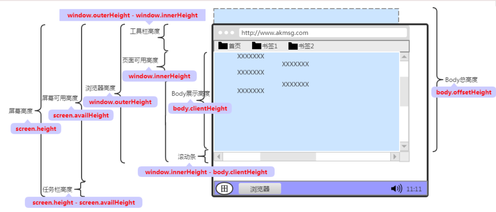
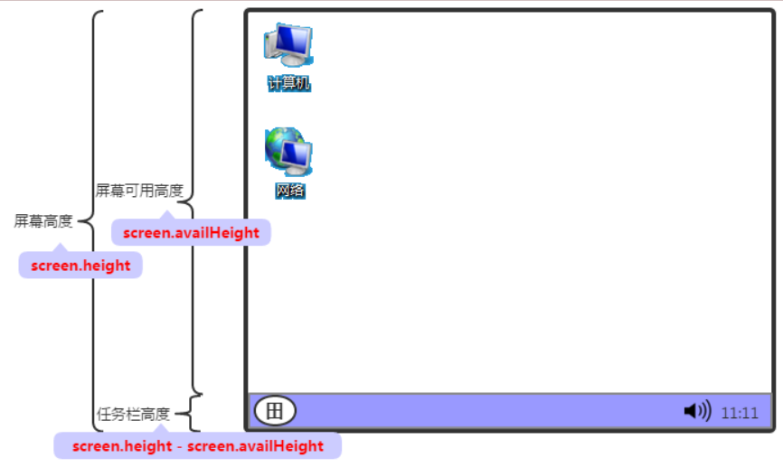
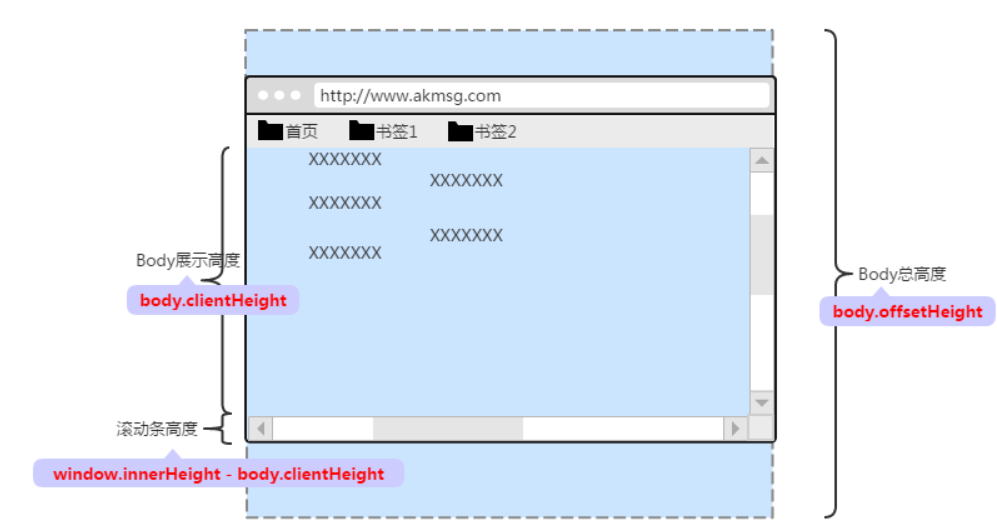

# DOM 属性计算

## screen

- screenX / screenY 是以屏幕为基准进行测量，也就是当前元素距离屏幕的尺寸。         

## offset

- offsetParent：返回最近一个带有定位的父元素。如果其父级元素都没有定位则为body。如果当前元素display设为none或为固定定位，则返回null。（parentNode 则不考虑它的父级元素是否带有定位。）

- offsetWidth（offsetHeight）= content + padding + border（不包括因为overflow而隐藏的部分）。

- offsetLeft（offsetTop）：相对于offsetParent左边或上边的距离，如果都没有定位，则以body为准。

- offsetX（offsetY）：同clientX（clientY， 但 offsetX（offsetY）是支持IE。

style.left（style.top）和 offsetLeft（offsetTop）都能获取到目标元素到 offsetParent 相应的距离，但通过 style 只能获取行内样式，而 offsetLeft 则无此限制。并且 offsetLeft 是只读的，返回的是数字；而 style.left 是可读写，返回的是字符串包括了单位。

# client

- clientWidth（clientHeight）= content + padding (只对块级元素有效）。

- clientLeft = border的宽度。

- clientX（clientY）：以当前可视区域为基准（不考虑页面滚动）。  

- pageX（pageY）：以当前文档为基准（算上滚动的距离，等同于 clientX/Y + 滚动距离）。

## scroll

- scrollLeft（scrollTop） = 滚动的长度。

- scrollWidth（scrollHeight）= content + padding + 被卷去的部分（不包括margin和border）。

- 判断元素是否滚动到底部：`element.scrollHeight - element.scrollTop === element.clientHeight`

兼容写法：
`window.pageYOffset || document.documentElement.scrollTop || document.body.scrollTop || 0`;
`window.pageXOffset || document.documentElement.scrollLeft || document.body.scrollLeft || 0;`

## 获取浏览器窗口大小

- `window.outerWidth`：整个浏览器的宽高。

- `document.documentElement.clientWidth, document.documentElement.clientHeight`：body的宽高

- `window.innerWidth, window.innerHeight`：浏览器宽高减去浏览器工具栏宽高

- `window.screen.availWidth, window.screen.availHeight`：屏幕可用的宽高，即屏幕宽度减去任务栏后的宽高，

- `window.screen.width, window.screen.height`：屏幕的宽高

## 获取网页正文的大小

- `document.body.clientWidth, document.body.clientHeight`

- `document.body.offsetWidth, document.body.offsetHeight`

- `document.body.scrollWidth, document.body.scrollHeight`

