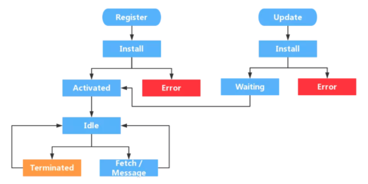

# 其他

## 数组 api 整理

#### 改变原数组的方法

- splice

如果只有一个参数，等同于将原数组在指定位置拆分成两个数组，并返回被删除的元素。`[1,2,3,4].splice(2)  // [3, 4]`

- sort

若比较函数返回值 <0，a 在前。若比较函数返回值> 0，b 在前。会 **返回一个到数组本身的引用**，后续对其中一个数组的操作会修改到两个。

- pop

- shift

删除后返回这一个元素，上同

- push

- unshift

添加一个或多个元素，并返回数组长度，上同

- reverse 会**返回一个到数组本身的引用**。

- copyWithin(target, start, end)

将 start 到 end 位置之间的字符复制到 target 位上，读了几个元素就从开始被替换的地方替换几个元素。**会返回一个到数组本身的引用**。

- fill(val, start, end)

用 val 填充 start 到 end 之间的字符，会代替原先位置上的字符。如果要填充的字符是引用类型，则 **被填充的几个元素都是引用同一个地址**，即对其中一个的操作会修改到其他几个。

```js
var arr = Array(3).fill({})    // [{}, {}, {}];
arr[0].hi = "hi";              // [{ hi: "hi" }, { hi: "hi" }, { hi: "hi" }]

let arr = new Array(3).fill([]);   // [[], [], []]
arr[0].push(5);                    // [[5], [5], [5]]
```


#### 不改变原数组的方法

- slice

`Array.prototype.slice.call({0: 'a', 1: 'b', length: 2})   // ['a', 'b']`

- concat

- flat(deep）

返回一个新数组，不改变原数组。会移除数组中的空项。 `[1,2,,,].flat() // [1, 2]`

- flatMap()

对每个成员执行一个函数（相当于 map()），然后对返回值组成的数组执行 flat() 方法。该方法同样返回一个新数组，不改变原数组。

```js
[2, 3, 4].flatMap((x) => [x, x * 2])

// 相当于 [[2, 4], [3, 6], [4, 8]].flat()  -> [2, 4, 3, 6, 4, 8]
// flatMap() 只能展开一层数组。
```


#### forEach

- 特性
  - 无法中途退出循环，只能用 return 退出本次回调，进行下一次回调。
  - 对于已在迭代过程中删除的元素，或者空元素会跳过回调函数 (对于 undefined 和 null 则不会跳过)
  - 遍历次数在第一次循环前就会确定，再添加到数组中的元素不会被遍历。

- 对于空数组，some 方法返回 false，every 方法返回 true，回调函数都不会执行。

#### 数组空位

数组的空位指，数组的某一个位置没有任何值。空位不是 undefined，一个位置的值等于 undefined，依然是有值的。空位是没有任何值，in 运算符可以说明这一点 (in 查找不到空位)。

```js
0 in [undefined, undefined, undefined]     // true
0 in Array(3) // false， 相当于 [, , ,]
```

## JS 数据

#### 原始数据

- 原始类型的值可以自动当作包装对象调用，即调用包装对象的属性和方法。这时 JavaScript 引擎会自动将原始类型的值转为包装对象实例，在使用后立刻销毁实例。比如，字符串可以调用 length 属性。**自动转换生成的包装对象是只读的**，无法修改。所以，字符串无法添加新属性。这意味着下一次调用字符串的属性时，实际是调用一个新生成的对象，而不是上一次调用时生成的那个对象，所以取不到赋值在上一个对象的属性。如果要为字符串添加属性，只有在它的原型对象 String.prototype 上定义。

-  基本数据类型的值不可变，动态修改后原始值也是不变的，如修改字符串某一位上的字符并不会改变原字符串，而是返回一个新的基本类型。

- 进制转换：
  - 十进制转为其他进制：`(17).toString(16)`。把十进制的 17 转为十六进制。
  - 其他进制转为十进制：`parseInt(11, 16)`。把 11 当做十六进制看待，解析成十进制。

#### 操作符的优先级


#### let

- 在程序或者函数的顶层，let 和 const 并不会像 var 一样在全局对象上创造一个属性。

```js
var x = 'global';
let y = 'global';
console.log(this.x); // "global"
console.log(this.y); // undefined

let val = 10;
let fn = function() {
  return this.val;  // undefined
}
console.log(fn());
```

- let 的变量提升和暂时性死区。

```js
var temp = 123;
if (true) {
  console.log(temp);
  let temp;
}

// 如果 let 有变量提升的话，temp 应该打印出 undefined，但并没有，说明没有变量提升。而按 var 的规则，此时 temp 可以向上层作用域获取到 22，但也没有，说明 let 声明的变量存在暂时性死区。
```

## DOM 相关

- 为什么说操作 DOM 慢：
  - 操作 DOM 可能会引起页面的重绘重排。
  - 操作 DOM 更新 UI，可能涉及到 JS 线程和 GUI 线程的通信，并且这两个线程是互斥的。

- textContent 和 innerText：
  - textContent 会获取所有元素的内容，包括 `<script>` 和 `<style>` 元素，然而 innerText 不会。
  - innerText 不会返回隐藏元素的文本，而 textContent 会。
  - innerText 受 CSS 样式的影响所以会触发重排，而 textContent 不会。

- 控制台打印使用不同的颜色：

```js
console.log('\x1B[32m%s\x1B[0m', 'green');
console.log('\x1B[31m%s\x1B[0m', 'red');
```
#### 节点操作

- 在 targetElement 后面插入一个节点，targetElement 和新节点是兄弟节点关系。

```js
function insertAfter(newElement, targetElement){
 var parent = targetElement.parentNode;
  // 如果目标节点已经是最后一个元素，那么直接添加即可
  if(targetElement === parent.lastChild){
    parent.appendChild(newElement);
  } else {
    //否则，在当前节点的下一个节点之前添加
    parent.insertBefore(newElement,targetElement.nextSibling);
  }
}
```


#### `MutationObserver` 观测 DOM 节点变化

> 参考 [MDN](https://developer.mozilla.org/zh-CN/docs/Web/API/MutationObserver)。

使用 `new MutationObserver()` 创建一个 `MutationObserver` 对象，并传入一个回调函数可在 DOM 节点发生相应变化时触发。实例化出来的 `MutationObserver` 对象有三个方法：`disconnect`、`observe`、`takeRecords`。

使用 `mutationObserver.observe(target[, options])` 可以监测某一个 DOM 节点，常用的配置选项有：`childList` 表示是否监测 DOM 节点的子孙节点，默认为 false；`attributes` 表示是否监测 DOM 节点的属性变换，默认也为 false。`subtree` 表示是否将监视范围扩展至目标节点整个节点树中的所有节点，默认也为 false。

```js
var targetNode = document.getElementById('some-id');
var config = { attributes: true, childList: true, subtree: true };

// Callback function to execute when mutations are observed
var callback = function(mutationsList) {
  for(var mutation of mutationsList) {
    if (mutation.type == 'childList') {
      console.log('A child node has been added or removed.');
    }
    else if (mutation.type == 'attributes') {
      console.log('The ' + mutation.attributeName + ' attribute was modified.');
    }
  }
};

var observer = new MutationObserver(callback);
observer.observe(targetNode, config);
observer.disconnect();
```

## Reflect

- 作用
  - 规范化方法分类。将 Object 对象的一些明显属于语言内部的方法（比如 `Object.defineProperty`），放到 Reflect 对象上。
  - 修改某些 Object 方法的返回结果，让其变得更合理。比如 `Object.defineProperty(obj, name, desc)` 在无法定义属性时，会抛出一个错误，而 `Reflect.defineProperty(obj, name, desc)` 则会返回 false。
  - 让 Object 操作都变成函数行为。某些 Object 操作是命令式，比如 `name in obj` 和 `delete obj[name]`，而 `Reflect.has(obj, name)` 和 `Reflect.deleteProperty(obj, name)` 让它们变成了函数行为。
  - Reflect 对象的方法与 Proxy 对象的方法一一对应，只要是 Proxy 对象的方法，就能在 Reflect 对象上找到对应的方法。这就让 Proxy 对象可以方便地调用对应的 Reflect 方法。

## 离线缓存 manifest

- 介绍：在 manifest 文件中定义那些需要缓存的文件，支持 manifest 的浏览器将按照 manifest 文件的规则将文件保存在本地，从而在没有网络链接的情况下，也能访问页面。我们第一次正确配置 app cache 后，当再次访问该应用时，浏览器会首先检查 manifest 文件是否有变动，如果有变动就会把相应的变动更新下来，同时改变浏览器里面的app cache；如果没有变动，就会直接把 app cache 的资源返回。

- 特点：
  - 离线浏览：用户可以在离线状态下浏览网站内容。
  - 更快的速度：因为数据被存储在本地，所以速度会更快.
  - 减轻服务器的负载：浏览器只会下载在服务器上发生改变的资源。
  - 相比于浏览器会自动缓存 Http 请求的内容，manifest 可以缓存没有被访问到的内容。

- 使用： `<html lang="en" manifest="index.manifest">`

- 文件格式

```bash
CACHE MANIFEST  # 固定格式，必须写在前面
# version 1.3

# 必须字段，标识出哪些文件需要缓存，可以是相对路径也可以是绝对路径，无法使用通配符 *。
CACHE:
  test.css

# 可选，表示永远不会被缓存的文件，可以使用通配符 ＊。
NETWORK:
	*

# 可选，表示当资源无法访问时，使用指定的后备资源来替代。每条记录都列出两个 url，第一个表示当前页面，第二个表示后备页面，都必须使用相对路径
FALLBACK:
  /html5/ /404.html
  *.html /404.html
```

- 更新缓存的方法：
  - 更新 manifest 文件，比如可以修改版本号。
  - 通过 JS 操作。`window.applicationCache.update()` 会在每次打开页面时自动调用，去检查服务端有没有更新 manifest，我们也可以手动调用它来及时更新。
  - 清除浏览器缓存。

- 注意事项：
  - manifest 文件需要配置正确的 `MIME-type`，即 `text/cache-manifest`，必须在 web 服务器上进行配置。或者使用新的写法 `<html manifest="index.appcache">` 就不需要再进行服务端配置了。
  - 浏览器对缓存数据的容量限制可能不太一样，一些浏览器是每个站点 5MB。
  - 如果 manifest 文件，或者内部列举的某一个文件不能正常下载，整个更新过程都将失败，浏览器继续全部使用老的缓存。
  - 引用 manifest 的 HTML 文件必须与 manifest 文件同源，在同一个域下。
  - FALLBACK 中的资源必须和 manifest 文件同源。
  - 站点中的其他页面即使没有设置 manifest 属性，请求的资源如果在缓存中也从缓存中访问。
  - （更推荐[使用 Service Worker 来做离线缓存](https://www.zhangxinxu.com/wordpress/2017/07/service-worker-cachestorage-offline-develop/)）。

- manifest 在缓存静态文件的同时，也会默认缓存 HTML 文件。这导致页面的更新只能通过 manifest 文件中的版本号来决定。所以 manifest 缓存只适合那种常年不变化的静态网站（这也是它无人问津的原因）。

## 装饰器

装饰器一般是用来装饰类、类属性、类方法。使用装饰器可以做到不直接修改代码，就实现某些功能。

#### 类装饰器

装饰类的时候，装饰器方法一般会接收一个目标类作为参数。

```js
// 给目标类增加原型方法
const withSpeak = (targetClass) => {
  const prototype = targetClass.prototype;
  prototype.speak = function() {
    console.log('I can speak ', this.language);
  }
}

@withSpeak
class Student {
  constructor(language) {
    this.language = language;
  }
}
const student1 = new Student('Chinese');
student1.speak();   // I can speak  Chinese
```

利用高阶函数的属性，还可以给装饰器传参，通过参数来判断对类进行什么处理。

```js
// 返回一个函数，当做新的装饰器函数来装饰 Student 类（类似于函数柯里化）
const withLanguage = (language) => (targetClass) => {
  targetClass.prototype.language = language;
}

@withLanguage('Chinese')
class Student {}
const student = new Student();
student.language; // 'Chinese'
```


####  类属性装饰器

类属性装饰器可以用在类的属性、方法、get/set 函数中，一般会接收三个参数：target 表示被修饰的类、name 表示类成员的名字、descriptor 表示属性描述符（对象会将这个参数传给 `Object.defineProperty` 以此修饰 target 类）。使用类属性装饰器可以实现将类属性设置为只读（设置 `descriptor.writable = false`），或者统计一个函数的执行时间。

```js
function time(target, name, descriptor) {
  const func = descriptor.value;
  if (typeof func === 'function') {
    descriptor.value = function(...args) {
      console.time();
      const results = func.apply(this, args);
      console.timeEnd();
      return results;
    }
  }
}

class Person {
  @time
  say() {
    console.log('hello')
  }
}
const person = new Person();
person.say();
```

#### 装饰器的应用

1. 例如 [`core-decorators.js` 库](https://github.com/jayphelps/core-decorators)，常用在 React 中绑定类的 this。此外还有防抖和节流，简化了不少代码。

2. 实现多重继承。

```js
// targetClass 继承了 mixins 中的所有类
const mixin = (...mixins) => (targetClass) => {
  mixins = [targetClass, ...mixins];

  function copyProperties(target, source) {
    for (let key of Reflect.ownKeys(source)) {
      if (key !== 'constructor'
        && key !== 'prototype'
        && key !== 'name'
      ) {
        let desc = Object.getOwnPropertyDescriptor(source, key);
        Object.defineProperty(target, key, desc);
      }
    }
  }
  class Mixin {
    constructor(...args) {
      for (let mixin of mixins) {
        copyProperties(this, new mixin(...args)); // 拷贝实例属性
      }
    }
  }

  for (let mixin of mixins) {
    copyProperties(Mixin, mixin); // 拷贝静态属性
    copyProperties(Mixin.prototype, mixin.prototype); // 拷贝原型属性
  }
  return Mixin;
}
```

3. 用来对类的属性进行类型的校验。

```js
const rules = {
  name: 'string',
  password: 'string',
  age: 'number'
}

// 对 targetClass 类中的各个属性按 rules 进行类型校验
const validator = rules => targetClass => {
  return newProxy(targetClass, {
    construct(target, args) {
      const obj = new target(...args);
      for (let [name, type] of Object.entries(rules)) {
        if (typeof obj[name] !== type) {
          thrownewError(`${name} must be ${type}`)
        }
      }
      return obj;
    }
  })
}

@validator(rules)
class Person {
  name = 'tom'
  password = '123'
  age = '21'
}

const person = new Person();
```

## 正则表达式

- `[xyz]`	字符集合。匹配所包含的任意一个字符。
- `[^xyz]` 负值字符集合。匹配未包含的任意字符。
- `[^a-z]` 负值字符范围。匹配任何不在指定范围内的任意字符。
- `.`	匹配除 `\n` 之外的任何单个字符。
- `\d` 匹配一个数字字符。等价于 `[0-9]`。
- `\D` 匹配一个非数字字符。等价于 `[^0-9]`。
- `\s` 匹配任何空白字符，包括空格、制表符、换页符等等。等价于 `[ \f\n\r\t\v]`。
- `\S` 匹配任何非空白字符。等价于 `[^ \f\n\r\t\v]`。
- `\w` 匹配包括下划线的任何单词字符。等价于 `[A-Za-z0-9_]`。
- `\W` 匹配任何非单词字符。等价于 `[^A-Za-z0-9_]`。
- `\b` 匹配一个单词边界，也就是指单词和空格间的位置。`er\b` 可以匹配 `never` 中的 `er`，但不能匹配 `verb` 中的 `er`。
- `\B` 匹配非单词边界。`er\B` 能匹配 `verb` 中的 `er`，但不能匹配 `never` 中的 `er`。
- `-?[0-9]+(\\.[0-9]*)?` 验证是否为数字（是否带小数点、正负都行）。

#### 反斜杠

```js
const str = "rgb(51, 112, 255)";
const reg = new RegExp("rgb\(51, 112, 255\)", "g");
console.log(str.match(reg));  // 匹配不到，输出为 null

const str = "rgb(51, 112, 255)";
const reg = new RegExp("rgb\\(51, 112, 255\\)", "g");
console.log(str.match(reg));  // 这样就可以匹配到了
```

第一个例子匹配不到的原因在于，字符串里的 `\` 并不表示单纯的 `\` 字符，它有特殊意义，用于转义它后面的字符，所以 `new RegExp("rgb\(51, 112, 255\)", "g")` 被翻译成了 `/rgb(51, 112, 255)/g`，这里的 `()` 具有特殊含义，所以匹配不到。

所以需要用 `\\` 来将字符串中的 `\` 转义为单纯的 `\` 字符，这样就翻译成了 `/rgb\(51, 112, 255\)/g`，就可以转义括号了，也就能正常匹配到了。

```js
const str = '\\\\';
console.log(str);   // \\
console.log(str.match(new RegExp('\\\\', 'g')));  // [ '\\', '\\' ]
console.log(str.match(/\\/g));    // [ '\\', '\\' ]
```

#### ?= 和 ?!

`exp1(?=exp2)`：查找 exp2 前面的 exp1。

`(?<=exp2)exp1`：查找 exp2 后面的 exp1。

`exp1(?!exp2)`：查找后面不是 exp2 的 exp1。

`(?<!exp2)exp1`：查找前面不是 exp2 的 exp1。


## 图片懒加载实现方式

#### 监听 scroll

先不设置图片的 src（是不设置而不是值设置为空字符串，设置为空字符串的话还是会发起一个 HTTP 请求），或者将其设置为 loading 的图片，而真实的图片 url 设置在 `data-src` 中。监听 scroll 事件，当图片节点出现在视图中时，就将 src 的值设置为 `data-src` 的值。

```js
// 判断图片是否出现在视图中
var clientHeight = document.documentElement.clientHeight;
var scrollTop = document.documentElement.scrollTop || document.body.scrollTop;
// 或者通过 getBoundingClientRect 判断
// 当 el.getBoundingClientRect().top <= window.innerHeight 时，图片就出现在视图中了
if(img.offsetTop < clientHeight + scrollTop) {
  if(img.getAttribute('src') === 'images/loading.gif') {
    img.src = img.getAttribute('data-src');
  }
}
```

- 优化点：
  - 因为滚动页面时，scroll 的监听函数触发频率很大，所以最好加个防抖操作。
  - 在 scroll 事件中，需要获取到页面中所有的 `` 标签，每次触发回调时都要去遍历这个 img 数组，可以用一个变量标志数组中哪个下标的图片已经加载了，避免每次都从头遍历数组。

#### IntersectionObserver API

使用 `IntersectionObserver` 这个 API 来自动实现懒加载。

> 参考 [IntersectionObserver API 使用教程](http://www.ruanyifeng.com/blog/2016/11/intersectionobserver_api.html)。

```js
// items 是一个数组，包含了被观察的并且可见性发生变化的节点，当节点的可见性发生变化时就会调用该回调函数
const io = new IntersectionObserver(function(items) {
  items.forEach(function(item) {
    const target = item.target;
    if(target.getAttribute('src') == 'images/loading.gif') {
      target.src = target.getAttribute('data-src');
    }
  })
});

imgDomArr.forEach(function(img) {
  // 添加要观察的 DOM 节点
  io.observe(img);
});
```

## PWA

- 简介：渐进式网页应用，集成了网页和 native app 的一些特点，包括：
  - 可以通过 url 分享。
  - 内容可以被搜索引擎搜索到。
  - 可以出现在设备的主屏幕而不用借助于浏览器，有利用增强用户粘性。
  - 可以在离线状态下运行（通过 Service Worker 实现的）。
  - 可以向设备发送通知。
  - 不用像 app 那样需要安装和更新，只需要刷新页面就可以了。

## Intelligence

> 这里记录一些对智力题的思考过程。不想再单独开一个菜单项了，就直接放这吧~

> 更多智力题参考[常见面试智力题总结](https://github.com/CavsZhouyou/Front-End-Interview-Notebook/blob/master/%E7%AE%97%E6%B3%95/%E6%99%BA%E5%8A%9B%E9%A2%98.md)

#### 取余制胜

Q：A 和 B 轮流拿硬币，每次最多只能拿 n 个，A 先手，怎么才可以拿到最后一个硬币？

A：A 要拿到最后一个，则需要在他倒数第二次拿的时候还剩 n+1 个硬币，这样无论 B 怎么拿 A 总能拿到最后一个。所以需要保证每轮 A 和 B 拿的硬币数量都是 n+1 的整数倍，也就是第一次拿的时候 A 要拿 `n % (n+1)` 个硬币，之后每次 B 拿多少个硬币，A 就拿相应的数量使两者之和凑到 n+1 即可。

思路总结：从后往前推，确定最后剩下多少个硬币时自己一定会获胜，然后再制定相应的策略。


#### n 匹马比赛求最后的前几名

Q：36 匹马分别在 6 个赛道比赛，每次比赛只知道名次而不知道具体的用时，如何快速决出前三名？

A：分三轮比赛：

第一轮：36 匹马分 6 组比赛，分别得到每场的第一名，6 组比赛分别按名次记为 A1、B1、C1、D1、E1、F1、A2、B2...

第二轮：A1、B1、C1、D1、E1、F1 进行比赛，得到前三名假如是 A1、B1、C1。结果只要前三名，所以已经可以排除掉所有 D、E、F 马匹了（D1、E1、F1 都没拿到前三，它们后面的自然也拿不到）。又因为 A1 已经连续两次第一，所以 A1 就是冠军了，此时只剩两个名额。而 C1 最好的成绩也只是第三名，所以 C2 和 C3 也可以排除掉了。

第三轮：现在只剩下 A2、A3、B1、B2、C1，进行一轮比赛可得到最后的季军和亚军。至此，前三名已经得到了，总共比赛次数是 6 + 1 + 1 = 8 次。


#### 时针分针形成的角度

Q：当时间为 m 点 n 分时，其时针与分针夹角的度数为多少？

A：每小时时针走的度数是 30°（`360 / 12`），每分钟分针走的度数是 6°（`360 / 60`），而每分钟时针走的度数是 0.5°（`30 / 60`）。所以 m 点 n 分时，时针走了 `30 * m + 0.5 * m`，分针走了 `6 * n`，它们的夹角是 `|30 * m - 5.5 * n|`。但因为小时可能为 24 小时制，所以 m 需要去对 12 取余；以及形成的夹角可能是更大的那个，所以还需要再判断取小的那个。

```js
var angleClock = function(hour, minutes) {
  hour = hour % 12;
  const res = Math.abs(30 * hour - 5.5 * minutes);
  return Math.min(res, 360 - res);
};
```

如果给的是特殊时间，需要随机应变想到更灵活的解法。比如 06:15 的时针分针夹角。这时候再去推断公式会比较慢，可以这么想：假如时针没有随着分针移动，那么两者之间夹角为 90°。而每分钟时针走的度数是 0.5°，所以 15 分钟里时针随分针走了 7.5°，即 06:15 的时候分针和时针的夹角是 97.5°。这样想是不是就快很多了。Orz，腾讯一面的时候问到这道题，我推论出公式后回答了，面试面试官说我想得太复杂，就告诉我这种解法。


#### 同时满足条件的占比

Q：一个班级 60% 喜欢足球，70% 喜欢篮球，80% 喜欢排球，问即三种球都喜欢占比有多少？

A：最多时有 60% 的人三种球都喜欢。根据题目可以知道有 40% 的人不喜欢足球，30% 的人不喜欢篮球，20% 的人不喜欢排球。所以最少的情况下，这里的 40%、30%、20% 中的人没有重复的，也就有 100% - 40% - 30% - 20% = 10% 的人都喜欢三种球。因此三种球都喜欢的人的占比为 10%-60%。


#### 三扇门选择正确的那扇

Q：有三扇门 a、b、c，其中只有一扇门是正确的。路人甲打算选择 a 门，而路人乙明确指出另外两扇门中其中一扇是错误的，并且路人乙没有说谎。问路人甲应该更换选择的门吗？

A：分三种情况讨论：

1. a 门是正确的，路人乙指出 b 或 c 是错误的。那么如果路人甲换门的话，会选错。

2. b 门是正确的，路人乙指出 c 门是错误的。那么如果路人甲换门的话，会选对。

3. c 门是正确的，路人乙指出 b 门是错误的。那么如果路人甲换门的话，会选对。

所以换门后选对的概率是三分之二，选错的概率是三分之一，也就是路人甲应该换门。

#### 四个瓶子找重量不同的那罐

Q：四个药罐中有一个浑浊的药罐，浑浊的每片药片都比其他三个干净的药罐多一克，如何只用一次天平找出浑浊的药罐？

A：通过控制药片的数量改变总重量来判断。首先将每个药罐进行编号，分别标记为 1、2、3、4 号药罐。然后从 1 号药罐中取出 1 片药片，从 2 号药罐中取出 2 片药片，从 3 号药罐中取出 3 片药片，从 4 号药罐中取出 4 片药片。将 10 片药片使用天平称重，药片的重量比正常重量多出几克，就是哪一号药罐的问题。

#### 八个球找重量不同的那个

Q：假设你有 8 个球，其中一个略微重一些，找出这个球的惟一方法是将两个球放在天平上对比。最少要称多少次才能找出这个较重的球？

A：最少两次可以称出。首先将 8 个球分为 3 组，其中两组为 3 个球，一组为 2 个球。第一次将两组三个的球进行比较，如果两边相等，则说明重的球在最后一组里。第二次将最后一组的球进行比较即可。如果两边不等，则说明重的球在较重的一边，第二次只需从这一组中随机取两球出来比较即可判断。

#### 握手次数

Q：五队夫妇参加聚会，每个人不能和自己的配偶握手，只能最多和他人握手一次。A 问了其他人，发现每个人的握手次数都不同，那么 A 的配偶握手了几次？

A：每个人最多只能和 8 个人握手，又每个人的握手次数都不同，所以总共有 9 种握手情况，握手次数分别为 0、1、2、3、4、5、6、7、8 这九种情况。握了 8 次手的人，只有和自己、他的配偶没握手，所以可以推断出握了 0 次手的人是握了 8 次手的人的配偶。握了 7 次手的人，只有和自己、他的配偶、握了 0 次手的人没握手，所以可以推断出握了 1 次手的人是握了 7 次手的人的配偶。同理可推断握了 6 次手和握了 2 次手的人、握了 5 次手和握了 3 次手的人是配偶。所以 A、A 的配偶都和他人握了 4 次手。


#### 烧绳子计时

Q：烧一根不均匀的绳子要用一个小时，如何用它来判断一个小时十五分钟？

A：一共需要三根绳子，假设分别为 1、2、3 号绳子，每个绳子一共有 A、B 两端。首先点燃 1 号绳子的 A、B 两端，然后点燃 2 号绳子的 A 端。当 1 号绳子燃尽时，此时过去了半小时，然后同时点燃 2 号绳子的 B 端。当 2 号绳子燃尽时，此时又过去了 15 分钟，此时再同时点燃 3 号绳子的 A、B 两端。当 3 号绳子燃尽时，又过去了半小时，以此一共加起来过去了一个小时十五分钟。

#### 砝码称重

Q：有 7 克、2 克砝码各一个，天平一只，如何只用这些物品三次将 140 克的盐分成 50、90 克各一份？

A：第一次用 7 克砝码和 2 克砝码称取 9 克盐。第二次再用第一次称取的盐和 7 克砝码称取 16 克盐。第三次再用前两次称取的盐称取 25 克盐，这样就总共称取了 50 克盐，剩下的就是 90 克。


#### 三个开关判断是控制哪盏灯

Q ：在房里有三盏灯，房外有三个开关，在房外看不见房内的情况并且只能进门一次，用什么方法来区分哪个开关控制哪一盏灯？

A：首先打开一个开关，100 分钟后再打开第二个开关。之后进入房间看看哪两盏灯亮，摸摸亮的那两盏灯，发热的是第一个开关打开的，另一盏亮的灯是第二个开关打开的，剩下不亮的那盏灯就是第三个开关控制的。


#### 识别三筐水果

Q：有三筐水果，一筐装的全是苹果，第二筐装的全是橘子，第三筐是橘子与苹果混在一起。筐上的标签都是错的。要求拿出其中一筐里的一只水果，然后正确写出三筐水果的标签。

A：从贴了混合标签里取出一个水果，取出的是什么水果，就写上相应的标签。将写了具体水果名字标签的其中一筐的标签改为另一种水果（因为它不会是混合水果，如果它是混合水果的话，另一筐水果贴的标签就是对的了）。剩下的那筐水果就是混合水果了。


## 经典问题

- this、作用域、优先级等综合考察：

```js
function Foo() {
  getName = function () { alert (1); };
  return this;
}
Foo.getName = function () { alert (2);};
Foo.prototype.getName = function () { alert (3);};
var getName = function () { alert (4);};
function getName() { alert (5);}
 
//请写出以下输出结果：
Foo.getName();
getName();
Foo().getName();
getName();
new Foo.getName();
new Foo().getName();
new new Foo().getName();

```

解析参考[这里](https://mp.weixin.qq.com/s/X40KEH37cRj01a_AuTzKrw)。


## 几个框架

- 共同的特性：
  - 使用 Virtual DOM 来优化页面性能。
  - 组件化思想，使项目模块化，易于维护和组件复用。
  - 响应式的数据。实现数据改变了自动更新视图，数据驱动视图。
  - 只提供核心功能，其他的功能如路由、状态管理器等交给其他的库实现，使用户选择性更高。
  - 都支持服务器端渲染。
  - 都支持跨端开发，比如小程序和 APP。

- 为什么使用框架：
  - 解决 UI 与状态同步的问题，这样开发者就可以着力于数据和逻辑的处理，而不需要管视图的更新。
  - 掩盖底层的 DOM 操作，使开发者可以使用更声明式的方式来描述目的，从而让代码更容易维护。
  - 页面组件化，易于维护。
  - 虚拟 DOM 的引入，使得不用频繁操作 DOM，提升了页面性能。
  - 一系列相关的生态库，比如路由和状态管理器，方便开发者使用。

#### React 和 Vue

- 区别：
  - JSX 和 Templates。JSX 使得编码更加自由，比如可以通过 JS 和临时变量来控制流程。对于条件判断、循环等，React 写起来就像是写 JS，Vue 则有特定的语法。（深层差别是 React 遵循的是 all in js 的思想，不管是 HTML 还是 CSS 都可以写在 JS 文件中）
  - 单向数据流和双向数据流。Vue 可以通过  `v-model` 来使视图的改变同步到数据，React 只有数据 -> 视图这个单项的数据流。并且 Vue1.x 支持子组件修改 props，虽然 Vue2.x 开始不支持了，但也提供了 `.sync` 来支持子组件修改 props。
  - 数据绑定实现不同。Vue 是数据劫持；React 默认是通过比较引用的方式，通过 setState 来修改数据并更新视图。
  - 组件通信。Vue 实现子组件向父组件通信，是通过 emit 触发父组件的方法；React 是父组件将方法作为 props 传递给子组件，子组件再直接调用。
  - 语法糖。Vue 提供了 computed 和 watch 等语法糖供用户使用，React 则需要自己写逻辑实现。
  - 重新渲染。React 中当某组件的状态发生改变时，它会以该组件为根，重新渲染整个组件子树。而在 Vue 中，组件的依赖是在渲染的过程中自动追踪的，所以系统能准确知晓哪个组件确实需要被重新渲染。


#### Angular 的脏检查

- 大致流程：
  1. 对于 UI 上的每个数据，都绑定一个 watch 对象（包含了变量名、监听函数会在值变化后返回新值、更新后的回调函数等属性），这些 watch 对象会被收集到 watchList 数组中。
  2. 当事件触发时例如数据改变了，会执行一个 digest 函数去遍历 watchList，判断里面的每个属性有没有被更改过，如果数据改变了就记录下新值是多少。digest 函数遍历完毕之后，就知道哪些属性被更改过。
  3. 再去遍历 scope 里面的所有属性查看有没有新添加的属性，如果 scope 里面更新了，会再次去循环遍历 watchList，直到没有数据更新为止，所以 digest 循环最少要遍历两次（最多执行 10 次，超过 10 次后抛出一个异常防止无限循环）。
  4. 调用 apply 函数更新页面。


- 脏检查的优点是，当有批量数据更新时，脏检查可以批量更新 UI（等到所有 watch 都没有变化的时候再更新）。比如使用 for 循环向一个数组中 push 进很多个元素。如果是 Vue 的数据劫持的话，这时候每次 push 都会进行一次更新；而脏检查可以等到它都 push 完成后再进行更新。

## Service Worker

- Service Worker 本质上也是浏览器缓存资源用的（例如 PWA），它基于 Web Worker，所以不会阻碍当前 JS 线程的执行。其最重要的工作原理就是：
  - 后台线程：独立于当前网页线程。
  - 网络代理：在网页发起请求时代理，来缓存文件。

- Service Worker 是基于 HTTPS 的，因为涉及到请求拦截，所以必须使用 HTTPS 协议来保障安全。如果是本地调试的话，localhost 也是可以的。

- Service Worker 工作的流程图


