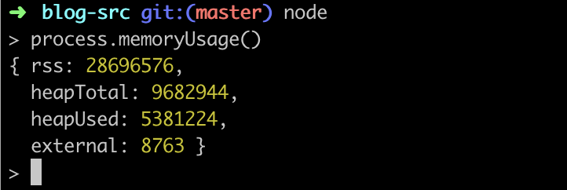

# 内存管理

## 栈和堆

| 栈内存 | 堆内存 |
| ----- | ----- |
| 存储基本数据类型 | 存储引用数据类型 |
| 主要用来执行程序 | 主要用来存放对象 |
| 按值访问 | 按引用访问 |
| 存储的值大小固定 | 存储的值大小可动态调整 |
| 由系统自动分配空间 | 通过代码手动分配 |
| 空间小但运行效率高 | 空间大但运行效率低 |
| 先进后出，后进先出 | 无序存储，可根据引用直接获取 |

## V8 垃圾回收机制

- 可分配的内存大小：在 64 位系统下大约为 1.4GB，32 位系统下大约为 700MB（JavaScript 一开始是用于浏览器中执行的，对内存并没有大需求）。在 NodeJS 环境中可以执行 `process.memoryUsage()` 来查看内存分配。
  - `rss（resident set size）`：所有内存占用，包括指令区和堆栈。
  - `heapTotal`：V8 引擎可以分配的最大堆内存，包含下面的 heapUsed。
  - `heapUsed`：V8 引擎已经分配使用的堆内存。
  - `external`： V8 管理 C++ 对象绑定到 JavaScript 对象上的内存。
  - （上述的内存单位均为字节 Byte）

- V8 只分配部分内存，是因为 JavaScript 是单线程运行的，这意味着一旦进入到垃圾回收，那么其它的各种运行逻辑都要暂停，而垃圾回收又是一个很耗时的操作，所以为了避免卡顿就直接限制内存的可分配大小了。

- 内存分配的生命周期
  1. 内存分配：声明变量、函数、对象的时候，系统会自动为它们分配内存。
  2. 内存使用：读写内存，也就是使用变量、函数等。
  3. 内存回收：使用完毕，由垃圾回收机制自动回收不再使用的内存。

- JavaScript 有自动垃圾收集机制，每隔固定的时间段就找出那些不再继续使用的值，然后释放其占用的内存。判断对象是否还有被使用到主要有两个方法：
  - 引用计数法：对象 B 可以访问到对象 A，即对象 A 被对象 B 引用，所以对象 A 的引用数加 1。当一个对象的引用数是 0 时，表示没有其他对象引用到它，此时该对象就可以被垃圾回收机制回收。但如果两个对象是循环引用的话，则无法回收。（需要注意的是 `WeakSet` 和 `WeakMap`，这两者是弱引用，它们对于值的引用都是不计入垃圾回收机制的）
  - 标记清除法：给进入执行环境的所有变量或者执行上下文打上标记，然后去掉运行环境中的变量以及被环境中变量所引用的变量的标记，最后依然有标记的变量就会被回收掉。

- 在局部作用域中，当函数执行完毕，局部变量也就没有存在的必要了，因此垃圾收集器很容易做出判断并回收。但是全局变量什么时候需要自动释放内存空间则很难判断，因此在我们的开发中，需要尽量避免使用全局变量，以确保性能问题。

## 内存泄漏

- 造成内存泄漏的情况：
  - 意外的全局变量引起的内存泄漏。
  - 闭包可以维持函数内局部变量，使其得不到释放。
  - 没有清理的 DOM 元素引用，
  - 没有移除的定时器或监听函数。
  - 子元素存在引用。类似于循环引用，比如一个 div 的子元素引用到这个 div，那么子元素就间接地引用到了自身。

## V8 垃圾回收策略

- 将内存分为新生代和老生代，新生代中的对象为存活时间较短的对象，老生代中的对象为存活时间较长或常驻内存的对象。分别对新老生代采用不同的垃圾回收算法来提高效率，对象最开始都会先被分配到新生代（如果新生代内存空间不够，则直接分配到老生代），新生代中的对象会在满足某些条件后被移动到老生代。

- 新老生代的内存分配：默认情况下，32 位系统新生代内存大小为 16MB，老生代内存大小为 700MB；64 位系统下，新生代内存大小为 32MB，老生代内存大小为 1.4GB。

### 新生代

- 新生代中将内存一分为二，一块处于使用状态，一块处于闲置状态。处于使用状态的称为 From 空间，处于闲置状态的称为 To 空间。采用 Scavenge 垃圾回收算法。

- 迭代流程：
  1. 新生代刚分配内存时，将对象分配给 From 空间。
  2. 执行垃圾回收（GC）清除掉 From 空间中不再使用到的对象。
  3. 剩下的活跃对象被复制到 To 空间，并清空 From 空间的所有内存。
  4. 交换 From 空间和 To 空间（为了让活跃对象始终保持在一个空间中，另一个空间始终保持空闲的状态）。

- 特性：
  - 垃圾回收过程中存在对象从 From 空间复制到 To 空间的过程，不直接从 From 空间中回收掉而还要再复制一次是因为，堆内存是连续分配的，清除掉空间的垃圾后会导致剩下的可利用内存空间不连续，也就是生成了很多内存碎片。而复制一次后可以将活跃对象归到一处，使得剩下的可利用空间连续，提高利用率。
  - 该垃圾回收算法只能使用堆内存的一半，是用空间换时间。不过新生代中对象的生命周期较短，所以影响不大。

### 晋升

- 定义：如果一个对象经过多次复制仍然存活，它就会被认为是生命周期较长的对象。这种较长生命周期的对象随后会被移动到老生代中，采用新的算法进行管理。对象从新生代移动到老生代的过程就叫作晋升。

- 晋升的两个条件：
  1. 对象是第二次经历从 From 空间复制到 To 空间（对象复制的时候通过检查它的内存地址来判断这个对象是否已经经历过 GC）。
  2. 当要从 From 空间复制一个对象到 To 空间时，如果 To 空间已经使用了超过 25%，则这个对象直接晋升到老生代中。（设置这个阈值的原因是当这次 GC 完成后，这个 To 空间会变为 From 空间，接下来的内存分配将在这个空间中进行，如果占比过高，会影响后续的内存分配）。

### 老生代

- 在老生代中，不再采用新生代的垃圾回收算法进行管理，原因有二：
  1. 老生代的存活对象占较大比重，复制存活对象的效率会很低。
  2. 新生代的垃圾回收算法会浪费一半内存，浪费严重，而老生代所占堆内存远大于新生代。

- 老生代中主要采用了 Mark-Sweep 和 Mark-Sweep 相结合的方式进行垃圾回收。
  - Mark-Sweep 分为标记和清除两个阶段。Mark-Sweep 算法在标记阶段遍历堆内存中的所有对象，并标记活着的对象，在随后的清除阶段，只清除没有被标记的对象（与 Scavenge 算法不同，Mark-Sweep 算法并不会将内存分为两份，所以不会浪费一半空间。Scavenge 算法是复制活着的对象，而 Mark-Sweep 是只清除死了的对象。活对象在新生代中只占较少部分，死对象在老生代中只占较少部分，所以这两种回收方式都能各自高效处理）。
  - Mark-Sweep 算法最大的问题是，在进行一次清除回收以后，内存空间会出现不连续的状态，这些内存碎片可能会导致后续给占用内存较大的对象分配空间时，需要再次 GC 以腾出空间甚至没有足够的空间分配。所以这时候就需要 Mark-Compact 算法了，Mark-Compact 算法在标记完存活对象以后，会将活着的对象向内存空间的一端移动，移动完成后直接清理掉边界外的所有内存，这样就不存在内存碎片了。不过因为要移动对象，所以 Mark-Compact 算法会比较慢。

- 需要区分的是，JavaScript 的标记清除法和老生代中使用的标记清除，前者是标记所有的变量，最后清除掉那些仍带有标记的变量；后者的标记清除是标记活跃的变量，最后清除掉没有被标记的标量。
