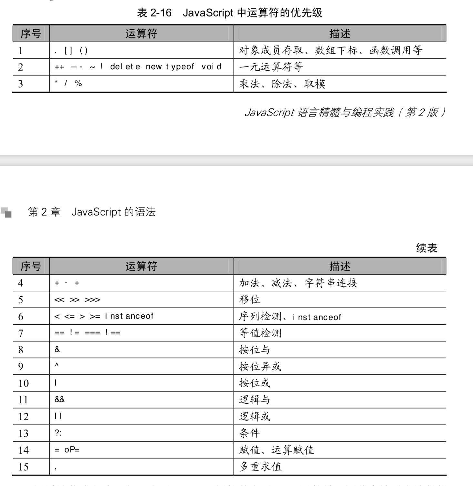

# 基本

## 数组 api 整理

### 改变原数组的方法

- splice

如果只有一个参数，等同于将原数组在指定位置拆分成两个数组，并返回被删除的元素。`[1,2,3,4].splice(2)  // [3, 4]`

- sort

若比较函数返回值 <0，a 在前。若比较函数返回值> 0，b 在前。会 **返回一个到数组本身的引用**，后续对其中一个数组的操作会修改到两个。

- pop

- shift

删除后返回这一个元素，上同

- push

- unshift
添加一个或多个元素，并返回数组长度，上同

- reverse

会 **返回一个到数组本身的引用**，后续对其中一个数组的操作会修改到两个。

- copyWithin(target, start, end)

将 start 到 end 位置之间的字符复制到 target 位上，读了几个元素就从开始被替换的地方替换几个元素。**会返回一个到数组本身的引用**，后续对其中一个数组的操作会修改到两个。

- fill(val, start, end)

用 val 填充 start 到 end 之间的字符，会代替原先位置上的字符。如果要填充的字符是引用类型，则 **被填充的几个元素都是引用同一个地址**，即对其中一个的操作会修改到其他几个。

```js
var arr = Array(3).fill({})    // [{}, {}, {}];
arr[0].hi = "hi";              // [{ hi: "hi" }, { hi: "hi" }, { hi: "hi" }]

let arr = new Array(3).fill([]);   // [[], [], []]
arr[0].push(5);                    // [[5], [5], [5]]
```


### 不改变原数组的方法

- slice

`Array.prototype.slice.call({0: 'a', 1: 'b', length: 2})   // ['a', 'b']`

- concat

- flat(deep）

返回一个新数组，不改变原数组。会移除数组中的空项。 `[1,2,,,].flat() // [1, 2]`

- flatMap()

对每个成员执行一个函数（相当于 map()），然后对返回值组成的数组执行 flat() 方法。该方法同样返回一个新数组，不改变原数组。

```js
[2, 3, 4].flatMap((x) => [x, x * 2])

// 相当于 [[2, 4], [3, 6], [4, 8]].flat()  -> [2, 4, 3, 6, 4, 8]
// flatMap() 只能展开一层数组。
```

## 其他

### 原始数据

- 原始类型的值可以自动当作包装对象调用，即调用包装对象的属性和方法。这时 JavaScript 引擎会自动将原始类型的值转为包装对象实例，在使用后立刻销毁实例。比如，字符串可以调用 length 属性。自动转换生成的包装对象是只读的，无法修改。所以，字符串无法添加新属性。这意味着下一次调用字符串的属性时，实际是调用一个新生成的对象，而不是上一次调用时生成的那个对象，所以取不到赋值在上一个对象的属性。如果要为字符串添加属性，只有在它的原型对象 String.prototype 上定义。

-  基本数据类型的值不可变，动态修改后原始值也是不变的，如修改字符串某一位上的字符并不会改变原字符串，而是返回一个新的基本类型。

### 操作符的优先级



- let 的变量提升和暂时性死区。

```js
var temp = 123;
if (true) {
  console.log(temp);
  let temp;
}

// 如果 let 有变量提升的话，temp 应该打印出 undefined，但并没有，说明没有变量提升。而按 var 的规则，此时 temp 可以向上层作用域获取到 22，但也没有，说明 let 声明的变量存在暂时性死区。
```

### let

- 在程序或者函数的顶层，let 和 const 并不会像 var 一样在全局对象上创造一个属性。

```js
var x = 'global';
let y = 'global';
console.log(this.x); // "global"
console.log(this.y); // undefined

let val = 10;
let fn = function() {
  return this.val;  // undefined
}
console.log(fn());
```

### forEach

- 特性
  - 无法中途退出循环，只能用 return 退出本次回调，进行下一次回调。
  - 对于已在迭代过程中删除的元素，或者空元素会跳过回调函数 (对于 undefined 和 null 则不会跳过)
  - 遍历次数再第一次循环前就会确定，再添加到数组中的元素不会被遍历。

- 对于空数组，some 方法返回 false，every 方法返回 true，回调函数都不会执行。

### 数组空位

数组的空位指，数组的某一个位置没有任何值。空位不是 undefined，一个位置的值等于 undefined，依然是有值的。空位是没有任何值，in 运算符可以说明这一点 (in 查找不到空位)。

```js
0 in [undefined, undefined, undefined]     // true
0 in Array(3) // false， 相当于 [, , ,]
```

### Reflect

- 作用
  - 规范化方法分类。将 Object 对象的一些明显属于语言内部的方法（比如 Object.defineProperty），放到 Reflect 对象上。
  - 修改某些 Object 方法的返回结果，让其变得更合理。比如，Object.defineProperty(obj, name, desc) 在无法定义属性时，会抛出一个错误，而 Reflect.defineProperty(obj, name, desc) 则会返回 false。
  - 让 Object 操作都变成函数行为。某些 Object 操作是命令式，比如 name in obj 和 delete obj[name]，而 Reflect.has(obj, name) 和 Reflect.deleteProperty(obj, name) 让它们变成了函数行为。
  - Reflect 对象的方法与 Proxy 对象的方法一一对应，只要是 Proxy 对象的方法，就能在 Reflect 对象上找到对应的方法。这就让 Proxy 对象可以方便地调用对应的 Reflect 方法。


### 正则表达式

#### 反斜杠

```js
const str = "rgb(51, 112, 255)";
const reg = new RegExp("rgb\(51, 112, 255\)", "g");
console.log(str.match(reg));  // 匹配不到，输出为 null

const str = "rgb(51, 112, 255)";
const reg = new RegExp("rgb\\(51, 112, 255\\)", "g");
console.log(str.match(reg));  // 这样就可以匹配到了
```

第一个例子匹配不到的原因在于，字符串里的 `\` 并不表示单纯的 `\` 字符，它有特殊意义，用于转义它后面的字符，所以 `new RegExp("rgb\(51, 112, 255\)", "g")` 被翻译成了 `/rgb(51, 112, 255)/g`，这里的 `()` 具有特殊含义，所以匹配不到。

所以需要用 `\\` 来将字符串中的 `\` 转义为单纯的 `\` 字符，这样就翻译成了 `/rgb\(51, 112, 255\)/g`，就可以转义括号了，也就能正常匹配到了。

```js
const str = '\\\\';
console.log(str);   // \\
console.log(str.match(new RegExp('\\\\', 'g')));  // [ '\\', '\\' ]
console.log(str.match(/\\/g));    // [ '\\', '\\' ]
```

#### ?=、?:、?!

`exp1(?=exp2)`：查找 exp2 前面的 exp1。

`(?<=exp2)exp1`：查找 exp2 后面的 exp1。

`exp1(?!exp2)`：查找后面不是 exp2 的 exp1。

`(?<!exp2)exp1`：查找前面不是 exp2 的 exp1。


## 常见问题

- this、作用域、优先级等综合考察：

```js
function Foo() {
  getName = function () { alert (1); };
  return this;
}
Foo.getName = function () { alert (2);};
Foo.prototype.getName = function () { alert (3);};
var getName = function () { alert (4);};
function getName() { alert (5);}
 
//请写出以下输出结果：
Foo.getName();
getName();
Foo().getName();
getName();
new Foo.getName();
new Foo().getName();
new new Foo().getName();

```

解析参考[这里](https://mp.weixin.qq.com/s/X40KEH37cRj01a_AuTzKrw)。
