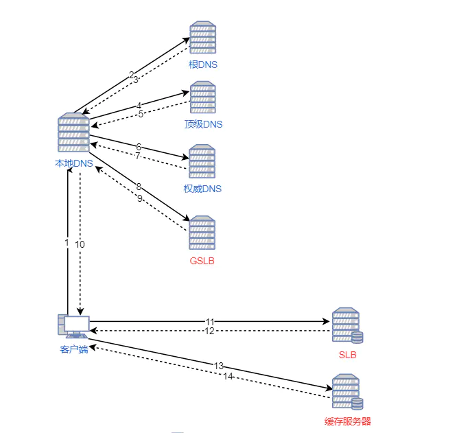

# 网络

## Ajax

[你真的会使用XMLHttpRequest吗？](https://segmentfault.com/a/1190000004322487)

- 创建一个异步对象

```js
if(window.XMLHttpRequest){
  var xhr = new XMLHttpRequest();
} else{
  var xhr = new ActiveXobject("Microsoft.XMLHTTP");    // 兼容 IE
}
```

- 设置请求并发送地址

```js
xhr.open("GET", "testAjax.php", "true");    // 第三个参数表示是否异步请求，默认为 true
// 在 IE 中，如果通过 Ajax 发送 GET 请求，则 IE 会认为同一个 url 只有一个结果。
// 解决方法：在 url 后面增加时间戳来让每次的 url 都不一样
// xhr.open("GET", "testAjax.php？=“ + （new Date().getTime()), true);
```

- 发送请求

```js
xhr.send();
```

- 监听状态变化

```js
// 在通过 send 方法发送请求后，xhr 对象在收到响应数据时会自动填充到其对应的属性中
xhr.onreadystatechange = function() {
  if(xhr.readyState === 4){
    if(xhr.status>= 200 && xhr.status < 300 || xhr.status === 304){
      success(xhr.response);
    } else{
      error(xhr.response);
    }
  }
}

// 还可以通过监听 timeout 时间设置超时回调
xhr.timeout = timeout;
xhr.ontimeout = function() {
  error('请求超时');
}
```


#### post 请求

```js
xhr.open("POST", "ajax_test.asp", true);
xhr.setRequestHeader("Content-type", "application/x-www-form-urlencoded");
xhr.send("fname=Bill&lname=Gates");
```

#### 存有 XMLHttpRequest 的状态。从 0 到 4 发生变化。

- 0: 请求未初始化，还没有调用 open 方法。
- 1: 服务器连接已建立，正在发送请求。
- 2: 请求已接收，send 方法已经被调用，响应头也已经被接收。
- 3: 响应处理中，正在获取响应体。
- 4: 响应已完成，且响应内容已经解析完成。


## Http 请求

- 通常会在请求的后面再加上个请求参数，这是为了防止客户端缓存页面，而浏览器缓存是基于 url 进行缓存的。如果页面允许缓存，则在缓存有效期内再次访问相同的 url，浏览器就不会再次发送请求到服务器端，而是直接从缓存中获取指定资源。

[77.9K 的 Axios 项目有哪些值得借鉴的地方](https://mp.weixin.qq.com/s?__biz=Mzg2NDAzMjE5NQ==&mid=2247486746&idx=1&sn=528017664625d3d923509df6f56a16f3&chksm=ce6ec9b6f91940a0f0bbca777fc1991c27f951cf0412cb772de625214f6ab5c6db2ca825b272&xtrack=1&scene=90&subscene=93&sessionid=1603592251&clicktime=1603592281&enterid=1603592281&ascene=56&devicetype=android-29&version=27001353&nettype=3gnet&abtest_cookie=AAACAA%3D%3D&lang=zh_CN&exportkey=AToid7PG14anlO%2FO87J0KR4%3D&pass_ticket=GKhTxWTVYQ%2FrQUF87XcB%2FhubJGzZak4fKg8dXHuRKD34hu0SagR85SUd5KM0G9wt&wx_header=1)

## 代理

### 正向代理

- 正向代理用于代理客户端，此时在服务器看来，代理就是客户端，服务器不知道真正客户端的存在。一般情况下，代理和客户端位于一个内网中，(客户端 <-> 代理) <-> 服务器。客户端不需要直接将请求发给服务器，而是发给代理，由代理代为请求服务器并返回结果。

- 作用：
  - 突破限制。
  - 流量控制和流量统计。
  - 提升性能（缓存网站）。

### 反向代理

- 反向代理用于代理服务器，此时在客户端看来，代理就是服务器，客户端不知道真正服务器的存在。一般情况下，代理和服务器位于一个内网中，客户端 <-> (代理 <-> 服务器)。服务器不需要直接和客户端沟通，而是由代理接收客户端的请求，再发送给服务器。

- 作用：
  - 突破限制。
  - 跨域请求。
  - 负载均衡。负载均衡的方法有：轮询、LRU（最近最少使用）等。
  - 访问加速（CDN）。
  - 保障安全。对非法 IP 做一层限流，避免直接将请求发送到目标服务器。
  - 设置缓存。将内容缓存到代理服务器，使得客户端可以直接从代理服务器获得而不用到目标服务器那里。请求时可以通过 `Cache-Control: private` 请求头来禁止代理服务器缓存。


## CDN 内容分发网络

- DNS 记录类型
  - A 记录：将域名指向一个 IPV4 地址。
  - AAAA 记录：将域名指向一个 IPV6 地址。
  - CNAME 记录：将域名指向另一个域名，相当于给域名起别名。
  - ......

- 内容：将目标服务器的资源缓存到位于全球各地的 CDN 节点上，用户请求资源时，就近返回节点上缓存的资源，而不需要每个用户的请求都向目标服务器获取。

- 作用：
  - 降低了网络的拥塞状况、提高请求的响应速度。
  - 减少源站的负载压力。

- CDN 原理：在 DNS 域名解析时将用户的访问请求引导到缓存节点上而不是目标服务器。设置一个全局负载均衡系统（GSLB）来根据用户的地理位置选择较近的本地负载均衡系统（SLB），本地负载均衡系统再根据用户请求的资源判断附近是否有缓存服务器拥有该资源，有的话则将 HTTP 请求重定向到最优的缓存节点上（根据网络负载量等信息进行筛选）。
  - GSLB 的主要功能是根据用户的 IP 地址判断用户的位置，筛选出距离用户较近的本地负载均衡系统。
  - SLB 的主要功能是判断缓存服务器集群中是否包含用户请求的资源数据，如果缓存服务器中存在请求的资源，则根据缓存服务器集群中节点的健康程度、负载量、连接数等因素筛选出最优的缓存节点。

- CDN 过程
  - 前面的 DNS 解析过程保持不变，主机（递归） -> 本地域名服务器（迭代） -> 根域名服务器 -> 顶级域名服务器 -> 权限域名服务器。
  - 查询权限域名服务器的时候，返回该域名对应的 GSLB 的 IP 地址（需要服务提供者即目标服务器配置它在权限 DNS 服务器中的记录。将直接指向目标服务器的 A 记录修改为一条 CNAME 记录及其对应的 A 记录，CNAME 记录将目标域名转换为 GSLB 的别名，A 记录又将该别名转换为 GSLB 的IP地址）。
  - 本地域名服务器再向 GSLB 查询，得到 SLB 的 IP 地址并将其返回给主机。
  - 主机向 SLB 发起 HTTP 请求，SLB 筛选出最优的缓存服务器后，回应主机的 HTTP 请求（状态码为 302，重定向地址为最优缓存节点的 IP 地址）。
  - 主机收到 SLB 响应后，将 HTTP 请求重定向到该缓存节点上。
  - 缓存节点判断请求的资源是否存在、过期，将缓存的资源直接回复给客户端，否则向它的上一级缓存服务器请求内容，直至追溯到网站的源服务器将内容拉到本地。




- 文件名的哈希通常使用 MD5 算法来生成，也就是根据文件内容来生成哈希，如果内容没变，MD5 戳也就不会变。MD5 的好处是：
  - 静态资源不是同名覆盖，老版本的静态资源依旧留在服务器上，所以不存在万一访问到老版本却找不到的情况。
  - 遇到问题回滚本时，无需回滚静态资源，只需要把静态资源的引用改回原来的就好。
  - 可以开启强缓存，只有更新了内容的静态资源文件才会缓存失效，提高缓存利用率。
  - 在文件中修改注释或增加空格等，生成的 MD5 不会改变。

```js
const fs = require('fs');
const crypto = require('crypto');

function createMd5(file) {
  const buffer = fs.readFileSync(file);
  const hash = crypto.createHash('md5');
  hash.update(buffer);
  const md5 = hash.digest('hex');
  return md5;
}
```

## 同源策略

协议、域名、端口号三者有一个不同就是跨域。

```js
// 域名和域名对应相同 ip 不允许
http://www.domain.com/a.js
http://192.168.4.12/b.js

// 主域相同，子域不同 不允许
http://www.domain.com/a.js
http://x.domain.com/b.js
http://domain.com/c.js
```

跨域请求并非是浏览器限制了发起跨站请求，而是请求可以正常发起，到达服务器端，但是服务器返回的结果会被浏览器拦截。

- 同源策略的限制
  - Cookie、LocalStorage 和 IndexDB 无法读取。
  - DOM 无法获得。
  - AJAX 响应不能获取。

- IE 中同源策略的不同：
  - 授信范围）：两个相互之间高度互信的域名如公司域名，则不受同源策略限制。
  - 端口：IE 未将端口号纳入到同源策略的检查中。


## 跨域解决方案

> 跨域的解决方案，后来动手实验了下其中几个方法，整理到了 [Blog](http://blog.dangosky.com/2020/01/10/%E8%B7%A8%E5%9F%9F%E8%A7%A3%E5%86%B3%E6%96%B9%E6%A1%88%E5%AE%9E%E8%B7%B5/)。

如果是 form 表单的话，则不会有跨域的问题。因为原页面用 form 表单提交到另一个域名之后，没有任何数据返回，原页面也就读取不到其他域名下的数据，所以浏览器认为这是安全的。而 ajax 可以读取到响应内容，因此浏览器会触发跨域问题。

### jsonp

- 原理：script、link、img 引入的资源允许跨域。

- 优点：它不像 XMLHttpRequest 对象实现的 Ajax 请求那样受到同源策略的限制；它的兼容性更好，在更加古老的浏览器中都可以运行，不需要 XMLHttpRequest 或 ActiveX 的支持；并且在请求完毕后可以通过调用 callback 的方式回传结果。

- 缺点：它只支持 GET 请求而不支持 POST 等其它类型的 HTTP 请求；它只支持跨域 HTTP 请求这种情况，不能解决不同域的两个页面之间如何进行 JavaScript 调用的问题。

- JSONP 的实现流程：
  - 声明一个回调函数，其函数名 (如 show) 当做参数值，要传递给跨域请求数据的服务器，函数形参为要获取目标数据(服务器返回的 data)。
  - 创建一个 script 标签，把那个跨域的 API 数据接口地址，赋值给 script 的 src, 还要在这个地址中向服务器传递该函数名（可以通过问号传参:?callback=show）。
  - 服务器接收到请求后，需要进行特殊的处理：把传递进来的函数名和它需要给你的数据拼接成一个字符串, 例如：传递进去的函数名是 show，它准备好的数据是 show('我不爱你')。
  - 最后服务器把准备的数据通过 HTTP 协议返回给客户端，客户端再调用执行之前声明的回调函数（show），对返回的数据进行操作。

```js
function jsonp(url, callback) {
  // 创建一个唯一的回调函数名称
  let fn = Symbol();
  // 先在 window 上定义这个回调函数，后端返回数据后会立即执行这个回调函数
  window[fn] = function(response) {
    try {
      callback(response);
    } finally {
      delete window[fn];
      document.body.removeChild(script);
    }
  };
  let script = document.createElement("script");
  script.type = 'text/javascript';
  // 判断 url 是否已经有其他的查询参数
  if(url.indexOf("?") === -1) {
    url += `?callback=${fn}`;
  } else {
    url += `&callback=${fn}`;
  }
  script.src = url;
  document.body.appendChild(script);
}
```

### document.domain + iframe

### location.hash + iframe

### window.name + iframe

### postMessage

postMessage() 方法允许来自不同源的脚本采用异步方式进行有限的通信，可以实现跨文本档、多窗口、跨域消息传递。可用于解决以下方面的问题：

- 页面和其打开的新窗口的数据传递
- 多窗口之间消息传递
- 页面与嵌套的 iframe 消息传递
- 上面三个场景的跨域数据传递

### CORS

跨域资源共享（CORS）义的 HTTP 头部让浏览器与服务器进行沟通，从而决定请求或响应是应该成功还是失败。服务端设置 Access-Control-Allow-Origin 就可以开启 CORS。 该属性表示哪些域名可以访问资源，如果设置通配符则表示所有网站都可以访问资源。

### nginx 代理

- 原理： 同源策略是浏览器的安全策略，不是 HTTP 协议的一部分。服务器端调用 HTTP 接口只是使用 HTTP 协议，不会执行 JS 脚本，不需要同源策略，也就不存在跨越问题。
使用 nginx 反向代理实现跨域，是最简单的跨域方式。只需要修改 nginx 的配置即可解决跨域问题，支持所有浏览器，支持 session，不需要修改任何代码，并且不会影响服务器性能。

- 实现思路：通过 nginx 配置一个代理服务器（域名与 domain1 相同，端口不同）做跳板机，反向代理访问 domain2 接口，并且可以顺便修改 cookie 中 domain 信息，方便当前域 cookie 写入，实现跨域登录。

 ### nodejs 中间件代理

同源策略是浏览器需要遵循的标准，而如果是服务器向服务器请求就无需遵循同源策略。使用一个中间服务器代理转发客户端的请求和目标服务器的响应。

### WebSocket

WebSocket 是一种双向通信协议，在建立连接之后，WebSocket 的 server 与 client 都能主动向对方发送或接收数据。


## XSS 和 CSRF

### XSS 攻击

> [前端安全系列（一）：如何防止XSS攻击？](https://juejin.im/post/5bad9140e51d450e935c6d64)

跨站脚本攻击。恶意攻击者往 Web 页面里插入恶意 Script 代码，当用户浏览页面的时候，嵌入页面里面的 Script 代码会被执行，从而达到恶意攻击用户的目的，比如窃取 Cookie。

XSS 的本质是，恶意代码未经过滤，与网站正常的代码混在一起。浏览器无法分辨哪些脚本是可信的，导致恶意脚本被执行。

#### Reflected XSS（基于反射的 XSS攻击）

指 XSS 代码在请求的 URL 或表单信息中，而后被提交到服务器。服务器解析后，XSS 代码随着响应内容一起传给客户端进行解析执行。（直接反射显示在页面）

#### Stored XSS（基于存储的 XSS攻击）

Stored XSS 和 Reflected XSS 的差别就在于，具有攻击性的脚本被保存到了服务器端包括数据库、内存、文件系统等。而且可以被用户完整的从服务端请求到并执行，导致 XSS 的攻击范围是所有打开页面的用户而不是个人（比如通过掘金等写作平台发帖、评论留言等）。

#### DOM-based or local XSS（基于 DOM 或本地的 XSS 攻击）

DOM 型 XSS 攻击**不会经过服务端**，而是作为中间人的角色，在数据传输过程劫持到网络数据包，然后修改里面的 HTML 文档。这样的劫持方式包括 WiFi 路由器劫持、本地恶意软件等。

#### 存在的情景

1. 在页面的输入框中输入 `<script>` 代码，导致这段脚本会直接被执行（比如之前的有道翻译页面）。

2. 直接将 `<script>` 代码拼在 URL 后作为请求参数，比如 `https://www.baidu.com?test=<script>alert(document.cookie)</script>`。

3. 在标签的 `href`、`src` 等属性中，包含 `javascript:` 等可执行代码。

4. 在 `onload`、`onerror`、`onclick` 等事件中，注入 JS 代码。


#### XSS 防御

1. 对用户提交的内容进行可靠性验证，包括对 URL、POST 数据等，仅接受指定长度范围内、采用适当格式、采用所预期的字符的内容提交，对其他的一律过滤。客户端和服务器都需要进行一层过滤（因为攻击者可能绕过前端直接利用接口发起请求）。

2. 对用户输入的内容进行转义。比如将 `<`、`>` 等字符转义为[字符实体](https://www.w3school.com.cn/html/html_entities.asp)。但对于富文本信息的话，可能会一刀切掉所有的标签，所以需要再设置黑名单或[白名单](https://github.com/leizongmin/js-xss/blob/master/README.zh.md)，只对某些特殊的标签进行转义。

3. 对 URL 进行 encodeURI 编码。

4. 开启 HttpOnly 进制 JavaScript 访问 Cookie，避免 Cookie 被窃取。

5. 前端尽量不使用能解析并执行的字符串的操作。 
  - 如 `.innerHTML`、`v-html` 等这些解析操作，而是使用 `.textContent` 等。
  - 如 `location`、`onclick`、`onerror`、`onload`、`onmouseover` 事件等。
  - `<a>` 标签的 `href` 属性，`eval`、`setTimeout`、`setInterval` 等


6. CSP 内容安全策略。明确告诉客户端，哪些外部资源是可以加载和执行的，实质上就是白名单制度。可以通过 CSP 来限制其他域下的资源加载、禁止向其它域提交数据、提供上报机制帮助我们及时发现 XSS 攻击等。使用方式：
  - 通过 HTTP 头信息的 `Content-Security-Policy` 的字段开启。
  - 通过网页的 meta 标签，`<meta http-equiv="Content-Security-Policy" content="script-src 'self'">`。

> [Content Security Policy 入门教程](http://www.ruanyifeng.com/blog/2016/09/csp.html)

7. [X-XSS-Protection](https://developer.mozilla.org/zh-CN/docs/Web/HTTP/Headers/X-XSS-Protection) 这个响应头会在检测到 XSS 时，浏览器将停止加载页面。但是这个响应头兼容性不好且不规范。

### CSRF 攻击

> [前端安全系列之二：如何防止CSRF攻击？](https://juejin.im/post/5bc009996fb9a05d0a055192)。

跨站请求伪造。攻击者伪造请求，冒充用户在站内进行操作。因为大多数网站是通过 Cookie 等方式识别用户身份的（包括 Session，SessionID 也基本是保存在 Cookie 里），所以攻击者可以通过欺骗用户打开恶意网站，并在恶意网站的代码里插入一些恶意代码（可以在 src、onload 中），比如可以带上原网站的 Cookie 信息对其发起一些请求。而因为请求信息里有了 Cookie，所以第三方网站不会知道这是一次 CSRF 攻击而通过这次非法请求，并且这次攻击对用户来说可能是无知觉的。（需要依赖于用户点击）

#### 存在的场景

1. 用户登录了银行网站 A，之后在网站 A 的 Cookie 还没过期时又访问了钓鱼网站 B，而网站 B 模拟了网站 A 的某些操作如转账时的 Http 请求。因为此时网站 A 的 Cookie 还是有效的，所以网站 B 的这次操作会被服务器认为是合法的。


#### CSRF 防御

1. 使用请求头 Origin 确定来源域名。

1. 验证请求头的 Referer 字段（记录了该 HTTP 请求的来源地址），判断请求来源是否合法。存在的问题是，CSRF 防御完全由浏览器的 Referer 字段来保证，并不能完全保证安全，因为在部分情况下，攻击者可以隐藏甚至修改自己请求的 Referer（比如低版本的 IE）。

2. 在请求参数中添加 Token 验证。CSRF 攻击之所以能够成功，是因为黑客可以完全伪造用户的请求，该请求中所有的用户验证信息都是存在于 Cookie 中，因此黑客可以在不知道这些验证信息的情况下直接利用用户自己的 Cookie 来通过安全验证。要抵御 CSRF，关键在于在请求中放入黑客所不能伪造的信息，并且该信息不存在于 Cookie 之中。所以可以在初始化请求页面的时候服务器返回一个 Token，之后每次请求的时候都带上这个 Token 让服务端验证就行。

3. 验证码。强制用户进行某些操作时，必须通过验证码验证合法性后才能完成最终请求。但这对于用户体验不是很好。

4. Cookie设置 SameSite 属性为 Strict，使 Cookie 在任何情况下都不可能作为第三方 Cookie 发送（比如请求 google.com 网站只能在 google.com 这个域名当中请求才能携带 Cookie，在其他网站请求则都不能）。或设置为 Lax，使请求是 GET 请求，并且是改变当前页面，或者打开了新页面且才能发送 Cookie。

### CRLF 攻击

回车换行攻击，又叫做 Http 响应割离（HTTP Response Splitting，HRS），通常表示为 `\r\n`，编码后是 `%0D%0A`。HTTP 请求头和请求体（响应头和响应体也是如此）就是用两个 CRLF 分割加以区分的，如果能够控制 HTTP 请求信息并注入 CRLF 的话，就能在请求体/响应体中注入一些 Cookie 或 HTML 代码等，从而达到攻击的目的。防御措施当然也就是过滤用户的输入输出了。

### SQL 注入

SQL 注入攻击是将 SQL 代码添加到输入参数中，传递到服务器解析并执行的一种攻击手法。