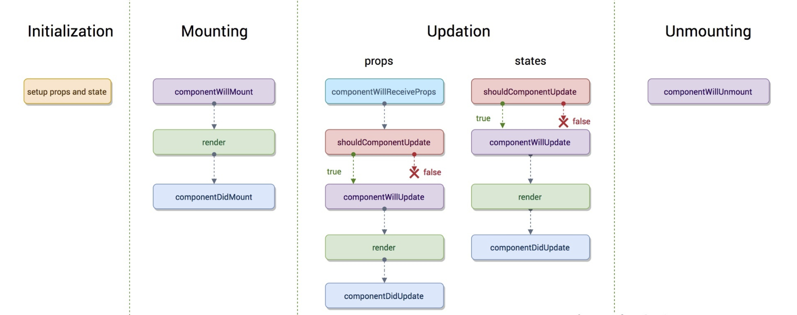
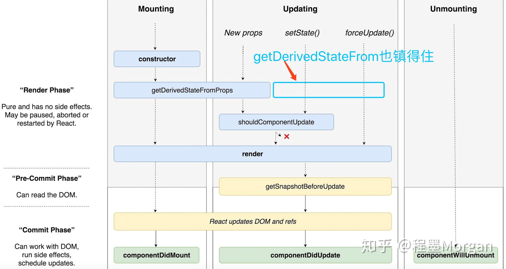

# 生命周期

> 官方文档[见这里](https://zh-hans.reactjs.org/docs/react-component.html#commonly-used-lifecycle-methods)。

## constructor
  - 使用：初始化 state 和 props。（只会执行一次）。

## componentWillMount 
  - 使用：可以调用 setState 方法来改变状态值。
  - 注意点：
    - 这方法里同步地设置状态将不会触发重渲染。
    - 无法获取页面中的DOM对象。
  - 不推荐使用，要被废弃了。

## render
  - 注意点：
    - 不要在 render 方法中调用 setState 方法，否则会递归渲染导致报错。
    - 无法获取页面中的DOM对象。

## componeDidMount
  - 触发条件：组件挂载后（插入 DOM 树中）立即调用，此时页面还没有渲染出来。
  - 使用：可以进行DOM操作和网络请求。
                        
## componentWillReceiveProps(nextProps)
  - 触发条件：组件要从父组件接受新的props，并且该组件不是第一次被渲染出来。
  - 不推荐使用，要被废弃了。

## shouldComponentUpdate(nextProps, nextState)
  - 触发条件：组件更新之前触发，默认返回 true。如果返回 false 则不再继续后面的生命周期钩子也就不会render（返回 false 并不会阻止子组件在 state 更改时重新渲染）。首次渲染或使用 forceUpdate() 时不会调用该方法。
  - 使用：可以通过比较新的 props 和旧的 props 中值是否更新来控制是否重新渲染。避免因为props变化了而子组件数据没有改变却依旧要执行render造成的性能浪费。

## componentWillUpdate(nextProps, nextState)
  - 触发条件：组件更新之前。只有 `shouldComponentUpdate` 返回 true 才会执行。
  - 不推荐使用，要被废弃了。

## componentDidUpdate(prevProps, prevState, snapshot)
  - 触发条件：在更新后会被立即调用，首次渲染不会执行此方法。
  - 注意：可以在 `componentDidUpdate` 中直接调用 setState()，但它必须被包裹在一个条件语件里，否则会导致死循环，因为每次更新都会调用到 `componentDidUpdate`。
  - snapshot参数：如果组件实现了 `getSnapshotBeforeUpdate` 生命钩子，则它的返回值将作为 `componentDidUpdate` 的第三个参数 snapshot，否则此参数将为 undefined。

## componentWillUnmount
  - 使用：清除定时器，取消网络请求。

## getDerivedStateFromProps(nextProps, prevState)

- 触发条件：在 render 之前调用，并且在初始挂载及后续更新时都会被调用。
- 使用：返回一个对象来更新 state，如果返回 null 则不更新任何内容。而 `componentWillReceiveProps` 仅在父组件重新渲染时触发，而不是在内部调用 setState 时。
- 注意：`getDerivedStateFromProps` 是一个静态函数，所以不能通过 this 访问到 class 的属性，即无法访问组件实例。

## getSnapshotBeforeUpdate(prevProps, prevState)

- 触发条件：在 update 后 DOM 更新前被调用，用于读取最新的 DOM 数据。其返回值将作为参数传递给 `componentDidUpdate`。

## static getDerivedStateFromError(error)

- 触发条件：在后代组件抛出错误后被调用。它将抛出的错误作为参数，并返回一个值以更新 state。

- 注意：`getDerivedStateFromError` 会在渲染阶段调用，因此不允许出现副作用。

## componentDidCatch(error, info)

- 触发条件：在后代组件抛出错误后被调用。它接收两个参数：
  error： 抛出的错误。
  info：带有`componentStack key` 的对象，其中包含有关组件引发错误的栈信息。

## 示意图

[图谱](http://projects.wojtekmaj.pl/react-lifecycle-methods-diagram/)。

## 执行流程

### 挂载

当组件实例被创建并插入 DOM 中时，其生命周期调用顺序如下：

1. `constructor`
2. `static getDerivedStateFromProps`
3. `render`
4. `componentDidMount`

### 更新

当组件的 props 或 state 发生变化时会触发更新。组件更新的生命周期调用顺序如下：

1. `static getDerivedStateFromProps`
2. `shouldComponentUpdate`
3. `render`
4. `getSnapshotBeforeUpdate`
5. `componentDidUpdate`

### 错误处理

当渲染过程，生命周期，或子组件的构造函数中抛出错误时，会调用如下方法：

1. `static getDerivedStateFromError`
2. `componentDidCatch`

### 渲染

只要 state 或 props 改变了（即使是赋相同的值），就会调用 `render` 函数渲染组件，之后进行 DOM diff。使用 pure Component 可以进行浅层次的比较，防止无谓的渲染（或者手动使用 `shouldComponentUpdate`）。

或者使用 `component.forceUpdate(callback)` 强制组件调用 render 刷新。此操作会跳过该组件的 `shouldComponentUpdate`，但还是会触发正常的生命周期方法。
