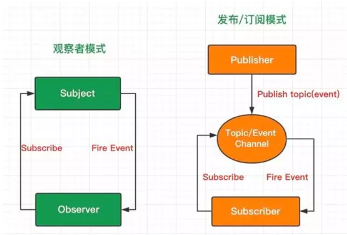

# 数据绑定

## 单向数据绑定

- 优缺点：
  - 一旦数据变化，就去更新页面，即 data-> 页面，但是没有页面 -> data;
  - 所有状态的改变可记录、可跟踪，源头易追溯，便于统一状态管理;
  - 所有数据只有一份，组件数据只有唯一的入口和出口，使得程序更直观更容易理解，有利于应用的可维护性;
  - HTML 代码渲染完成就无法改变，有新数据就须把旧 HTML 代码去掉，整合新数据和模板重新渲染; 代码量大。

## 双向数据绑定
- 数据模型（Module）和视图（View）之间的双向绑定。无论数据改变，或是用户操作，都能带来互相的变动，自动更新。（其实就是在单向数据绑定的基础上，给可输入元素添加监听函数，比如 `v-modal`）

- 优缺点：
  - 用户在视图上的修改会自动同步到数据模型中去，数据模型中值的变化也会立刻同步到视图中去。在表单交互较多的场景下，会简化大量业务无关的代码。
  - 数据变化来源入口和数据变化响应出口变得不止一个，数据流转方向易紊乱，代码可能会变得难于维护和管理，也无法追踪局部状态的变化。

- 如果是 v-model 中使用到 vuex 中的 state 的话，则鉴于修改 state 的数据需要在 mutation/action 中，所以要监听 v-model 的数据的改变在监听函数中调用 mutation/action 进行修改。

## 双向数据绑定实现

> 具体原理看 [Blog](http://blog.dangosky.com/2019/08/17/Vue%E5%8F%8C%E5%90%91%E6%95%B0%E6%8D%AE%E7%BB%91%E5%AE%9A%E5%8E%9F%E7%90%86/)。

- 通过数据劫持（利用 `Object.defineProperty` 修改 get 和 set）结合发布订阅者模式的方式来实现的。
- 实现一个监听器 Observer，用来劫持并监听所有属性，如果有变动的，就通知订阅者。
- 实现一个订阅者 Watcher，每一个 Watcher 都绑定一个更新函数，watcher 可以收到属性的变化通知并执行相应的函数，从而更新视图。
- 实现一个解析器 Compile，可以扫描和解析每个节点的相关指令（v-model，v-on 等指令），如果节点存在 v-model，v-on 等指令，则解析器 Compile 初始化这类节点的模板数据，使之可以显示在视图上，然后初始化相应的订阅者（Watcher）。

## 观察者模式和发布订阅者模式

- 观察者模式是被观察者知道观察者是谁，一旦发生变化就会亲自通知观察者。
- 发布订阅者模式是发布者无需知道谁是订阅者，一旦发生变化只需要通知消息中心，由信息中心去通知订阅者。类似 Vue 的 Watcher 和 Observer。




## Vue 双向数据绑定的缺陷

- 可以观察到数组变化的方法：`push`、`pop`、`shift`、`unshift`、`splice`、`sort`、`reverse`。
  - 实现原理：Vue 重写了原型上的数组方法。

- Vue 不能检测到以下情况的数据变动：
  - 通过索引直接修改数组元素，例如：`vm.arr[index] = newValue`。
  - 修改数组的长度时，例如：`vm.arr.length = newLength`。
  - 动态添加的对象属性。

- 对应的解决方法：
  - 使用 `Vue.set(vm.arr, index, newValue)` 或 `this/vm.$set(vm.arr, index, newValue)` 或 `vm.arr.splice(index, 1, newValue)` 修改数组元素。
    - `Vue.set()` 是将 set 函数绑定在 Vue 构造函数上，`this.$set()` 是将 set 函数绑定在 Vue 原型上。
  - 使用 `vm.arr.splice(newLength)` 修改数组长度。
  - 事先在对象上写好之后可能会有的属性，或者使用上述的 set 方法。

- 产生原因：对于数组元素和对象属性，Vue 是在实例构建时就递归使用 `Object.defineProperty` 对 data 的各个数据进行 get 和 set 方法劫持。而因为 `Object.defineProperty` 本身的缺陷，对于通过索引修改数组元素、直接修改数组长度、动态增加对象属性这几种情况，就无法监测到了。除非再次使用 `Object.defineProperty` 劫持一遍数据，但这样不利于性能。

## Object.defineProperty 和 Proxy

> Proxy 具体可参考[这里](https://es6.ruanyifeng.com/#docs/proxy)。

- 区别：
  - `Object.defineProperty` 仅仅只是控制对象的某个属性，而 `Proxy` 可以劫持整个对象（并返回一个代理的 `Proxy` 对象）。这样在进行数据劫持的时候，就不用递归去劫持一个对象了。
  - `Proxy` 可以直接监测到数组长度的变化，可以劫持到数组的 `length` 属性。不需要跟 `Object.defineProperty` 那样有需要很多的 hack。
  - `Proxy` 有更多的拦截方法，比如 `apply`、`ownKeys`、`deleteProperty`、`has`。

- `Proxy` 的应用：
  - 在读取属性时做一层拦截，可以用来记录访问日志，定义计算属性。
  - 在设置属性值时做一层拦截，可以用来校验数据类型和其他一些赋值错误。
  - 用来实现数据绑定。

- `Object.defineProperty` 辨析

> [为什么 Vue3.0 不再使用 defineProperty 实现数据监听？](https://www.infoq.cn/article/sPCMAcrdAZQfmLbGJeGr)
>
> [记一次思否问答的问题思考：Vue为什么不能检测数组变动](https://segmentfault.com/a/1190000015783546)

实际上，`Object.defineProperty` 是可以监测到数组下标变化的，测试如下。对于数组下标，`Object.defineProperty` 同样将其看做是对象中的属性 key，只有第一次劫持的时候数组中现有的下标才会被劫持到。也就是说，如果一开始数组中只有下标 0、1、2，那么后续也只会有下标 0、1、2 能被监测到，即使通过 push、unshift、shift 等操作改变数组，也还是如此。

所以，Vue2.x 中无法通过数组下标来实现响应式数据的自动更新是 Vue 本身的设计导致的，而不是 `Object.defineProperty` 的锅。可能的原因是：如果劫持数组下标的话，就需要遍历整个数组一一劫持。如果数组是稀疏数组并且数组长度很大，这样对于性能是有消耗的不利于用户体验，不如直接改写数组方法和通过 set 来修改。

```js
function defineReactive(data, key, value) {
  Object.defineProperty(data, key, {
    enumerable: true,
    configurable: true,
    get: function defineGet() {
      console.log(`get key: ${key} value: ${value}`)
      return value
    },
    set: function defineSet(newVal) {
      console.log(`set key: ${key} value: ${newVal}`)
      value = newVal
    }
  })
}
function observe(data) {
  Object.keys(data).forEach(function(key) {
    defineReactive(data, key, data[key])
  })
}
let arr = [1, 2, 3]
observe(arr)
```