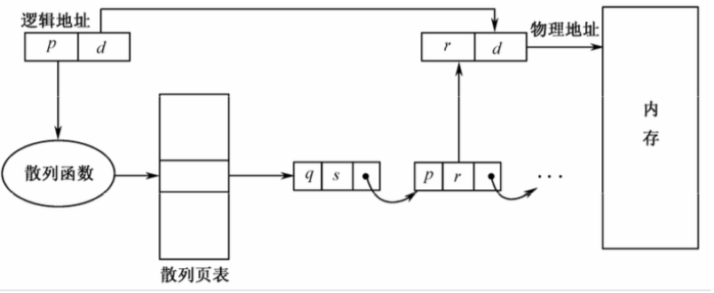

# 存储管理

- 内存 / 主存：CPU 能直接存取指令和数据的存储器。对内存的访问是通过一系列对指定地址单元进行读或写来实现的（每个内存单元都有相应的内存地址，类似于数组中按下标来获取数组值）。

- 从用户源程序进入系统，到相应程序在机器上运行，要经历的主要处理阶段有编辑、编译、 连接、装入、运行。

- 逻辑地址空间 / 地址空间：由程序中逻辑地址（相对地址）组成的地址范围。

- 内存空间 / 物理空间 / 绝对空间：由内存中一系列存储单元所限定的地址范围.

- 重定位：程序和数据装入内存时，需对目标程序中的地址进行修改，把逻辑地址转变为内存物理地址（绝对地址）。
  - 静态重定位：在目标程序装入内存时，由装入程序对目标程序中指令和数据的逻辑地址都改成实际的内存地址。
    - 缺点：程序的存储空间只能是连续的一片区域，而且在重定位之后就不能再移动，不利于内存空间的有效使用。各个用户进程很难共享内存中的同一程序的副本。 
  - 动态重定位：在程序执行期间，每次访问内存之前进行重定位。需要靠硬件地址转换实现（一个存放起始地址的基址寄存器，一个存放用户程序逻辑地址最大范围的限长寄存器）。
    - 优点：程序占用的内存空间动态可变，并且不必连续存放在一处。比较容易实现几个进程对同一程序副本的共享使用。

## 分区法

- 分区分配：除操作系统占用内存的某个固定分区（通常是低址部分）外，把其余内存供用户程序使用，并且划分成若干分区，每个分区里容纳一个作业。

#### 固定分区法

- 固定分区就是内存中分区的个数固定不变，各个分区的大小也固定不变，每个分区只可装入一个进程。根据分区的大小是否相等，分为等分和查分方式两种固定分区方式。

- 缺点：要在系统生成时指定分区的个数，这就限制了系统中处于活动状态的进程数目。并且内存空间的利用率也不高。

#### 动态分区法

- 各个分区是在相应进程要进入内存时才建立的，使其大小恰好适应进程的大小。

- 使用一个内存登记表，记录内存中所有分区的大小、分区号、起始地址、使用状态，并由前后向指针连接起前后分区。

- 某个进程终止并释放它的分区后，如果恰好与其他空闲分区相邻接，则系统还要将它们合并起来使其成为一个连续更大的空闲区。

- 给一个进程分配分区时，若有多个容量满足要求的空闲内存区，则需要根据不同的分配算法选择不同的分区：
  - 最先适应算法：分配第一个满足要求的分区。使用这种算法时空闲表是按位置排列的，空闲块地址小的，在表中的序号也小。
    - 优点：便于释放内存时进行合并，且为大作业预留高址部分的大空闲区。
    - 缺点：内存高地址部分和低地址部分的利用不均衡，且会出现许多很小的空闲块，影响内存效率。
  - 最佳适应算法：尽量分配最小的空闲块。使用这种算法时空闲表是以空闲块的大小升序排列的，小块在前，大块在后。
    - 优点：产生的剩余块是最小的。
    - 缺点：不便于释放内存时与邻接区的合并，也同样会出现许多难以利用的小空闲块。
  - 循环适应算法：不从空闲表的开头查找，而从上次找到的可用分区的下一个空闲分区开始查找，从中选择满足大小要求的第一个空闲分区。
    - 优点：能使内存中的空闲块分布得更均匀，减少查找空闲块的开销。
    - 缺点：无法为大作业预留大的空闲块。

#### 碎片

- 内部碎片：在一个分区内部出现的碎片，如固定分区法。

- 外部碎片：在所有分区之外新增的碎片，如动态分区法。

- 紧缩 / 可重定位分区法：定时或在分配内存时把所有碎片合并为一个连续区。通过移动某些已分配区的内容（需要修改分区的信息），使所有进程的分区紧挨在一起，而把空闲区留在另一端。为了减少紧缩时进程的移动数量，在进程装入内存时，不是从上至下依次放置，而是采用 ”占两头 空中间“ 的办法。当紧缩时，各个进程按地址大小分别向两端靠拢，从而使空闲区保留在内存的中间部位。

- 紧缩的时机：
  - 当进程结束、释放所占用的分区时，如果它不与空闲区邻接就立即进行紧缩。
  - 在分配进程的分区时进行，即各个空闲区都不能满足该进程的需求时才进行紧缩。

## 分页

- 对换技术和分区技术要求必须把一个系统程序或用户程序装入一个连续的内存空间中。虽然使用紧缩可以提高内存利用率，但也花费了很多的 CPU 时间。而使用分页技术可以允许程序的存储空间不连续。

- 逻辑空间分页：将一个进程的逻辑地址空间划分成若干大小相等的部分，每个部分称做页面或页。每页都有一个编号叫做页号，页号从 0 开始依次编排。页面的大小是由系统确定的，它一般选择为 2 的若干次幂。

- 内存空间分块：把内存划分成与页面相同大小的若干存储块，称做内存块或页框。

- 逻辑地址表示：页号 + 页内地址。
  - 页号表示该地址所在页面的页号；页内地址表示页内位移。
  - 页号 = 逻辑地址 / 页面大小。页内地址 = 逻辑地址 % 页面大小。

- 页表：分页时，进程的页号连续但块号不连续。使用页表实现从页号到物理块号的地址映射（通常一个进程有一个页表）。

- 内存块表：记录每个内存块的分配情况。

- 分页系统中逻辑地址到物理地址的转换：页表都放在内存中。当进程需要访问某个逻辑地址中的数据时，分页地址映像硬件自动按页面大小将 CPU 得到的相对地址分成两部分：页号和页内地址。以页号为索引去检索页表（由硬件自动进行），从页表中得到该页的物理块号，把它装入物理地址寄存器中。同时将页内地址直接送入物理地址寄存器的块内地址字段中。这样物理地址寄存器中的内容就是由二者拼接成的实际访问内存的地址。

- 页面越大的话，造成的内部碎片就越大；页面越小的话，需要的页面数就越多，需要用更大的页表， 同时页表寄存器的装入时间就越长。

- 页表通常都保存在内存中（但如果页表较小的话，也可以存储在寄存器中）。存取数据时需要访问两次内存，一次是访问页表确定数据的物理地址，另一次是根据这个物理地址存取数据或指令。

- 快表：记录最近使用过的页表表项。存取数据时先访问快表中是否存在该数据，不存在的话再访问页表。

### 页表构造

- 为避免页表太大，可以把页表分成若干较小的片段，离散地存放在内存中，并且只将当前需要的部分表项调入内存，其余的页表项根据需要动态地调入内存。

#### 多级页表

- 利用两级页表，把页表本身也分页，使每个页面的尺寸与物理内存块的大小相同。

其中，p1 是访问外层页表的索引，外层页表中的每一项是相应内层页表的起始地址。p2 是访问内层页表的索引，其中的表项是相应页面在内存中的物理块号。

- 地址转换过程是：利用外层页号 p1 检索外层页表，从中找到相应内层页表的基址。再利用 p2 作为该内层页表的索引，找到该页面在内存的块号。用该块号和页内地址 d 拼接起来，形成访问内存的物理地址。

#### 散列页表

- 以页号作为参数形成散列值。散列表中每一项有一个链表，它把有相同散列值的元素链接起来。每个链表元素由三部分组成：①：页号；②：对应的内存块号：③：指向链表中下一个元素的指针。

- 地址转换过程是：以逻辑地址中的页号 p 作为散列函数的参数，得到一个散列值，以它作为检索散列表的索引。把逻辑页号 p 与相应链表的第一个元素内表示页号的字段进行比较，如果匹配，则将相应的内存块号与逻辑地址中的页内地址拼接起来，形成访问内存的物理地址。否则就沿着链表指针向下搜索，直至找到匹配的页号。

#### 倒置页表

- 按内存块号排序的，每个内存块占有一个表项。每个表项包括：存放在该内存块中页面的虚拟页号、拥有该页面的进程标识符。这样系统中只有一个页表，每个内存块对应唯一的表项。

- 地址转换过程是：系统中每个虚拟地址由进程标识符 pid、虚拟页号 p 、页内地址 d 三部分组成，每个倒置页表的表项由进程标识符 pid 和虚拟页号 p 组成。当需要 访问地址时，就用进程标识符和页号去检索倒置页表。如果找到与之匹配的表项，则该表项的序号 i 就是该页在内存中的块号，块号 i 与逻辑地址中的页内地址 d 拼接起来就构成访问内存的物理地址。

- 倒置页表可减少页表占用的内存，却增加了检索页表时所耗费的时间，或许要查完整个页表才能找到匹配项。

#### 页面共享

- 有若干用户同时运行相同的程序时，为避免同时在内存中有同一页面的多个副本，可以使用页面共享，使这些相关进程的逻辑空间中的页指向相同的内存块（该块中放有共享程序或数据）。但可能会造成一个页面内既有共享程序，又有私有数据。

## 分段

- 一个用户程序是由若干相对独立的部分组成的，它们各自完成不同的功能（比如各个函数）。把程序按照逻辑关系划分成若干段，并按照这些段来分配内存。

- 段长度由该段所包含的逻辑信息的长度决定，因而各段长度不等。

- 逻辑地址：段号 + 段内地址（二维的）。

- 内存以段为单位进行分配，每段单独占用一块连续的内存分区，各分区的大小由对应段的大小决定。一个作业或进程的各段不一定放在彼此相邻的分区中。

- 段表：段表项包含段号、段长、段起始地址。当作业调度程序调入该作业时，就为相应进程建立段表。在撤消进程时，清除此进程的段表。

- 段表地址寄存器：包含两部分，一部分指出该段表在内存的起始地址；另一部分指出该段表的长度，表明该段表中共有多少项。

- 分页和分段的区别：
  - 页是信息的物理单位，不考虑一页中是否包含完整的完整，一条指令可能分布在两个页面中。段是信息的逻辑单位，每段在逻辑上包含了相对完整的信息，用户知道程序分为多少段和每段的作用。
  - 在一个系统中也的大小都是唯一的并且每页的大小相等。段的长度因段而异，它取决于用户所编写的程序。
  - 分页的进程地址空间是一维的，只需用一个地址编号就可确定地址空间中的唯一地址。分段的进程地址空间是二维的，标识一个地址时，除给出段内地址外，还必须给出段名。
  - 分页系统很难实现过程和数据的分离，因此无法分别对它们提供保护，也不便于在用户间方便地对过程进行共享。分段系统却可以很容易实现这些功能。

- 逻辑地址到物理地址的转换：在分段系统中用二维地址表示程序中的对象，但实际的物理内存仍是一维的字节序列，所以必须借助段表把二维地址映射成一维物理地址。
  - ① 将段表的内存地址 B 与段号 s 相加，得到查找该进程段表中相应表项的索引值。
  - ② 从该表项中得到该段的长度 limit 及该段在内存中的起始地址 base。
  - ③ 将段内地址 d 与段长 limit 进行比较。如果 d ≥ limit，则表示地址越界发出地址越界中断，终止程序执行，否则表示地址合法。
  - ④ 将段内地址 d 与该段的内存始址 base 相加，得到所要访问单元的内存地址。

#### 段的共享和保护

- 每个进程有一个段表。当不同的进程想要共享某个段时，只需在各个进程的段表中都登记一项，使它们的基地址都指向同一个物理单元。任何共享信息可以单独成为一段，但所有共享进程必须以同样的段号定义该段。

## 段页式技术

- 进程的地址空间采用分段方式。把进程的程序和数据等分为若干段，在段内分页。把每段划分成若干页，页面的大小与内存块（等分内存）相同。

- 逻辑地址 = 段号 s + 段内页号 p + 页内地址 d。

- 系统要为每个进程建立一个段表，为段表中的每段建立一个页表。这样进程段表的内容不再是段长和该段在内存的起始地址，而是页表长度和页表地址。为了指出运行进程的段表地址系统有一个段表地址寄存器，它指出进程的段表长度和段表起始地址。

- 进程映像对换是以页为单位进行的，使得逻辑上连续的段存放在分散的内存块中。

- 逻辑地址到物理地址的转换：
  - ① 地址转换硬件将段表地址寄存器的内容 B 与逻辑地址中的段号 s 相加，得到访问该进程段表的入口地址（第 s 段）。
  - ② 将段 s 表项中的页表长度与逻辑地址中的页号 p 进行比较。如果页号 p 小于页表长度则表示未越界，向下正常进行。否则发出中断。
  - ③ 将该段的页表基址与页号 p 相加，得到访问段 s 的页表中第 p 页的入口地址。
  - ④ 从该页表的对应页表项中读出该页所在的物理块号 f，再用块号 f 和页内地址 d 拼接成访内地址。
  - ⑤ 如果对应的页未在内存，则发缺页中断，系统进行缺页中断处理。如果该段的页表未在内存中建立起来，则发缺段中断，然后由系统为该段在内存建立页表。

## 虚拟存储器

- 因为程序执行过程也存在局部性，即一个程序并非全部都会同时使用到，而且分配的内存往往大于实际的使用内存，所以只把当前运行需要的那部分程序和数据装入内存，其余部分暂时放在外存上，待以后实际需要时再分别调入内存。

- 虚拟存储器：用户能用于编址的虚拟存储空间，它使用户逻辑存储器与物理存储器分离，是操作系统给用户提供的一个比真实内存空间大得多的地址空间。

- 实现虚拟存储技术的物质基础是二级存储器结构和动态地址转换机构 DAT。动态地址转换机构在程序运行时把逻辑地址转换成物理地址，以实现动态定位。

- 虚拟存储器的容量限制因素：
  - 指令中表示地址的字长。
  - 外存容量。

## 请求分页技术

- 请求分页技术 = 分页技术 + 虚拟存储器（页面根据缺页中断装入）。

- 请求分页技术中的页表表项结构：
  - 内存块号。
  - 标志位：标示对应的页面是否已装入内存，其值为 1 时表示该页已在内存中可以访问，为 0 表示该页尚未装入内存不能立即进行访问需要请求装入。
  - 保护位：规定该页的访问权限。
  - 修改位：当写入一页时，硬件自动置上该页的修改位。当进行页面置换时，若选中的内存块置上了修改位就必须将该页写回外存，以保证外存中保存的内容和内存块中的内容一致。如果修改位未置上，表示该页的内容未做更改，在置换该页时就不必把它写回外存，以减少写回引起的系统开销和盘 I/O 的次数。
  - 引用位：记载最近对该页访问过没有，不论读还是写，在访问该页时都置上引用位。在发生缺页时，操作系统可能淘汰某些页，如果设置了该页的引用位就不会淘汰它。
  - 禁止缓存位：该位用于禁止该页被缓存（非必须）。

- 缺页中断机制：

## 页面置换

### 页面置换的过程

- 如果访问的页面不在内存中，发出缺页中断，将需要的页面从外存调入内存。
- 如果内存中有空闲块，则可以把该页装入任何的内存块中。
- 否则需要淘汰已在内存中的一个页面（页面置换算法），腾出空间后再装入所需页面。
  - 如果置换页的修改位没有设置，就不需要将置换页写回硬盘上，若有修改的话则需要写置换页写回硬盘（此时的页面置换有两次页面传送，换出和换入）。
  - 修改相应的页表和存储块表比如标志位。
- 装入完毕后重新启动用户进程。

### 页面置换算法

#### 先进先出法 FIFO

- 总是淘汰在内存中停留时间最长的一页，即先进入内存的页，先被换出。

#### 最佳置换法 OPT

- 要淘汰的页面应在将来不被使用，或者是在最远的将来才被访问。实现由困难。

#### 最近最久未使用置换法 LRU

- 当需要置换一页时，选择在最近一段时间里最久没有使用过的页面予以淘汰。

#### 最近未使用置换法

- 页表项设置引用位和修改位，分为两类：最近未访问未修改 00，最近未访问已修改 01，最近访问未修改 10，最近访问已修改 11（其中引用位定期会被清 0）。按下面的顺序选择淘汰页：
  - 第一个 00 类的页面（这样就想不用把淘汰页写回磁盘）。
  - 第一个 01 类的页面。
  - 将所有页面的引用位都置 0 后，第一个 00 类的页面。

#### 第二次机会置换法

- 当选择某一页面置换时，就检查最老页面的引用位，如果是 0 的话就立即淘汰该页，如果该引用位是 1 就给它第二次机会，将引用位清 0 后把它放入页面链表的末尾，把它的装入时间重置为当前时间。

- 可以保证经常使用的页面不会被淘汰掉，但如果所有的页面之前都被访问过，就退化成了先进先出置换算法。

#### 时钟置换法

- 把所有页面保存在一个类似钟表表盘的环状链表中，由一个指针指向最老的页面。当发生缺页时，首先检查指针指向的页面，如果它的引用位是 0 就淘汰该页，且把新页面插入这个位置，然后把指针向前移一个位置。如果引用位是 1 就清 0，且把指针前移一个位置。重复这个过程，直至找到引用位为 0 的页面为止。

#### 最少使用置换法

- 为每个页面设置一个软件计数器，用于记载该页被访问的次数，其初值为 0。在每次时钟中断时，操作系统扫描内存中的页面，将每页的引用位的值加到对应的计数器上。这个计数器可粗略反映各页被访问的频繁程度。发生缺页时，淘汰其计数值最小的页。

#### 页面缓冲算法

- 维护两个链表，一个是空闲页链表，另一个是修改页链表。空闲页链表是页面内存块链表用于读入页面，修改页链表是由已修改页面的内存块构成的链表。当发生缺页时，按照 FIFO 算法选取一个淘汰页，并不是抛弃它，而是把它放入两个链表中的一个。如果该页未被修改，就放入空闲页链表中；否则放入修改页链表中。注意此时页面在内存中并不做物理上的移动，只是将页表中的表项链入上述两个链表之一。需要读入的页面装入空闲页链表中的第一个内存块，使得该进程尽可能快地重新启动。不必等待淘汰页面被写出去。当淘汰页以后要写出去时，也只是把该页的内存块链入空闲页链表的末尾。类似地，当选中的淘汰页为已修改页面时，也把该页的内存块链入修改页链表的末尾。

- 利用这种方式可使被淘汰页当时还留在内存中。

#### 抖动

- 抖动：系统的页面替换非常频繁，以致大部分机器时间都用在来回进行的页面调度上，只有一小部分时间用于进程的实际运算。

- 产生原因：如果 CPU 利用率太低，CPU 调度程序就会增加多道程序度从而将新进程引入系统中。新进程的启动运行要从正在运行的进程那里取得一些内存块，结果导致更多缺页，磁盘设备频繁地进行页面的换入和换出，而 CPU 利用率进一步下降。调度程序进一步增加多道程序度。这样恶性循环下去导致页面频发置换。
  
- 影响：缺页率急剧增加，内存的有效存取时间加长，系统吞吐量骤减。

- 防止抖动的方法：
  - 采用局部置换策略。如果一个进程出现抖动，它不能从另外的进程那里获取内存块，从而便不会引发其他进程出现抖动，使抖动局限于一个小范围内。
  - 利用工作集（一个进程在某一小段时间内访问页面的集合）策略防止抖动。
  - 挂起某些进程，腾出一些内存空间。
  - 采用缺页频度法。设置缺页率相应的上限和下限，如果实际缺页率超出上限值，就为该进程分配另外的内存块。如果实际缺页率低于下限值，就从该进程的驻留集中取走一个内存块。
