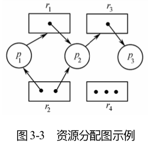
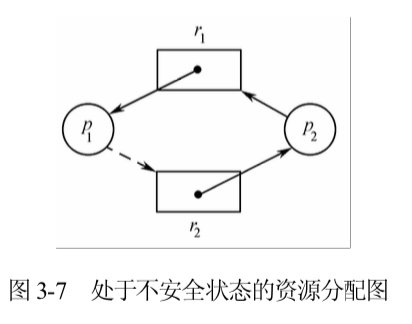

# 死锁

- 死锁：指在一个进程集合中的每个进程都在等待仅由该集合中的另一个进程才能引发的事件而无限期地僵持下去的局面。

- 造成死锁的根本原因：资源有限且操作不当。

- 造成死锁的条件：

  - 互斥条件。某个资源在一段时间内只能由一个进程占有，不能同时被两个及其以上的进程占有。
  - 占有且等待条件。进程至少已经占有一个资源，但又申请新的资源。由于该资源已被另外进程占有，此时该进程阻塞。但是，它在等待新资源时，仍继续占有已分到的资源。
  - 不可抢占条件。一个进程所占有的资源在用完之前，其他进程不能强行夺走该资源，只能由该进程用完之后主动释放。
  - 循环等待条件。存在一个进程等待序列 {P1, P2, ⋯, Pn}，其中每个进程都在等待另一个进程占有的资源，并且这种等待关系形成了环（隐含着前三个条件的结果）。

  只要有一个必要条件不满足，则死锁就可以排除。

- 资源分配图：

  通常用圆圈表示每个进程，用方框表示每种资源类型。pi → rj 称为申请边（进程pi 申请资源 rj），有向边 rj → pi 称为赋给边（rj 赋给 pi）。

  - 在每类资源只有一个的情况下，资源图中的环路就是死锁存在的充要条件。

  - 如果每类资源的实体不止一个，那么资源分配图中出现环路不一定会出现死锁。此时存在环路是死锁存在的必要条件，但不是充分条件。

## 死锁的预防

只要破坏其中一个死锁的必要条件就行了。

#### 1. 破坏互斥条件

#### 2. 破坏占有且等待条件

- 使一个进程无论什么时候都可申请它没有占有的任何其他资源。

  - 预分资源策略，即在一个进程开始执行之前就申请并分到所需的全部资源，从而它在执行过程中就不再需要申请另外的资源。
  - 空手申请资源策略，即每个进程仅在它不占有资源时才可以申请资源。

- 这种方法存在的缺陷是，一个进程在执行之前不可能知道它所需要的全部资源、资源率用率低、降低了进程的并发性、可能出现有的进程总得不到运行机会的饥饿状况。

#### 3. 破坏非抢占条件

- 隐式抢占方式：如果一个进程占有某些资源并且还要申请被别的进程占有的资源，该进程就一定处于等待状态。此时该进程当前所占有的全部资源可被抢占，相当于这些资源隐式地释放了。仅当该进程获得它被剥夺的资源和新申请的资源时，它才能重新启动。

- 该办法常用于资源状态易于保留和恢复的环境中，如 CPU 寄存器和内存空间，但一般不能用于打印机或磁带机之类的资源。

#### 4. 破坏循环等待条件

- 实行资源有序分配策略。即把全部资源事先按类编号然后依序分配，使进程申请、占用资源时不会形成环路（最有效的方法）。

  - 所有进程对资源的申请严格按照序号递增的次序进行，一个进程最初可以申请任何类型的资源比如 ri，此后该进程可以申请一个新资源 rj 仅当 rj > ri 时。

  - 或者一个进程申请资源 rj 时，它应释放所有满足 ri ≥ rj 关系的资源 ri。

## 死锁的避免

- 死锁的预防是静态策略，限制了申请资源，但可能会降低资源利用率和减少系统吞吐量。而死锁的避免是动态策略，它不限制进程有关申请资源的命令，而是对进程所发出的每个申请资源命令加以检查，根据检查结果决定是否进行资源分配。

- 安全序列：系统能够按照某种次序为每个进程分配资源，并且使它们依次成功地运行完毕，例如 {P1, P2,⋯, Pn}（表示进程完成的先后顺序）。若存在一个安全序列，则说明系统的分配状态是安全的（即使在不安全状态也不一定会发生死锁）。

- 当一个进程申请一个可用资源时，系统必须决定是把该资源立即分给它，还是让该进程等待，仅当系统处于安全状态下才能满足其申请。对于不满足申请的进程，可以等待它前面的进程运行完毕后释放所占有的资源，最终获得所需的全部资源便可能满足申请条件了。

### 资源分配图算法

- 在资源分配图上新增一条要求边，pi → rj（用虚线连接）表示进程 pi 以后能够申请到资源 rj。

- 设进程 pi 申请资源 rj，仅当把申请边 pi → rj 转换成赋给边 rj → pi 且不会导致资源分配图中出现环路时，该申请才可实现。安全性检查是由环路检测算法实现的。该算法需要 n2 次操作（ n 为系统中进程个数）。

- 资源分配图算法只适用于单体资源类（系统中某类资源只有一个单位），对于多体资源类需要使用银行家算法。

### 银行家算法

- 设计思想：当用户申请一组资源时，系统必须做出判断。假设把这些资源分出去，系统是否还处于安全状态。若是就可以分出这些资源；否则该申请暂不予满足（要求进程数保持固定不变）。

## 死锁的检测和恢复

#### 对单体资源类的死锁检测

在资源分配图中，去掉表示资源类的节点，且把申请和占用同一个资源的边折叠在一起。检查该等待图是否存在环路。

#### 对多体资源类的死锁检测

类似于银行家算法。任一一个进程分配资源后，是否都会造成其他进程都无法满足它们所需的资源。

- 进行死锁检测的时机：死锁出现的频繁程度、有多少个进程受到死锁的影响。

#### 从死锁中恢复

- 通过抢占资源实现恢复：临时性地把资源从当前占有它的进程那里拿过来，分给另外某些进程直至死锁环路被打破。

  - 能否做到抢占资源，且在不影响原进程执行的情况下返回，取决于资源的属性。

- 通过回退执行实现恢复：定期对系统中各个进程进行检查，并将检查点的有关信息（如进程状态、资源状态等）写入文件，以备重启时使用。当检测到死锁时，就让某个占有 必要资源的进程回退到它取得另外某个资源之前的一个检查点。回退过程所释放的资源分配给一个死锁进程，然后重新启动运行。

- 通过杀掉进程实现恢复：强行终止进程。分为终止所有的死锁进程和一次终止一个进程。

## 饥饿锁和活锁

- 饥饿锁：在可以预计的时间内，某个或某些进程永远得不到完成工作的机会，因为它们所需的资源总是被别的进程占有或抢占。

  - 死锁的进程一定处于阻塞状态，但饥饿锁的进程可以在就绪状态。

  - 可以使用先来先服务的资源分配策略避免饥饿锁。

- 活锁：进程在轮询地等待某个不可能为真的条件为真，导致一直重复尝试、失败、尝试、失败而一直无法完成的过程（可能自行解开）。

  - 活锁也不会被阻塞，并且可以调度运行。