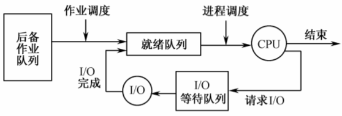
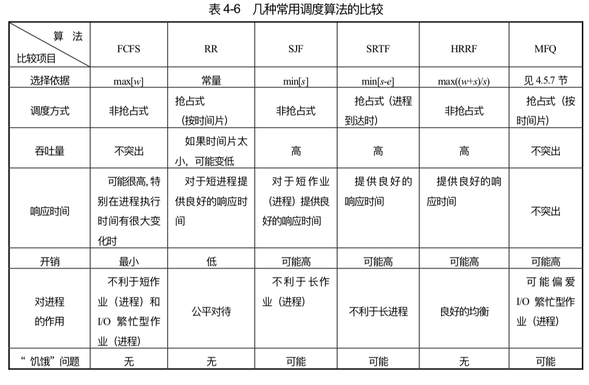

# 调度

## 调度类型

- 一般来说，作业从进入系统到最后完成，可能要经历三级调度：高级调度、中级调度、低级调度。

#### 高级调度 / 作业调度 / 长期调度。

- 根据一定的算法，从输入的一批作业中选出若干作业，分配必要的资源如内存、外设等，为它建立相应的用户作业进程和为其服务的系统进程（如输入输出进程），最后把它们的程序和数据调入内存，等待进程调度程序对其执行调度，并在作业完成后做善后处理工作。

#### 中级调度 / 中期调度

- 在内存使用情况紧张时，将一些暂时不能运行的进程从内存对换到外存上等待。以后当内存有足够的空闲空间时，再将合适的进程重新换入内存，等待进程调度。

- 实际上就是存储管理中的对换功能，用于提高内存的利用率和系统吞吐量。

#### 低级调度 / 进程调度 / 短期调度

- 根据一定的算法，将 CPU 分派给就绪队列中的一个进程（真正决定哪个就绪进程是下一个得以执行的进程）。

- 进程调度程序：执行低级调度功能的程序，由它实现 CPU 在进程间的切换。

## 作业调度

- 作业状态： 在批处理系统中，用户的计算任务是按作业方式进行管理的。作业从提交给系统，直到它完成任务后退出系统前，分为提交、 后备、执行、完成 4 种状态。
  - 提交状态：用户向系统提交一个作业。
  - 后备状态：用户作业经输入设备（如读卡机）送入输入（磁盘）中存放，等待进入内存。
  - 执行状态：作业分配到所需的资源后被调入内存，且在 CPU 上执行相应的程序。
  - 完成状态：作业完成计算任务。

- 作业控制块 JCB：记录作业的有关信息，系统通过 JCB 实行对作业的管理和调度。

- 在磁盘输入中的所有后备作业按作业类型（CPU 型，I/O 型等）组成不同的后备作业队列，由作业调度从中挑选作业，随后放入内存并运行。

- 作业调度的主要任务是完成作业从后备状态到执行状态、从执行状态到完成状态的转换。

- 作业调度的任务：
  - 记录系统中各个作业的情况。
  - 按照某种调度算法从后备作业队列中挑选作业，决定接纳多少个作业进入内存和挑选哪些作业进入内存。
  - 为选中的作业分配内存和外设等资源。
  - 为选中的作业建立相应的进程，并把该进程放入就绪队列中。
  - 作业结束后进行善后处理工作，如输出必要的信息，收回该作业所占用的全部资源，撤消与该作业相关的全部进程和该作业的 JCB。（实际上，内存和外设的分配与释放分别由存储管理程序和设备管理程序完成，通过作业调度程序调用它们来实现）

- 作业调度的时机：
  - 一个作业终止时。
  - CPU 的空转时间超过某个限度时。

## 进程调度

- 进程调度的作用：
  - 保存现场。
  - 挑选进程。
  - 恢复现场。

- 进程调度的时机：
  - 创建进程时。
  - 进程终止时。
  - 等待事件时。
  - 中断发生时。
  - 时间片用完时。

- 进程调度的方式：
  - 非抢占方式。
  - 抢占方式。

#### 两级调度模型

- 作业调度和进程调度是 CPU 主要的两级调度。作业调度是宏观调度，它所选择的作业只具有获得处理机的资格，但尚未占有处理机不能立即投入运行。而进程调度是微观调度，它根据一定的算法动态地把处理机实际地分配给所选择的进程，使之真正活动起来。

- 作业调度和进程调度的区别：
  - 一个基本区别是它们执行的频率不同，进程调度必须相当频繁地为 CPU 选择进程。
  - 作业调度执行的次数很少。作业调度控制程序的道数（即内存中进程的数目），如果系统中作业道数保持不变，那么进入系统的作业的平均到达速率就一定等于离开系统的作业的平均离去速率。
  - 在某些系统中可以没有作业调度。例如在分时系统中，往往没有作业调度程序，而是简单地把每个新进程装入内存，供进程调度程序使用。

## 调度性能准则

- CPU 利用率。
- 吞吐量：表示单位时间内 CPU 完成作业的数量。
- 周转时间：从作业提交到作业完成的时间间隔。周转时间是作业等待进入内存、进程在就绪队列中等待、进程在 CPU 上执行和完成 I/O 操作所花费时间之和。（周转时间通常受到输出设备速度的限制）
  - 平均周转时间：完成 n 个作业的平均周转时间，可以衡量不同调度算法对相同作业流的调度性能。
  - 带权周转时间：用来合理地反映长短作业的差别（因为作业周转时间没有区分作业实际运行时间长短的特性）。带权周转时间 W = T / R（ T 为周转时间，R 为实际运行时间）。
  - 平均带权周转时间：完成 n 个作业的平均带权周转时间，可以比较某种调度算法对不同作业流的调度性能。
- 就绪等待时间：CPU 调度算法并不真正影响作业执行或 I/O 操作的时间数量。各种 CPU 调度算法仅影响作业或进程在就绪队列中所花费的时间数量。
- 响应时间：提交第 1 个请求到产生第 1 个响应所用的时间。

## 调度算法

#### 先来先服务法 FCFS

- 把 CPU 优先分配给最先达到的作业或进程。

- FCFS 调度算法对 CPU 繁忙型作业（需要大量 CPU 时间进行计算的作业）较有利，而不利于 I/O 繁忙型作业（需要频繁请求 I/O 的作业）。

#### 短作业优先法 SJF

- 把 CPU 优先分配给运行时间最短的作业。如果两个进程有相同的估计运行时间，就根据先来先服务法处理。

- 缺点：对长作业很不利。

#### 最短剩余时间优先法 SRTF

- 采用抢占式策略。当新进程加入就绪队列时，如果它需要的运行时间比当前运行的进程所需的剩余时间还短，则强行剥夺 CPU 的控制权，调度该新进程运行。

- 缺点：增加系统开销，如保存进程断点现场、统计进程剩余时间等。

#### 优先级法

- 把 CPU 优先分配给优先级最高的进程。如果在运行过程中，就绪队列中出现优先级更高的进程时，可以选用非抢占式优先级法或者抢占式优先级法。

- 优先级的确定方式：
  - 静态优先级是在创建进程时就确定下来的，而且在进程的整个运行期间保持不变。但可能会造成饥饿锁。
  - 动态优先级是随着进程的推进而不断改变的。解决低优先级进程饥饿锁的一种办法可以是，使系统中等待 CPU 很长时间的进程逐渐提升其优先级。（UNIX 系统中优先数小、优先级高）。

#### 轮转法 RR

- 把所有就绪进程按先入先出的原则排成一个队列，新来的进程则加到就绪队列末尾。每当执行进程调度时，进程调度程序总是选出就绪队列的队首进程，让它在 CPU 上运行一个时间片的时间。用完后系统的计时器发出时钟中断，调度程序便停止该进程的运行，把它放入就绪队列的末尾，之后再分配给队首进程一个时间片时间运行，如此往复。

- 时间片的长短的确定因素：
  - 系统的响应时间。在进程数目一定时，时间片的长短直接正比于系统对响应时间的要求。
  - 就绪队列进程的数目。当系统要求的响应时间一定时，时间片的大小反比于就绪队列中的进程数。
  - 进程的转换时间。若执行进程调度时的转换时间为 t，时间片为 q，应使比值 t / q 不大于某一数值。
  -  CPU 运行指令速度。CPU 运行速度快，则时间片可以短些；反之则应取长些。

#### 多级队列法 MQ

- 把就绪队列划分成几个单独的队列，一般根据进程的某些特性如占用内存大小、进程优先级、进程类型等，永久性地把各个进程分别链入不同的队列中，每个队列都有自己的调度算法。在各个队列之间通常采用固定优先级的抢占式调度。或者各个队列也可以规定时间比例，即每个队列都取得一定的 CPU 时间片段，然后调度本队列中的各个进程。

#### 多级反馈队列法 MFQ

- 实现思想：
  - 系统中设置多个就绪队列，每个队列对应一个优先级，第 1 个队列的优先级最高，以下各个队列的优先级逐个降低。
  - 各就绪队列中进程的运行时间片不同，高优先级队列的时间片小，低优先级队列的时间片大。从高到低 依次加倍。
  - 新进程进入系统后，先放入第 1 个队列的末尾。如某个进程在相应时间片内没有完成工作，则把它转到下一个队列的末尾，直至进入最后一个队列。
  - 系统先运行第 1 个队列中的进程，第 1 个队列为空后，才运行第 2 个队列中的进程，依此类推。

- 也会存在饥饿锁问题，解决办法是提升在低优先级队列中等待了很长时间的进程的优先级。

- 多级反馈队列法是最通用的 CPU 调度算法。

#### 高响应比优先法 HRRF

- 为每个进程计算一个响应比 RR = (w + s) / s = w / s + 1（w 是进程等待处理机所用的时间，相当于等待时间；s 是进程要求的服务时间）。在调度进行时，以各进程的响应比作为其优先级，从中选出级别最高的进程投入运行。

- 利于短作业（进程）。而对于长进程，随着其等待时间的延长，相应的优先级可以上升，从而避免了饥饿锁问题。

#### 公平共享法 FS

- 系统为每个用户分配一定比例的 CPU 时间，然后按照这个比例在各用户之间挑选相应的进程。可以防止不同用户创建的进程数量差别很大，而导致进程数多的用户占用更多 CPU 时间的情况。

## 线程调度

- 用户级线程：核心不负责线程的调度，只调度进程，由进程内部的线程调度程序决定让哪个线程运行。

- 核心级线程：由核心调度线程。

- 用户级线程和核心级线程的主要区别：
  - 性能。用户级线程切换可用机器指令，速度快。而核心级线程切换需要全部上下文切换，因而速度慢。
  - 挂起。核心级线程方式下，一个线程因等待 I/O 而阻塞时，不会挂起整个进程。而用户级线程方式下却会挂起整个进程。

## 多处理器调度

- 多处理器系统的类型：
  - 松散耦合多处理器系统 / 集群系统：每台处理器有自己的内存和 I/O 通道，每台处理器上有自己的操作系统。
  - 主从多处理器系统： 操作系统和它的表格只放在一个称做主控机的处理器上，而其他处理器是从机。主控机控制各从机的工作和执行 I/O 操作，而从机仅运行用户进程，为主控机提供服务。所有的系统调用都重定向到主控机，由它予以处理。
  - 紧密耦合多处理器系统：一组处理器共享一个内存，并且在一个操作系统的集中控制下工作。每个处理器都可控制 I/O 设备或对内存单元进行访问，但任何时候只能有一个处理器正在执行。

- 多处理器系统中的线程调度方式：
  - 负载共享。不把进程分给具体的处理器，系统维护一个全局的就绪线程队列，当某个处理器空闲时，就从该队列中选择一个线程。
  - 成组调度。把一组相关线程作为一个单位同时调到一组处理器上运行，所有成组线程一起开始和结束它们的时间片。
  - 专用处理器分配：当一个进程被调度时，它的每个线程被分配到一个处理器上，在该进程完成之前，处理器由相应的线程专用。
  - 动态调度：允许在进程执行期间动态改变其线程的数目。操作系统的调度职责主要限于处理器的分配。

## 实时调度

- 对于周期性任务，需要满足处理所需的 CPU 时间 ≤ 任务出现的周期（可调度测试公式），系统才能处理这个任务。

- 实时调度算法
  - 优先级随速率单调的调度算法：针对可抢占的周期性进程。为每个进程分配一个固定的优先级，它等于触发事件发生的频度。
  - 最早截止时间优先调度算法：选择截止时间最近的进程运行，如果新进程就绪时，就比较它和当前运行进程的截止时间，新进程的截止时间更近的话就抢占当前运行进程。

## 中断处理

- 中断：CPU 对系统发生的某个事件作出的一种反应，使得 CPU 暂停正在执行的程序，保留现场后自动执行相应的处理程序。

- 中断源：引起中断事件或发出中断请求的来源。

- 中断请求：中断源向 CPU 提出的处理请求。

- 中断向量：中断处理程序的入口地址。

- 实现并发的基础是由硬件和软件结合而成的中断机制。
  - 中断响应：由硬件对中断请求作出反应的过程。
    - 终止当前程序执行。
    - 保存源程序的断点信息。
    - 转到相应的处理程序。
  - 中断处理：中断响应后，由软件即中断处理程序进行相应处理。
    - 保存现场。
    - 分析中断原因。
    - 转入相应的处理程序执行。
    - 恢复现场。

- 中断系统的作用：
  - 提高主机的利用率。
  - 及时进行事故处理。
  - 实现分时操作。通过中断终止已用完时间片的进程。
  - 实现实时操作。
  - 方便程序调试。

- 中断的类型：
  - 中断：由 CPU 以外的事件引起，如 I/O 中断、时钟中断、控制台中断等。中断是异步的，其产生和正在执行的进程无关。
  - 异常：由 CPU 内部的事件或程序执行中的事件引起。分为出错、陷入、可编程异常。出错和陷入的主要区别在于，处理完异常事件返回时，出错会重新执行导致异常的指令，而陷入则不会。

- CPU 在执行完一条指令后，立即检查有无中断请求。如果有的话并且中断允许触发器为 1，则立即响应中断，并把中断允许触发器置为 0（中断响应期间，CPU 不再响应其他的中断请求不管其级别高低）。

- 中断级：把紧迫程度大致相当的中断源归并为一组。每一级可以只有一个中断处理程序。在不同级别的中断同时到达的情况下，级别最高的中断会先被响应，并且高级别的中断可以打断低级别中断。

- 中断屏蔽：提出中断请求后，CPU 不予响应的状态。常常用来处理某个中断时防止同级中断的干扰，或在处理一段必须连续执行的程序时防止意外事件把它打断。（接受中断但不响应）

- 中断禁止：在可引起中断的事件发生时，系统不接受该中断信号。（不接受中断）

- 中断屏蔽的作用：
  - 延迟或禁止对某些中断的响应。
  - 协调中断响应与中断处理的关系。
  - 防止同类中断的相互干扰。

## 信号

- 运行进程当遇到相应事件或出现特定要求时（如进程终止或中途出现错误），就把一个信号写到相应进程的 PCB 信号项里。接受信号的进程在运行过程检测自身是否收到信号，是的话则执行系统规定好的信号处理程序，完成之后再返回继续执行原先的程序。（信号的接受者只能是进程）

- 信号和中断的相同点：
  - 都可以达到同样的功能。
  - 都是异步的。
  - 实现上都采用向量表的方式。中断根据中断向量找到入口地址，信号根据信号号码获取信号处理程序的入口地址。
  - 都有屏蔽手段。

- 信号和中断的不同点：
  - 中断是软硬件结合实现的，信号完全由软件实现。
  - 中断向量表和对应的处理程序都在系统空间中；信号向量表在系统空间中，对应的信号处理程序却在用户空间中。
  - 通常 CPU 接受到中断请求会立即响应，信号的响应要在特定情况下才能进行（如退出中断之前）。