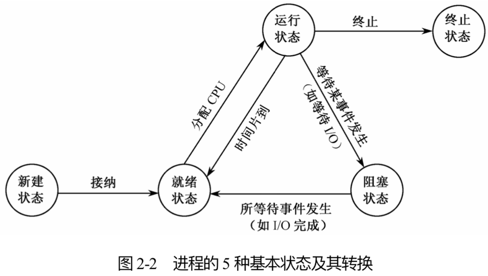

# 进程

---

Win10 上判断某个端口的占用情况并终止其使用：

1. 查看某个端口的使用情况：`netstat -aon | findstr "<pid>"`。或者查看所有端口：`netstat -ano`。

2. 查看某个端口的运行进程：`tasklist | findstr "<pid>"`。

3. 杀死该进程：`taskkill -PID <pid> -F`。

使用场景是：npm 启动某个服务，但端口已经被不知道是哪个应用占据了，此时可以通过查找该端口的占用进程并杀死它来解决。

---

- 进程作为**资源分配**和**调度运行**的单位，具有一定的生命周期，可以并发运行。

  - 资源分配，一个进程有自己的地址空间，其中包括程序、数据、PCB 及其他资源如打开的文件、子进程、未处理的报警、信号、统计信息等。

  - 调度执行，一个进程在执行过程中需要使用一个或多个程序，并且一个进程的执行过程会与其他进程夹在一起。

## 进程状态

- 运行状态：指当前进程正在占用 CPU，它的程序正在处理机上执行时的状态。处于这种状态的进程的个数不能大于 CPU 的数目。

- 就绪状态：指进程已经具备运行条件，但因为其他进程正占用 CPU，使得它暂时不能运行而处在等待分配 CPU 的状态。

- 阻塞状态：指进程因等待某种事件发生（例如等待某个输入、输出操作完成，等待其他进程发来的信号等）而暂时不能运行的状态。

- 新建状态：指进程刚被创建，尚未放入就绪队列时的状态。当新建状态的进程完成所有初始工作（分配一个进程控制块、分配内存空间、对进程控制块初始化等）后就成为了就绪状态。

- 终止状态：指进程完成自己的任务而正常终止时或在运行期间由于出现某些错误和故障（比如地址越界、使用非法指令）而被迫终止时所处的状态。处于终止状态的进程不能再被调度执行。

## 进程组成

- 进程映像：由程序、数据集合、进程描述栈（用来保存过程调用和相互传送参数的踪迹）、PCB 等 4 部分组成。

- 进程控制块 PCB：包含有进程的描述信息和控制信息，是进程动态特性的集中反映，也是系统识别和控制进程的依据。

  - 组成：
    - 进程名。唯一的标志对应进程的一个标志符或数字。有的系统用进程标识符作为进程的外部标志，用进程标识号 PID作为进程的内部标志。
    - 特征信息。包括是系统进程还是用户进程，进程实体是否常驻内存等信息。
    - 进程状态信息。表明该进程的执行状态，是运行状态、就绪状态还是阻塞状态。
    - 调度优先权。表示进程获取 CPU 的优先级别。当多个就绪进程竞争 CPU 时，系统一般让优先权高的进程先占用 CPU。
    - 通信信息。反映该进程与哪些进程有什么样的通信关系，如等待哪个进程的信号等。
    - 现场保护区。当对应进程由于某种原因放弃使用 CPU 时，需要把它的一部分与运行环境有关的信息保存起来，以便在重新获得 CPU 后恢复正常运行。通常被保护的信息有程序计数器、程序状态字、各工作寄存器的内容等。
    - 资源需求、分配和控制方面的信息，如进程所需要或占有的 I/O 设备、磁盘空间、数据区等。
    - 进程实体信息。指出该进程的程序和数据的存储情况，在内存或外存的地址、大小等。 
    - 族系关系。反映父子进程的隶属关系。
    - 其他信息。如文件信息、工作单元等。

  - 作用：
    - 标记唯一的进程。
    - 操作系统根据 PCB 控制和管理进程。
    - 进程的动态、并发等特征是利用 PCB 表现出来的。

- 进程队列：为了对所有进程进行有效的管理，所以将各个进程的 PCB 以某种方式组织起来，有线性方式、链接方式、索引方式。

  - 线性方式：因为需要预先确定整个系统中同时存在的进程的最大数目，所以限定了系统中同时存在的进程的最大数目。而且每次寻找进程都要对整个线性队列进行扫描，降低了调度效率。（简单）
  
  - 链接方式：按照各进程的不同状态分别将它们的 PCB 放在不同 的队列中。（灵活）

  - 索引方式：利用索引表记载不同状态进程的 PCB 地址。（速度快）

## 进程管理

#### 进程创建

- 进程派生：由一个应用进程派生出另一个进程，后者接收前者生成的数据。派生之后，新进程和老进程并发运行，或者父进程等待它的某个或全部子进程终止。

- 创建步骤：
  - 申请一个空闲的 PCB。
  - 为新进程分配资源。
  - 将新进程的 PCB 初始化。包括父进程标识符、处理机初始状态、进程优先级、本进程开始地址等。
  - 将新进程加到就绪队列中。
  
  建立子进程的地址空间时，要么子进程复制父进程的地址空间，要么把程序装入子进程的地址空间。

- 父进程利用 fork 系统调用来创建新进程，父进程和子进程都可以继续执行 fork 系统调用之后的指令。但有一个差别，fork 的返回值（即子进程的 PID）等于 0 时表示子进程在执行；不等于 0 时表示父进程在执行（PID 不可能为负数，如果小于 0 则表示出现错误）。

#### 进程终止

- 终止原因：
  - 正常终止，进程完成任务后使用 exit 系统调用。
  - 异常终止，比如运行超时、内存不足、地址越界、保护错误、算术运算错误、等待超时、I/O 故障、非法指令、特权指令、数据不可用。
  - 外部干扰，出现死锁、父进程终止（父进程终止时自动终止它所有的子孙进程）、父进程要求终止子孙进程。

- 终止步骤：
  - 从系统的 PCB 表中找到指定进程的 PCB。若它正处于运行状态，则立即终止该进程的运行。
  - 回收该进程所占用的全部资源。
  - 若该进程有子孙进程，则还要终止其所有子孙进程，回收它们所占用的全部资源。
  - 将被终止进程的 PCB 从原来队列中摘走，以后由父进程从中获取数据并释放它。

#### 进程阻塞

- 阻塞原因：正在运行的进程因为提出的服务请求如 I/O 未被操作系统立即满足，或者所需数据尚未到达等原因，只能转变为阻塞状态，等待相应事件出现后再把它唤醒。

- 阻塞步骤：
  - 立即停止当前进程的执行。
  - 将现行进程的 CPU 现场送到该进程的 PCB 现场保护区中保存起来，以便重新运行时恢复此时的现场。
  - 把该进程 PCB 中的现行状态由运行改为阻塞，把该进程插到具有相同事件的阻塞队列中。
  - 转到进程调度程序，重新从就绪队列中挑选一个合适进程投入运行。

#### 进程唤醒

- 由与阻塞进程相关的进程如完成 I/O 操作的进程调用系统原语 wakeup（唤醒在同一原因上睡眠的所有进程）唤醒阻塞进程，阻塞进程不能唤醒自己。

- 唤醒步骤：
  - 把阻塞进程从相应的阻塞队列中摘下。
  - 将现行状态改为就绪状态，然后把该进程插入就绪队列中。
  - 如果被唤醒的进程比当前运行进程的优先级更高，则设置重新调度标志。

## 线程

- 进程只作为资源拥有者，把调度和运行功能赋予线程，也就是线程是进程中实施调度和分派的基本单位。

- 线程的组成：使用线程控制块保存自身的私有信息，包括：
  - 线程标识符。
  - 调度状态信息，描述处理器工作情况的一组寄存器（如程序计数器、状态寄存器、通用寄存器等）的内容。
  - 核心栈指针（线程在核心态下运行时使用）。
  - 用户栈指针（线程在用户态下运行时使用）。
  - 私有存储区，存放现场保护信息和其他与该线程相关的统计信息等。

- 线程和进程的区别：
  - 一个进程可以包含一个或多个线程，而且一个线程只能在一个进程的地址空间内活动（进程有自己独立的地址空间，而线程没有，线程必须依赖于进程而存在。）。
  - 一个程序至少有一个进程，一个进程至少有一个线程。
  - 进程是资源分配的单位，线程是执行的单位（处理机分配给线程，即真正在处理机上运行的是线程）。
  - 线程上下文切换比进程上下文切换要快得多，进程间切换消耗的资源更大。
  - 同一进程的线程除自己私有的少量资源外，要共享所属进程的全部资源。
  - 同个进程下的线程之间通信更方便，因为它们共享所属进程的信息。而进程的通信则需要借助其他方法才行。

- 引入线程的好处：
  - 易于调度。进程在创建、阻塞、恢复时都要付出较大的时空开销，比如创建时要提供环境分配空间、阻塞和恢复时要保存和复原环境。而因为多个线程共享一个进程的资源，所以易于切换，可以轻装运行。
  - 提高并发性。进程可创建多个线程来执行同一个进程中的多个程序（比如说在浏览器中既可以浏览网页也可以下载文件也可以播放音频）。
  - 开销少。创建线程比创建进程要快。
  - 利于充分发挥多处理器的功能。通过创建具有多线程的进程，并让每个线程各在一个处理器上运行，从而实现应用程序的并发性，使每个处理器都得到充分运行。

## 进程同步和互斥

- 同步：进程通过共享资源来协调活动，在执行时间的次序上有一定约束。虽然彼此不直接知道对方的名字，但知道对方的存在和作用。

- 异步：逻辑上相互无关的两个或多个进程由于争用同一资源而发生的相互制约关系，不知道彼此的存在。

- 临界资源：一次仅允许一个进程使用的共享资源，如打印机和磁带机等。

- 临界区：在每个进程中访问临界资源的那段程序。处于临界区的进程最多只能有 1 个。

- 解决进程互斥进入临界区的方法：
  - 利用硬件方法
    - 禁止中断：使每个进程在进入临界区之后立即关闭所有的中断，在它离开临界区之前才重新开放中断。因为在时钟中断或其他中断出现时才会发生 CPU 切换（从一个进程切换到另一个进程）。但对于多处理器的计算机系统，因为关闭中断仅对执行本指令的 CPU 起作用，而其他 CPU 照常运行，也就不能保障对临界区的互斥进入。
    - 专用机器指令：使用 TSL 指令（测试并上锁）把内存字 LOCK 的内容读到寄存器 RX 中，然后在该地址单元中存入一个非零值。读数和存数的操作是不可分割的，即在这条指令完成之前，其他进程不能访问该单元。如果前面已有一 个进程进入临界区，则后者就不断利用 TSL 指令进行测试并等待前者开锁（忙式等待）。

  - 使用原语。
    - 原语：为完成某些特定的功能而编制的一段系统程序。所有动作要么全做，要么全不做。执行原语操作时，要屏蔽中断。
    - 使用 P 和 V 操作。

  - 解决进程互斥问题。例如置锁变量方法。

#### 信号量：解决进程同步、互斥问题的更通用的工具。

- 整型信号量
  - 将信号量定义为一个共享的整型量，它保存可供使用的唤醒数目。如果信号量的值为 0，表示没有保存唤醒。如果它的值大于 0，表示有一个或多个保留的唤醒。
  - 使用 P 和 V 两个操作来访问信号量。P 操作表示测试，V 操作表示增加。
  - P(S)测试信号量 S 的值。如果大于 0，则 S 的值减 1 并且程序向下执行，否则循环测试。V(S)只是简单地把 S 的值加 1。
  - 在 P 或 V 操作完成或阻塞之前其他进程不能访问该信号量。
  - 当一个进程处于临界区时，其他试图进入临界区的进程必须在入口处持续进行测试，这种忙式等待会消耗 CPU 时间。

- 结构性信号量 / 计数信号量
  - 由信号量和一个指针构成。当多个进程都等待同一个信号量时，它们就排成一个队列，由信号量的指针项指向该队列的队首，而 PCB 队列是通过 PCB 自身所包含的指针项进行链接的（最后一个 PCB(即队尾)的链接指针为 0）。
  - 信号量的值大于 0 时，表示当前可用资源的数量。当它的值小于 0 时，其绝对值表示等待使用该资源的进程个数，即在该信号量队列上排队的 PCB 的个数。
  - 信号量的值只能由 P 和 V 操作来修改。
  - 信号量 S > 0 时，S 值表示可用资源的数量。执行一次 P 操作相当于请求分配一个单位资源，而执行一次 V 操作意味着释放一个单位资源。
  - P 和 V 操作本身就是临界区。

#### 管程：用来解决进程互斥（利用信号量需要安排 P 操作的出现顺序，否则可能会出现死锁）。

- 一个管程定义一个数据结构和能为并发进程在其上执行的一组操作，这组操作能使进程同步和改变管程中的数据。
- 特性：
  - 管程内部的局部数据变量只能被管程内定义的过程所访问，不能被管程外面声明的过程直接访问。
  - 进程要想进入管程，必须调用管程内的某个过程。
  - 一次只能有一个进程在管程内执行，而其余调用该管程的进程都被挂起，等待该管程成为可用的。

## 进程通信 IPC

1. **共享内存方式**：在内存中分配一片空间作为共享内存区。需要进行通信的各个进程把共享内存区映射到自己的地址空间中，之后就可以对共享内存区中的数据直接进行读或写。这种方式的通信效率更高，但需要依靠某种同步机制如信号量来避免同时读写的问题。

2. **消息队列方式**：以消息为单位在进程间进行数据交换。分为两种方式：
  - 直接通信方式：发送进程直接将消息挂在接收进程的消息缓冲队列上，接收进程从消息缓冲队列中得到消息。
  - 间接通信方式 / 信箱通信：发送进程将消息送到称做信箱的中间设施中，接收进程从信箱中取得消息。

3. **管道文件方式**：管道文件也称管道线，它是连接两个命令的一个打开文件。一个命令向该文件中写入数据，另一个命令从该文件中读出数据（但它不属于某一个文件系统，是一种特殊的文件相当于缓冲区）。读写方式类似于队列。
  - 匿名管道：一种半双工的通信方式，数据只能单向流动（双方通信时需要建立起两个管道），而且只能在具有亲缘关系的进程间使用。进程的亲缘关系通常是指父子进程关系。
  - 有名管道：也是半双工的通信方式，但是它允许无亲缘关系进程间的通信（通过提供进程的路径名来实现）。

4. **远程过程调用 RPC**：允许程序调用另外机器上的进程。当机器 A 的一个客户进程或线程调用机器 B 上的一个进程时，A 上的调用进程挂起，被调用进程在 B 上开始执行。调用者以参数形式把信息传送给被调用者（通过 RPC 的超时重传软件），被调用者把进程执行结果回送给调用者。

5. **套接字**：可用于不同计算机间的进程通信，相当于端口和端口之间的通信。

6. **信号**：通过信号的方式将信息发送给某一个进程，用于通知接受进程某个事件已经发生。信号是软件层次上对中断机制的一种模拟，是一种异步通信方式。信号可以在用户空间进程和内核之间直接交互，内核可以利用信号来通知用户空间的进程发生了哪些系统事件，信号事件主要有两个来源：
  - 硬件来源：用户按键输入 Ctrl+C 退出、硬件异常如无效的存储访问等。
  - 软件终止：终止进程信号、其他进程调用 kill 函数、软件异常产生信号。

7. **信号量**：相当于一个计数器。信号量可以用来控制多个进程对共享资源的访问，实现进程间的互斥与同步。基于操作系统的 P V 操作，对信号量进行加 1 或减 1。

#### 消息传递系统

- 优点：不必借助于共享数据就可以进行通信（并且也可以使用于多 CPU 系统）。
- 使用到的两个原语：`send (destination, message)` 和 `receive (source, message)`。
- 涉及到的问题：
  - 同步：发送进程和接受进程需要同步。在一个进程发送消息之前，接收进程不能接收消息。
  - 寻址：
    - 直接通信：
      - 对称寻址：进行通信的每一方都必须显式地指明消息接收方或发送方是谁。
      - 非对称寻址：只有发送方知道接收方的名字，而接收方不必知道发送方的名字。
    - 间接通信：发送方把消息发送到一个共享的数据结构中，该结构由临时存放消息的队列组成，通常称做**信箱**（有唯一的标识）或者**端口**。发送方把消息送到信箱后，接收方从信箱中取走消息。
      - 公用信箱：由操作系统创建。所有进程都可以向公用信箱发送消息，也可以取出发送给自己的消息。
      - 共享信箱：由某个进程创建。对它要指明共享属性及共享进程的名字，信箱的创建者和共享者都可从中取走发给自己的消息。
      - 私有信箱：用户进程为自己创建的信箱。创建者有权从中读取消息，而其他进程只能把消息发送到该信箱中。
