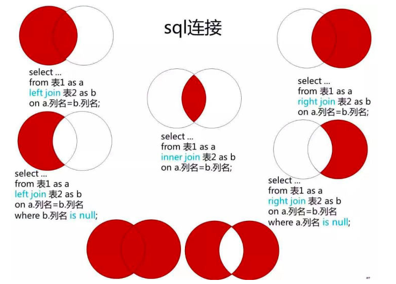

# MySQL 基本使用

## 常用操作

#### 查看数据库状态

`service mysqld status`

#### 重启数据库

`service mysqld restart`

#### 启动数据库

在安装 MySQL 目录下 bin 文件夹里运行 `net stat mysq` 启动，对应的关闭命令是 `net stop mysql`。

#### 连接 MySQL

`mysql -h 主机名 -P 端口号 -u 用户名 -p -D 数据库名`

参数说明：

- -h：指定客户端所要登录的 MySQL 主机名，登录本机 localhost 或 127.0.0.1 时该参数可以省略。
- -P：表示要连接的端口号。
- -u：登录的用户名。
- -p：表示使用一个密码来登录，如果所要登录的用户名密码为空，可以忽略此选项。
- -D：表示要登录进哪个数据库。

也可以简化成 `mysql -u 用户名 -p`。

如果提示报 `command not found: mysql` 的错误，试试运行 `source ~/.bash_profile` 命令再看看。

#### 创建用户

`create user 用户名@'主机' identified by '密码'`

注意引号不能省略，如果只是访问本地数据库的话，主机则为 localhost。

#### 修改账号密码

`alter user '<用户名>'@'<主机/localhost>' identified by '<新密码>'`

#### 查看所有用户列表

使用 root 账号登录后，`select user, host from mysql.user`

#### 授权

`grant all privileges on 数据库名.* to '用户名'@'%'`

参数说明：

- all 代表所有权限，也可以具体写成增删改查等权限。

- % 代表所有 IP 都能访问，也可以更改为某个 IP 才能访问。

#### 创建数据库

`create database 数据库名`

#### 删除数据库

`drop database 数据库名`

#### 查看所有的数据库

`show databases`

#### 使用指定的数据库

`use 数据库名` 

#### 创建表

`CREATE TABLE table_name (column_name column_type)`

#### 查看所有的数据表

`show tables`

#### 删除表

`DROP TABLE table_name`

#### 修改表名

`alter table 旧表名 rename to 新表名`

#### 插入数据

`INSERT INTO table_name (field1, field2,...fieldN) VALUES (value1, value2,...valueN)`

#### 查询数据

`SELECT * FROM table_name [WHERE Clause] [OFFSET M] [LIMIT N]`

参数说明：

- 使用 * 来代替列名，SELECT 语句会返回表的所有字段数据。
- 使用 WHERE 语句来指定筛选条件。
- 使用 OFFSET 指定 SELECT 语句开始查询的数据偏移量，默认情况下偏移量为 0，通常用于列表分页查找。
- 使用 LIMIT 指定返回的数据总量。如果只传了一个参数 `LIMIT n`，则相当于是 `LIMIT 0 n`。

#### 修改数据

`UPDATE table_name SET field1=new-value1, field2=new-value2 [WHERE Clause]`

#### 删除数据

`DELETE FROM table_name [WHERE Clause]`

#### 所有数据表所有的列

1. `show columns from 数据表名`

2. `describe 数据表名` 或 `desc 数据表名`

#### 增加列

`alter table <表名> add column <列名> varchar(30)`

设置默认值:

`alter table <表名> add column <列名> varchar(30) not null default ''`

#### 删除列

`alter table 表名 drop column 列名`


#### 导入数据库

`source sql文件路径`

注意点：

1. 要导入的 sql 文件路径不能用 `\`，得用 `/`。

2. 导入过程如果报 `source  unknown command \\` 错误，可能是编码问题，解决方法是，在登录数据库时就指定编码为 utf-8，`mysql -u 用户名 -p --default-character-set=utf8`


#### 内连接/等值连接

获取两个表中指定字段相匹配的记录。相当于取两个表中指定字段的交集。

```sql
SELECT a.runoob_id, a.runoob_author, b.runoob_count
FROM runoob_tbl a INNER JOIN tcount_tbl b
ON a.runoob_author = b.runoob_author
```

等价于 `SELECT a.runoob_id, a.runoob_author, b.runoob_count FROM runoob_tbl a, tcount_tbl b WHERE a.runoob_author = b.runoob_author`

#### 左连接

除了获取等值连接的数据外，还会获取所有左数据表的数据。如果右数据表没有和它匹配的对应数据项（即不等值），则该数据项仍会获取到，但对应字段值会为 null。

```sql
SELECT a.runoob_id, a.runoob_author, b.runoob_count
FROM runoob_tbl a LEFT JOIN tcount_tbl b
ON a.runoob_author = b.runoob_author
```

#### 右连接

除了获取等值连接的数据外，还会获取所有右数据表的数据，即使在左数据表中没有和它匹配的对应数据。

```sql
SELECT a.runoob_id, a.runoob_author, b.runoob_count
FROM runoob_tbl a RIGHT JOIN tcount_tbl b
ON a.runoob_author = b.runoob_author;
```




## 子句

#### where 子句

- WHERE 子句的字符串比较默认是不区分大小写的，可以使用 **BINARY** 关键字来使其区分大小写。`SELECT * from table_name WHERE BINARY column_name='xxx'`

#### like

LIKE 通常与 % 一同使用，相当于查找包含某个子串的值。如下例相当于查找值中包含有 com 这个子串的 field 字段。

`SELECT field FROM table_name WHERE field LIKE '%com'`

或者也可以使用正则表达式来指定匹配条件。

`SELECT field FROM table_name WHERE field REGEXP 'com$'`

#### ORDER BY

根据指定的字段按升序或降序排列好后再返回结果，默认是升序 ASC。

`SELECT field1, field2 FROM table_name1, table_name2 ORDER BY field1 ASC [DESC]`

#### not in

选择不再某个表里出现过的字段。

```sql
select Name from A 
where Id not in (
  select Id from B
) ;
```

## 操作符

#### union

连接两个及以上的 SELECT 语句的结果组合到一个结果集合中。使用 DISTINCT 时会删除重复的数据（默认），使用 ALL 则会保留重复数据。

```sql
SELECT expression1 FROM tables [WHERE conditions]
UNION [ALL | DISTINCT]
SELECT expression2 FROM tables [WHERE conditions]
```

#### distinct

用于对选择出来的数据进行去重。

`select distinct name from Person`

#### alert

用于修改数据表名或者修改数据表字段。

- 删除列。`ALTER TABLE table_name DROP field`

- 新增列。`ALTER TABLE table_name ADD field INT`

- 修改字段类型。`ALTER TABLE table_name MODIFY field CHAR(10)`

或 `ALTER TABLE table_name CHANGE field newFieldName INT`


## Null

1. 无法直接使用 = 或 !=  来查找 Null 值，需要使用 `IS NULL` 或 `IS NOT NULL`。

2. `<=>` 表示比较的两个值都为 Null 或相等时返回 true。

3. NULL 值与任何其它值的比较（即使是 NULL）永远返回 NULL，即 NULL = NULL 返回 NULL 。
