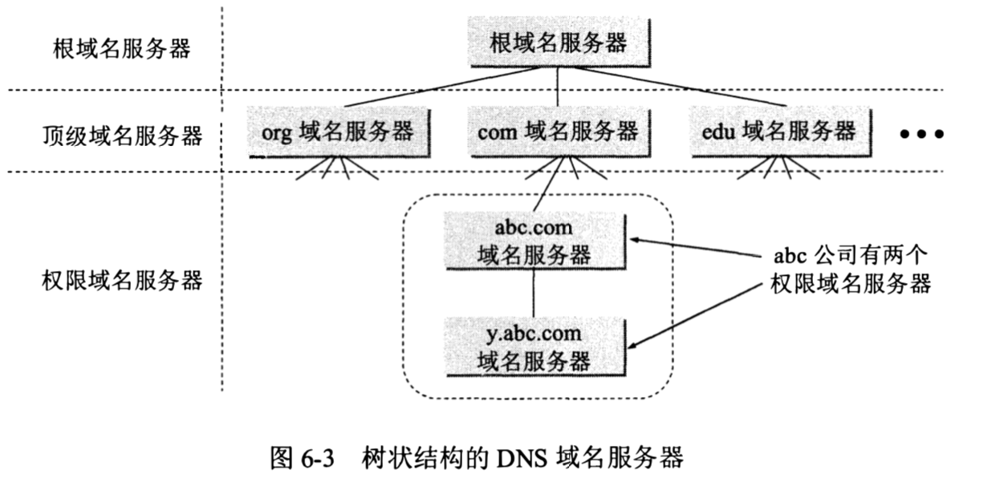
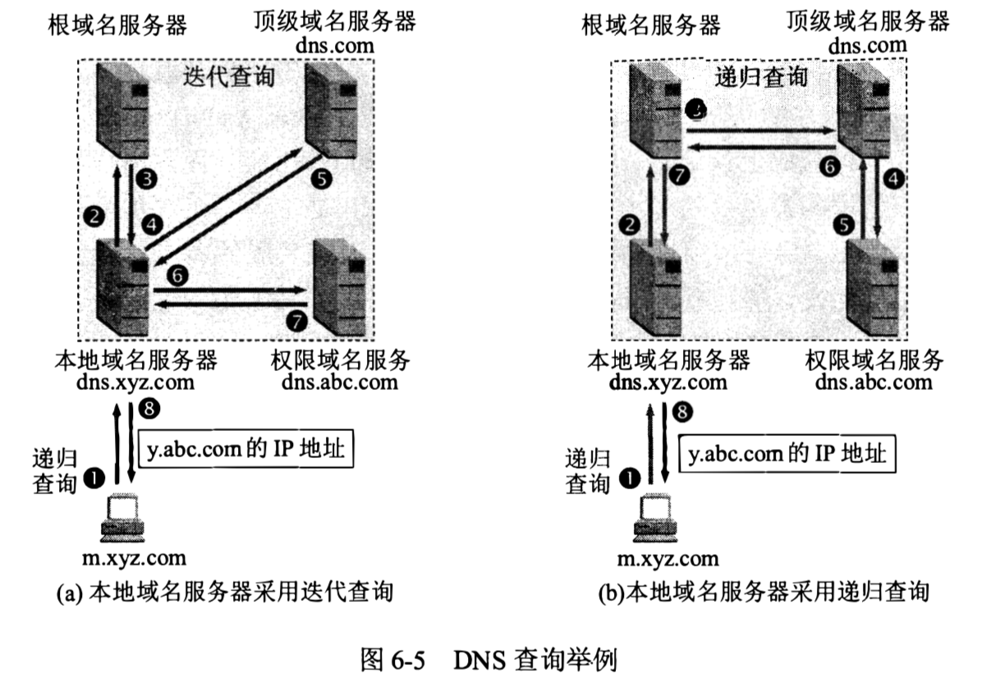
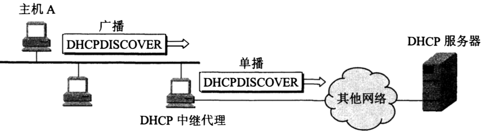
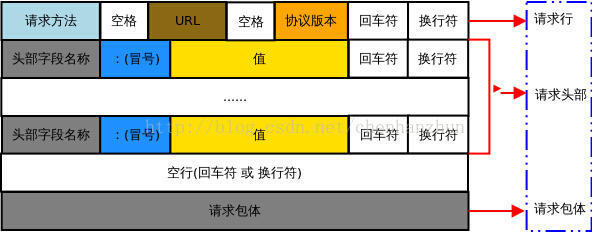

# 应用层

## 域名系统 DNS

- 处理 IP 数据报时为什么不直接使用域名：

  - IP 地址的长度是固定的 32 位或 128 位，而域名的长度并不是固定的。

  - 机器更适合于处理数字。

- DNS 请求报文使用 UDP。

### 域名结构

- 级别最低的域名写在最左边，而级别最高的顶级域名则写在最右边。例如 dangosky.com 是 二级域名.顶级域名的结构。

- 由多个标号组成的完整域名总共不超过 255 个字符。 

- 各级域名由其上一级的域名管理机构管理。

### 域名服务器

- 区：一个服务器所负责管辖的范围，一个区中的所有节点必须是能够连通的。DNS 服务器的管辖范围以区为单位，域 ≥ 区。

- 四种域名服务器：

  - 根域名服务器：最高层次的域名服务器，所有根域名服务器都知道所有的顶级域名服务器的域名和 IP 地址。

    - 根域名服务器采用了**任播**技术，因此当 DNS 客户向某个根域名服务器的 IP 地址发出查询报文时，互联网上的路由器就能找到离这个 DNS 客户最近的一个根域名服务器。这样做不仅加快了 DNS 的查询过程，也更加合理地利用了互联网的资源。

    - 在许多情况下，根域名服务器并不直接把待查询的域名直接转换成 IP 地址（根域名服务器也没有存放这种信息），而是告诉本地域名服务器下一步应当找哪一个顶级域名服务器进行查询。

  - 顶级域名服务器：负责管理在该顶级域名服务器注册的所有二级域名。

  - 权限域名服务器：用来保存该区中的所有主机的域名到 IP 地址的映射。当一个权限域名服务器不能给出最后的查询回答时，就会告诉发出查询请求的 DNS 客户，下一步应当找哪一个权限域名服务器。

  - 本地域名服务器 / 默认域名服务器：当一台主机发出 DNS 查询请求时，这个查询请求报文会首先发送给本地域名服务器。

- 为了提高域名服务器的可靠性，DNS 域名服务器都把数据复制到几个域名服务器来保存，其中一个是主域名服务器，其他的都是辅助域名服务器。当主域名服务器出故障时，辅助域名服务器可以保证 DNS 的查询工作不会中断。主域名服务器定期把数据复制到辅助域名服务器中，而更改数据只能在主域名服务器中进行，这样就保证了数据的一致性。

### DNS 劫持

- DNS 劫持又被称为域名劫持或 DNS 重定向，是一种 DNS 攻击方式。即 DNS 解析结果被劫持，导致用户拿到错误的 ip 地址，从而可能访问到恶意的网站，用户隐私被窃取，或者进行某些恶意的操作。

- DNS 劫持的方法
  - 本机 DNS 劫持。攻击者通过某些手段使用户的计算机感染上木马病毒或者恶意软件，之后再恶意修改本地 DNS 配置如本地 hosts 文件、缓存等。
  - 路由 DNS 劫持。攻击者入侵到路由管理员账号中，修改路由器的默认配置。
  - 攻击 DNS 服务器。攻击者直接攻击 DNS 服务器，例如对 DNS 服务器进行 DDOS 攻击使 DNS 服务器宕机出现异常请求，还可以利用某些手段感染 DNS 服务器的缓存，使给用户返回来的是恶意的 IP 地址。

- DNS 劫持防护
  - 加强本地计算机病毒检查，开启防火墙等，防止恶意软件、木马病毒感染计算机。
  - 增加路由器密码安全性，防止攻击者修改路由器的 DNS 配置。

#### Http 劫持

在路由器上设置协议检测，一旦发现是 HTTP 请求并且是 HTML 类型请求，则拦截处理。后续可以返回 302 跳转到另外的地址，或者在服务器返回的 HTML 数据中插入 DOM 节点也就是插入广告。

### 域名解析过程

- 递归查询和迭代查询：

  - 递归查询：一般是主机向本地域名服务器的查询。如果主机所询问的本地域名服务器不知道被查询域名的 IP 地址，那么本地域名服务器就以 DNS 客户的身份向其他根域名服务器继续发出查询请求报文，而不是让该主机自已进行下一步的查询。因此，递归查询返回的查询结果或者是所要查询的IP地址，或者是报错表示无法查询到所需的 IP 地址。（帮你查询完毕后直接告诉你目标的 IP 地址）

  - 迭代查询：一般是本地域名服务器向根域名服务器的查询。当根域名服务器收到本地域名服务器发出的迭代查询请求报文时，要么给出所要查询的 IP 地址，要么告诉本地域名服务器下一步应当向哪一个域名服务器进行查询，而不是替本地域名服务器进行后续的查询。（只告诉你下一步要向哪个域名服务器查询）

- 高速缓存：

  - 为了提高 DNS 查询效率，并减轻根域名服务器的负荷和减少互联网上的 DNS 查询报文数量，在域名服务器中广泛地使用了高速缓存。高速缓存用来存放最近查询过的域名以及从何处获得域名映射信息的记录，比如对应的顶级域名服务器或权限域名服务器的 IP 地址，这样就可以直接向相应的域名服务器查询了而不用按部就班一个个域名服务器查询过去。

  - 主机也使用高速缓存，维护存放自己最近使用的域名，只有在从缓存中找不到时才使用域名服务器。

  - 高速缓存的每项内容都设置一个计时器，到期后需要重新查询。

**查询过程总结**

应用进程发起解析 -> 主机高速缓存 -> 发 DNS 请求报文给本地域名服务器 -> 根域名服务器 -> 顶级域名服务器 -> 权限域名服务器（查询域名服务器前都先看自身有没有缓存）。

## 动态主机配置协议 DHCP

- 即插即用连网。自动配置计算机的 IP 地址、子网掩码、默认路由器的 IP 地址和域名服务器的 IP 地址等。

- 需要 IP 地址的主机在启动时就向 DHCP 服务器广播发送发现报文（将目的 IP 地址置为 255.255.255.255)。发送广播报文是因为现在还不知道 DHCP 服务器在什么地方，因此要发现 DHCP 服务器的 IP 地址。这台主机目前还没有自己的 IP 地址，因此将 IP 数据报的源 IP 地址设为全 0。这样在本地网络上的所有主机都能够收到这个广播报文，但只有 DHCP 服务器才对此广播报文进行回答。DHCP 服务器先在其数据库中查找该计算机的配置信息。若找到的话则返回找到的信息。否则从服务器的 IP 地址池中取一个地址分配给该计算机。

- 为了避免在每一个网络上都设置一个 DHCP 服务器，因此使每一个网络至少有一个 DHCP 中继代理（通常是一台路由器），它配置了 DHCP 服务器的 IP 地址信息。当 DHCP 中继代理收到主机以广播形式发送的发现报文后，就以单播方式向 DHCP 服务器转发此报文并等待其回答。收到 DHCP 服务器回答的提供报文后，DHCP 中继代理再把此提供报文发回给请求主机（DHCP 报文使用 UDP）。

## HTTP

- 使用 HTTP/1.0 请求一个万维网文档所需的时间是：该文档的传输时间（与文档大小成正比）+ 2 * RTT (一个 RTT 用于建立 TCP 连接，另一个 RTT 用于请求和接收万维网文档。第三次握手时可以把 HTTP 请求报文做为报文数据发送给服务器）。

- HTTP/1.1 使用长连接可以保持浏览器和该服务器的连接。HTTP/1.1 有两种工作方式：

  - 非流水线方式：浏览器在收到前一个响应后才能发出下一个请求。

  - 流水线方式：浏览器在收到 HTTP 的响应报文之前就能够接着发送新的请求报文。

#### 幂等

- 幂等是指同一个请求方法执行多次和仅执行一次的效果完全相同。

- 按照 RFC 规范，PUT、DELETE 等方法都是幂等的。虽说是规范，但服务端实现是否幂等是无法确保的。

- 引入幂等主要是为了处理同一个请求重复发送的情况，比如在请求响应前失去连接，如果方法是幂等的就可以放心地重发一次请求。这也是浏览器在后退和刷新时遇到 POST 会给用户提示的原因，POST 不是幂等的，重复请求可能会带来意想不到的后果。

### 请求报文

- 仅有 POST、PUT、PATCH 这三种方法的请求报文会包含请求体，GET、HEAD、DELETE、CONNECT、TRACE、OPTIONS 都不包含请求体。

#### 请求头

- Date：请求发送的日期和时间。

- User-Agent：包含发出请求的用户信息，例如 User-Agent: Mozilla/5.0 (Linux; X11)。

- Accept：浏览器能够接受的响应类型，如纯文本数据或图片。

- Accept-Charset：浏览器可接受的字符集。

- Content-Type：客户端发送的数据类型。
 
- Content-Encoding：客户端采用的请求体压缩方式。比如 gzip、deflate、br 等。

- Content-Language：客户端支持的语言类型，主要用来做国际化。

- Content-Length：表示请求消息正文的长度。对于 POST 请求来说，必须携带 Content-Length 请求头。对于不定长的请求，则需要使用 `Transfer-Encoding: chunked` 来分块传输数据，此时 Content-Length 字段会被忽略。

- Host：访问的主机名。Host 指定请求资源的 Intenet 主机和端口号，表示请求 url 的原始服务器或网关的位置。HTTP/1.1 请求必须包含主机头域，否则系统会以 400 状态码返回。

- If-Modified-Since：告诉服务器资源的缓存时间。如果请求的部分在指定时间之后被修改则请求成功，未被修改则返回 304 Not Modified 应答。

- If-None-Match：如果内容未改变返回 304，参数为服务器先前发送的 Etag，与服务器回应的 Etag 比较判断是否改变。

- Expires：设置绝对缓存时间，时间字符串。（使用于 http1.0）

- Cache-Control：设置相对缓存时间，max-age。（使用于 http1.1，优先级比 Expires 高）

- Referer：值为一个 URL，告诉服务器它是从哪个连接来访问当前的请求页面的。

- Connection：处理完这次请求后是否断开连接还是继续保持连接。如果值为 Keep-Alive 或者使用的是 HTTP 1.1，则会开启长连接。

- Range：请求指定范围内的数据。可以用于下载等。

- Pragma：形式唯一为 Pragma: no-cache。只用在客户端发送的请求中，要求所有中间服务器不返回缓存的资源。

### 响应报文

#### 响应头

- Date：响应的时间。

- ETag：标志请求的服务端资源是否发生了变化。

- Set-Cookie：设置客户端的 Cookie。

- Allow：服务器支持哪些请求方法。

- Accept：服务器可以接收的数据类型。

- Accept-Encoding：服务器可以接收的压缩方式。

- Accept-Language：服务器可以接收的语言类型。

- Accept-Charset：服务器可以接收的字符类型，比如 UTF-8。客户端没有对应的请求头，所以客户端发送的字符类型是写在 Content-Type 字段里的。

- Content-Type：表示后面的文档属于什么 MIME 类型。Servlet 默认为 text/plain，但通常需要显式地指定为 text/html。

- Expires：告诉浏览器把回送的资源缓存多长时间，-1 或 0 则是不缓存。

- Last-Modified：文档的最后改动时间（和请求报文中的 If-Modified-Since 联系起来）。

- Location：配合 302 状态码使用，用于重定向到一个新 URI 地址。

### 状态码

#### 1xx

信息性状态码，表示服务器已接收了客户端请求，客户端可继续发送请求。

#### 2xx

成功状态码，表示服务器已成功接收到请求并进行处理。

- 200 OK：请求被正常处理。

- 201	Created：已创建。成功请求并创建了新的资源。

- 202	Accepted：已接受。已经接受请求，但未处理完成。
  
- 204 No Content：表示请求已成功处理但是没有内容返回。
  
- 206：服务器已经成功处理了部分 GET 请求（范围性请求）。类似于迅雷这类的 HTTP 下载工具都是使用此类响应实现断点续传或者将一个大文档分解为多个下载段同时下载。该请求必须包含 Range 头信息来指示客户端希望得到的内容范围，响应报文中包括 content-range 指定范围的实体内容。

#### 3xx

重定向。

- 301 Moved Permanently：永久重定向。资源已经被分配了新的 URI。新的 URI 应该提示在响应报文的 Location 首部字段。搜索引擎在抓取新内容的同时也将旧的网址替换为重定向之后的网址。

- 302 Found：临时重定向。请求的资源暂时被配到到了新的 URI。新的临时 URI 应该提示在响应报文的 Location 首部字段。常用于在 404 页面跳转到首页或未登录用户跳转到登陆页面。搜索引擎会抓取新的内容而保留旧的网址。

- 304 Not Modified：请求的资源未修改，服务器返回此状态码时不会返回任何资源（联系起浏览器缓存，强缓存和协商缓存）。

- 307 Temporary Redirect：临时重定向，使用 GET 请求重定向。302 禁止 POST 变为 GET，但并没有被严格遵守。而 307 就会遵照标准，不会从 POST 变为 GET，但各个浏览器的处理响应行为可能不同。

#### 4xx

客户端错误。

- 400 Bad Request：客户端请求的语法错误，服务器无法理解。

- 401 Unauthorized：请求要求用户的身份认证。

- 403 Forbidden：服务器理解请求客户端的请求，但是拒绝执行此请求，比如没有权限。

- 404 Not Found：服务器找不到请求的资源。

#### 5xx

服务端错误。

- 500 Internal Server Error：服务器内部错误，无法完成请求。

- 501	Not Implemented：服务器不支持请求的功能，无法完成请求。

- 502	Bad Gateway：服务器作为代理服务器或网关使用时，从上游服务器接收到了一个无效或非法的响应。

- 503 Service Unavailable：由于超载或系统维护，服务器暂时的无法处理客户端的请求。如果服务器知道还需要多长时间，就将服务器 Retry-After 首部字段返回。

- 504	Gateway Time-out：充当网关或代理的服务器，未及时从远端服务器获取请求

- 505 HTTP Version not supported：服务器不支持请求的 HTTP 协议的版本，无法完成处理。

### GET 和 POST 的区别

- 语义上的区别，GET 用于获取数据，POST 用于提交数据。

- GET 的请求参数会加在 URL 之后，而 POST 则把请求参数放在 HTTP 的请求体中。因此又有：

  - GET 历史参数保留在浏览器历史中。POST 参数不会保存在浏览器历史和服务器日志中。

  - 安全性问题。但这安全性只是相对的。htpp 本身就是明文传输，只要通过抓包还是能获取数据报文。

  - 然而 HTTP 没有要求 POST 的请求参数一定要放到请求体里面，GET 就一定要放到 URL 里面，只是规定如此而已。如果服务器支持的话，也可以反过来使用 POST 在 URL 中写参数。

- GET 的请求参数有长度限制，而 POST 无限制。

  - HTTP 协议并没有对 HTTP 请求头和请求体有长度限制，只是受限于 URL 长度（具体的数值取决于浏览器和服务器的限制）。这是因为避免处理超长的 URL 造成服务器负担和恶意的攻击如 XSS。

- GET 后退按钮/刷新无害，POST 数据会被重新提交（POST 请求非幂等，浏览器应该告知用户数据会被重新提交）。

- GET 产生一个 TCP 数据包，POST 产生两个 TCP 数据包。POST 首先发 HEADER 部分，如果服务器响应 100 再发 body 部分(火狐浏览器除外，它的 POST 请求只发一个 TCP 包)。

  - 对于 GET 方式的请求，浏览器会把请求头和请求体一并发送出去，服务器响应 200。而对于 POST，浏览器先发送请求头，服务器响应 100 后再发送请求体，服务器响应 200。但这只是部分浏览器的请求实现，不属于 POST 的必然行为。

- 对数据类型的限制：GET 只允许用 ASCII 字符，POST 则没有限制，可以用二进制数据。在编码类型上：GET 编码类型 `application/x-www-form-url`，POST 编码类型 `encodedapplication/x-www-form-urlencoded` 或 `multipart/form-data`。为二进制数据使用多重编码。

- GET 书签可收藏，POST 为书签不可收藏。

- GET 能被缓存，POST 不能缓存。

### 浏览器的缓存策略

浏览器的缓存分为两种，一种是强缓存，另一种是协商缓存。前者不需要发送 HTTP 请求，后者则需要。

#### 强缓存

强缓存使用到的响应头字段是 `Expires`（HTTP1.0 使用）和 `Cache-Control`（HTTP1.1 使用）。如果命中强缓存的话，返回的状态码是 200。

- `Expires`：采用缓存有效的截止时间来设置缓存有效期（相对于服务器时间），例如 `Expires: Wed, 22 Nov 2019 08:41:00 GMT`。潜在的问题是：
  - 服务器的时间和浏览器的时间可能并不一致，导致 `Expires` 的时间可能不准。
  - 即使服务器资源没有更新但缓存时间到期了的话，缓存会失效。

- `Cache-Control`：采用有效时长来设置缓存有效期，表示距离上次请求的 N 秒内缓存有效，对应的字段是 `max-age`，例如 `Cache-Control: max-age=3600`。如果 `Cache-Control` 和 `Expires` 同时存在，则 `Cache-Control` 优先级更高。`max-age` 的其他取值有：
  - `public`：客户端和代理服务器都可以缓存。
  - `private`：只有浏览器能缓存了，中间的代理服务器不能缓存。
  - `no-cache`：跳过当前的强缓存，发送 HTTP 请求，即直接进入协商缓存阶段。
  - `no-store`：不进行任何形式的缓存。
  - `s-maxage`：和 `max-age` 类似，但 `s-maxage` 是针对代理服务器的缓存时间。
  - `must-revalidate`：缓存过期时必须检验（针对客户端有时候可以使用过期缓存）。

#### 协商缓存

如果强缓存没有命中的话，则发起 HTTP 请求，进入协商缓存阶段。使用到的响应头是 `Last-Modified` 和 `ETag`。

- `Last-Modified`：表示服务器的最后修改时间。在浏览器第一次给服务器发送请求后，服务器会在响应头中加上 `Last-Modified` 字段。当浏览器再次请求时，会在请求头中携带 `If-Modified-Since` 字段，这个字段的值等于服务器传来的最后修改时间。服务器拿到请求头中的 `If-Modified-Since` 字段后，会和服务器中该资源的最后修改时间对比。如果请求头中的这个值小于最后修改时间，说明资源更新了需要重新请求，此时走正常的 HTTP 请求，状态码是 200；否则命中协商缓存状态码是 304。

- `ETag`：是服务器根据文件的内容，给文件生成的唯一标识，只要里面的内容有改动，这个值就会变（类似于哈希摘要 MD5）。服务器通过响应头把这个值给浏览器，
浏览器在下次请求时将这个值作为 `If-None-Match` 这个字段的内容放到请求头中，然后发给服务器。服务器接收到 `If-None-Match` 后，会跟服务器上该资源的 `ETag` 进行对比。如果两者不一样说明资源更新了需要重新请求，此时走正常的 HTTP 请求，状态码是 200；否则命中协商缓存状态码是 304。（`ETag` 优先级高于 `Last-Modified`）

- `Last-Modified` 和 `ETag`
  - 在精准度上，`ETag` 优于 `Last-Modified`。`Last-Modified` 只是简单地通过文件修改时间来判断是否命中缓存，如果文件只是修改了注释或增加空格等，也会引起 `Last-Modified` 的改变导致缓存失效，而 `ETag` 则不会改变。
  - `Last-Modified` 能够感知的单位时间是秒，如果文件在 1 秒内改变了多次，那么这时候 `Last-Modified` 就不能正确判断出了。
  - 在性能上，`Last-Modified` 优于 `ETag`。因为 `Last-Modified` 只是记录一个时间点而已，而 `ETag` 需要计算文件内容得到哈希值。

#### 用户行为对缓存的影响

F5：跳过强缓存直接进行协商缓存。

Ctrl + F5：跳过强缓存和协商缓存，直接从服务器拉资源。

#### 缓存的位置

- Service Worker
- Memory Cache：内存缓存。从效率上讲是最快的，但是存活时间最短。当渲染进程结束后，内存缓存也就不存在了。
- Disk Cache：磁盘中的缓存。存取效率较慢，当存储空间和存储时长更大更长。
- Push Cache：推送缓存。

### Http1.1 的新增功能

> [一文串联 HTTP / [ 0.9 | 1.0 | 1.1 | 2 | 3 ]](https://mp.weixin.qq.com/s/R0dBfnkARzZ91AY27Ba4Sw)

- 支持长连接，默认开启了 `Connection: keep-alive`。在一个 TCP 连接上可以传送多个 HTTP 请求和响应，减少了建立和关闭连接的消耗和延迟。而 Http1.0 每次请求都需要重新建立 TCP 连接。

- 支持范围传输。例如客户端只是需要某个对象的一部分，而服务器却将整个对象送过来了，并且不支持断点续传功能（比如迅雷下载）。HTTP1.1 在请求头引入了 range 字段，它允许只请求资源的某个部分，对应的响应状态码是206，这样有助于充分利用带宽。

- 引入了更多缓存控制策略。在 HTTP1.0 中主要使用请求头的 `If-Modified-Since` 和 `Expires` 来做为缓存判断的标准。Http1.1 则引入了 `Entity tag`、`If-Unmodified-Since`、`If-Match`、`If-None-Match`、`Cache-Control`。

- 请求消息必须包含 Host 字段，否则报 400 错误。在 HTTP1.0 中认为每台服务器都绑定一个唯一的 IP 地址，因此请求消息中的 URL 并没有传递主机名。但随着虚拟主机技术的发展，在一台物理服务器上可以存在多个虚拟主机，并且它们共享一个 IP 地址。为了区分不同的虚拟主机，HTTP1.1 要求请求头必须加上 Host 字段才行。 
- 增加了 24 个错误状态码响应。如 409 表示请求的资源与资源的当前状态发生冲突；410 表示服务器上的某个资源被永久性的删除。

- 加入新的状态码 100。HTTP 1.1 支持只发送请求头（不带任何请求体），如果服务器认为客户端有权限请求服务器，则返回 100，否则返回 401。这样使得客户端在发送请求体之前先询问服务器是否可以处理，如果不可以的话则不用白白发送了请求体浪费带宽。

- 支持管线化技术。HTTP 请求不用等上一个请求返回响应后才能继续发送下一个请求，可以连续发送多个请求，服务器再一一响应。但这需要请求方法是幂等的，也就是多次请求的结果是一样的，比如 GET、HEAD、PUT 请求，而 POST、PATCH 请求则不是幂等的。（第一次请求时不应启动管线化，因为服务器不一定支持 HTTP1.1）。

- 支持并发连接。对于一个域名允许分配多个长连接，可以缓解 HTTP1.0 队头阻塞的问题（HTTP 请求中有一个处理很慢，导致它后面的请求都得等待它处理完毕才能进行）。但这实际上每个长连接中还是需要等待前面一个有响应了才能继续请求，HTTP2.0 的多路复用才能解决队头阻塞的问题。

### Http2.0 的新增功能

- 二进制分帧。HTTP2 把要传输的信息分割成一个个二进制帧，首部信息会被封装到 Header Frame，相应的请求体就放到 Data Frame。通信双方都可以给对方发送二进制帧，这种二进制帧的双向传输的序列也叫做流。HTTP/2 用流来在一个 TCP 连接上来进行多个数据帧的通信。

- 支持多路复用。在 HTTP1.1 中请求一个资源只有得到响应后才能请求下一个资源，在 HTTP2.0 中可以同时发起多个请求，而不用等待前面的请求响应。
  - 原理：二进制分帧后，服务器看到的就不再是一个个完整的 HTTP 请求报文，而是一堆乱序的二进制帧，也就可以将几个请求同时发送出去。这里的乱序是指不同的请求的帧是乱序的，同一个请求中的帧还是有序的。所以服务端按不同的请求（它会有一个 ID 标识）顺序接收它们的帧即可得到一个完整有序的请求或响应报文。

- 支持服务端推送。能把客户端所需要的其他资源伴随着请求一起发送到客户端，比如请求一个 HTML 文件时把引用到的静态资源一起返回。这样就省去了客户端重复请求的步骤，所以静态资源通过服务端推送的方式可以极大地提升速度。

- 数据压缩。HTTP1.1 不支持请求头压缩（请求体可以经过 gzip 压缩，但请求头不行），HTTP2.0 使用 HPACK 算法对请求头进行压缩，这样数据体积小了，在网络上传输也就更快了。
  - 压缩原理：首先在服务器和客户端之间建立一张动态的哈希表，将用到的字段存放在这张表中，那么在传输的时候对于之前出现过的值，只需要把它的索引传给对方即可，对方拿到索引查表就行了。这样可以使每次通信时不用带上原先的请求头字段，而是压缩成了一个索引，大大缩小了体积，也就减少了 TCP 报文段数量。其次是对于整数和字符串进行哈夫曼编码，哈夫曼编码的原理就是先将所有出现的字符建立一张索引表，然后让出现次数多的字符对应的索引尽可能短，传输的时候也是传输这样的索引序列。

### Http 和 Https 的不同点

- HTTP 传输的内容都是明文，HTTPS 运行在 SSL/TLS 之上，SSL/TLS 运行在 TCP 之上，所有传输的内容都经过加密的。

- HTTP 两端无法验证对方身份，可能会被中间人伪装。对此 HTTPS 协议使用到了数字证书，需要到 CA 申请证书。

- HTTP 无法证明报文的完整性，可能会中间人篡改。即使通过 MD5 和 SHA-1 等散列值校验的方法，若是散列值本身也被修改的话也是没办法意识到的。对此 HTTPS 由 CA 下发数字签名，验证证书的哈希就可以知道内容是否被篡改过。

- HTTP 即使是无意义的请求也会照单全收，无法阻止海量请求下的 Dos 攻击（指故意地攻击服务器以耗尽被攻击对象的资源，目的是让目标计算机或网络无法提供正常的服务或资源访问，使目标系统服务停止响应甚至崩溃）。

- 使用的端口不一样，HTTP 是80，HTTPS 是443。

## 加密解密

> [图解 HTTPS：Charles 捕获 HTTPS 的原理](https://github.com/youngwind/blog/issues/108)。

> [阮一峰：SSL/TLS协议运行机制的概述](https://www.ruanyifeng.com/blog/2014/02/ssl_tls.html)

> [阮一峰：数字签名是什么？](http://www.ruanyifeng.com/blog/2011/08/what_is_a_digital_signature.html)

> [解析HTTPS](https://segmentfault.com/a/1190000012196642)

> 因为对称加密和非对称加密都提到了秘钥，所以为了区分，使用公钥私钥指代非对称加密中使用的两把秘钥，使用会话秘钥指代对称加密中使用的那把秘钥。

### 对称加密

- 大致原理：客户端和服务端都用一把会话秘钥加密和解密信息。客户端先向服务端请求会话秘钥，服务端把会话秘钥发送给客户端，之后两者都使用这把会话秘钥进行加密解密。

- 特点：计算量小、加密速度快、加密效率高。

- 存在的问题：一旦会话秘钥被中间人拦截到，那么中间人也可以加密解密到信息。

- 解决办法：非对称加密。

### 非对称加密

- 大致原理：使用非对称加密来约定会话秘钥，之后使用这个约定好的会话秘钥来进行对称加密通信，这样中间人就获取不到会话秘钥了。

- 大致流程：
  - 服务端先拥有公钥和私钥，客户端向服务端请求公钥，服务端将公钥发送给客户端。
  - 客户端先生成会话秘钥用于后续的对称加密，然后用服务端发送来的公钥加密这把会话秘钥，并把该会话秘钥发送给服务端。（因为这个过程是非对称加密，而私钥只在服务端哪里，所以中间人无法对秘钥进行解密）
  - 服务端使用私钥解密得到会话秘钥，至此客户端和服务端都得到了只有彼此才知道的会话秘钥，此后便使用这把会话秘钥进行对称加密通信。

- 存在的问题：客户端无法验证非对称加密中接收到的公钥是不是服务端发来的。
  - 在非对称加密中，中间人拦截服务端发送的公钥，并将自己的假公钥发给客户端。客户端不知道这个公钥是假的，所以使用假公钥加密会话秘钥并发送出去。接着，中间人用自己假的私钥解密它后，再用原来拦截到的服务端公钥加密会话秘钥发给服务端。之后客户端服务端约定好了会话秘钥，但这把会话秘钥也已经被中间人知道了。

- 解决办法：客户端收到非对称加密的公钥后，先对它进行认证，看看是不是服务端发来的公钥，此时就需要用到数字证书了。

### 数字证书

- 大致原理：服务端借助数字证书发送公钥等信息，客户端通过数字认证中心确认证书的有效性。

- 大致流程：
  - 服务端向数字证书认证机构提出公钥的申请，数字证书认证机构在判明提出申请者的身份之后，会对已申请的公钥做数字签名，并将该公钥和数字签名放入数字证书中，之后使用认证机构的私钥对证书进行加密。（数字签名就是认证机构对通信内容进行哈希运算后，使用认证机构的私钥对这个信息摘要进行加密）
  - 客户端向服务端发出加密通信的请求，服务端返回响应。

    其中客户端发送的信息包括：
    - 支持的协议版本，比如 TLS1.0 版。
    - 一个客户端生成的随机数，用于生成会话密钥。
    - 支持的加密方法，比如 RSA 公钥加密。
    - 支持的压缩方法。

    服务端返回的信息包括：
    - 确认使用的加密通信协议版本，比如 TLS1.0 版本。如果浏览器与服务器支持的版本不一致，服务器关闭加密通信。
    - 一个服务器生成的随机数，用于生成会话密钥。
    - 确认使用的加密方法，比如 RSA 公钥加密。
    - 服务器证书。

    （除了上面这些信息，如果服务器需要确认客户端的身份，就会再包含一项请求，要求客户端提供客户端证书）
  - 客户端上自动安装了许多权威证书签发中心，首先会先验证证书，如果证书不是可信机构颁布，或者证书中的域名与实际域名不一致，或者证书已经过期，就会向客户端显示一个警告，由其选择是否还要继续通信。验证通过后就找到证书上的那个权威中心对应的公钥，并用这把公钥解密证书，得到写在里面的服务器公钥、域名和向信息摘要等信息（客户端通过将通信内容再次进行哈希生成摘要，和证书里的摘要对比来判断证书内容是否被修改过，根据域名可以判断证书是否被中间人劫持）。然后向服务器发送以下的信息：
    - 一个随机数，用于生成会话密钥。该随机数用服务器公钥加密，防止被窃听。
    - 编码改变通知，表示随后的信息都将用双方商定的加密方法和密钥发送。
    - 客户端握手结束通知，表示客户端的握手阶段已经结束。这一项同时也是前面发送的所有内容的 Hash 值，用来供服务器校验。
  - 服务端收到客户端的信息后，用私钥解密出里面的随机数，并按双方事先商定的加密方法计算生成会话秘钥。然后向客户端最后发送以下信息：
    - 编码改变通知，表示随后的信息都将用双方商定的加密方法和密钥发送。
    - 服务器握手结束通知，表示服务器的握手阶段已经结束。这一项同时也是前面发送的所有内容的 Hash 值，用来供客户端校验通信内容有没有被篡改。
  - 至此，客户端和服务器都有了三个随机数，并按之前约定的加密方法生成了会话秘钥，接下来就用这把会话秘钥进行对称加密通信。

- 注意点：从这里可以看出，私钥并非一定用于解密，公钥并非一定用于加密。认证中心就是使用私钥加密，客户端使用公钥解密。这是因为很多客户端都安装了认证中心并且需要验证数字证书的有效性，所以客户端用来解密的秘钥是公开的，此时也就是公钥解密，私钥加密了。

- 三个随机数的作用：保证安全性，并使生成的秘钥每次都不一样。如果只有一个随机数的话，很可能会被破解出来。三个随机数一起的话，随机性则大大提高了。

- 通信过程可能存在的安全问题：
  - 如果中间人拦截了证书怎么办？但因为证书中有数字签名的存在，所以客户端可以通过对比信息摘要来判断证书内容是否被篡改过。
  - 如果中间人连数字签名都修改了，但因为中间人没有认证机构的私钥，无法再对数字签名进行加密，所以客户端也能够很容易判断出来。
  - 如果中间人自己从相同的第三方认证机构中申请了证书，并将这个证书发给客户端。因为这个 CA 是真实存在的，所以可以使用 CA 的公钥解密证书得到中间人的信息。但因为数字证书在申请的时候都会绑定域名，所以客户端可以通过检测数字证书中的域名和真实访问的域名是否一致来避免这个问题。

- 存在的问题：
  - 因为服务器在与客户端协商次数增多，客户端服务端加密解密的运算处理，所以通信的耗时会更长，也消耗了更多的资源。
  - HTTPS 需要向认证机构购买数字证书，存在经济开销。

### Charles 抓包原理

- 大致原理：Charles 拦截了服务端的数字证书，并发送给客户端 Charles 自己的证书，且该证书被客户端验证通过。
- 大前提：客户端安装了 Charles 根证书。

- 大致流程：
  - Charles 拦截了服务端发送的数字证书，如果来源域名需要被代理的话，Charles 则将自己的公钥连同域名生成证书，并用 Charles 签证中心的私钥加密它并发送给客户端。
  - 因为客户端安装了 Charles 根证书，所以用 Charles 对应的公钥解密接收到的证书并验证通过。因此客户端使用证书上 Charles 自己的公钥加密会话秘钥并发送给服务端。
  - Charles 用自己的私钥解密得到会话秘钥，用之前拦截到的证书里服务器的公钥加密一遍会话秘钥，发送给服务端。
  - 服务端用自己的私钥解密，得到会话秘钥。至此，客户端、Charles 和服务端都得到了会话秘钥，所以 Charles 就能抓取它们之后的加密信息了。

- 备注：这里可能有个问题，Charles 既然能够获取到服务端发来的证书中的公钥，那么是不是意味着中间人也可以获取到证书中的公钥呢？理论上是的，但中间人即使获取到了公钥也无济于事。这时候即使中间人去篡改公钥，客户端在确认证书时也会验证证书里面的域名和哈希等信息是否符合。再者即使中间人向客户端发送自己假的数字证书，客户端因为没有安装它的根证书也不会验证通过这张伪造的证书。

