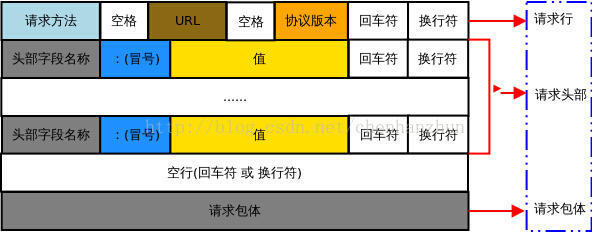

# 报文

## 请求报文

> 仅有POST、PUT以及PATCH这三个动词时会包含请求体，而GET、HEAD、DELETE、CONNECT、TRACE、OPTIONS这几个动词时不包含请求体。

- Date：请求发送的日期和时间。

- User-Agent：User-Agent的内容包含发出请求的用户信息。User-Agent: Mozilla/5.0 (Linux; X11)。

- Accept：浏览器能够接受的响应类型，如纯文本数据或图片。

- Accept-Charset：浏览器可接受的字符集。

- Content-Length：表示请求消息正文的长度。大多数请求头并不是必需的，但Content-Length除外。对于POST请求来说 Content-Length必须出现。

- Host： 访问的主机名。Host头域指定请求资源的Intenet主机和端口号，必须表示请求url的原始服务器或网关的位置。HTTP/1.1请求必须包含主机头域，否则系统会以400状态码返回。

- If-Modified-Since：客户机通过这个头告诉服务器资源的缓存时间。如果请求的部分在指定时间之后被修改则请求成功，未被修改则返回304“Not Modified”应答。

- If-None-Match：如果内容未改变返回304代码，参数为服务器先前发送的Etag，与服务器回应的Etag比较判断是否改变。

- Expires：设置绝对缓存时间，时间字符串。（http1.0）

- Cache-Control： 设置相对缓存时间，max-age。（http1.1，优先级比 Expires 高）
  - public：为所有用户都设置缓存（响应报文）
  - private：只为单个用户缓存。（响应报文）
  - no-cache: 使用缓存前线校验缓存是否过期。
  - no-store: 不使用缓存。
  - must-revalidate: 缓存过期时必须检验（针对客户端有时候可以使用过期缓存）。

- Referer：客户机通过这个头告诉服务器，它是从哪个资源来访问服务器的(防盗链)。包含一个URL，用户从该URL代表的页面出发访问当前请求的页面。

- Cookie：客户机通过这个头可以向服务器带数据，这是最重要的请求头信息之一。（sessionID携带在cookie里）

- Connection：处理完这次请求后是否断开连接还是继续保持连接。如果值为“Keep- Alive”，或者使用的是HTTP 1.1(HTTP 1.1默认进行持久连接)，它就会开启持久连接。

- Range：Range头域可以请求实体的一个或者多个子范围。例如，表示头500个字节：bytes=0-499表示第二个500字节：bytes=500-999（对应状态码206）。

- Pragma：定义形式唯一：Pragma: no-cache。作为与HTTP/1.0的向后兼容。只用在客户端发送的请求中，要求所有中间服务器不返回缓存的资源。

## 响应报文

- Date：当前的GMT时间。

- ETag： 一个代表响应服务端资源（如页面）版本的报文头属性，如果某个服务端资源发生变化了，这个ETag就会相应发生变化。

- Set-Cookie：服务端可以设置客户端的Cookie，其原理就是通过这个响应报文头属性实现的：。

- Allow：服务器支持哪些请求方法(如GET、POST等)。

- Content-Type：表示后面的文档属于什么MIME类型。Servlet默认为text/plain，但通常需要显式地指定为text/html。

- Expires：告诉浏览器把回送的资源缓存多长时间，-1或0则是不缓存。

- Last-Modified：文档的最后改动时间。（和请求报文中的 If-Modified-Since 联系起来）。

- Location：这个头配合302状态码使用，用于重定向接收者到一个新URI地址。

