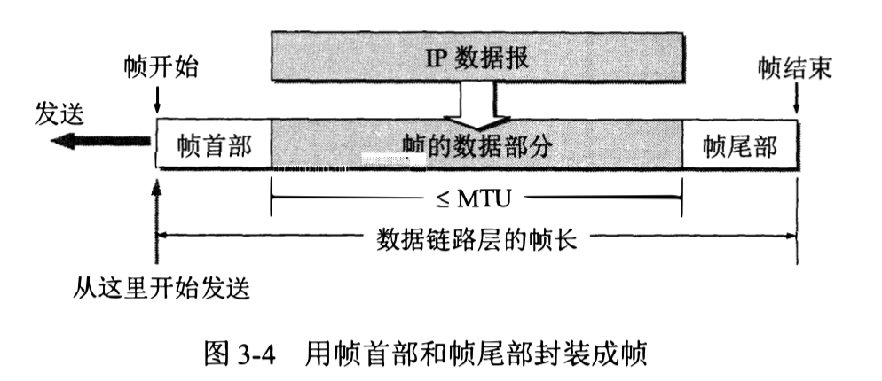
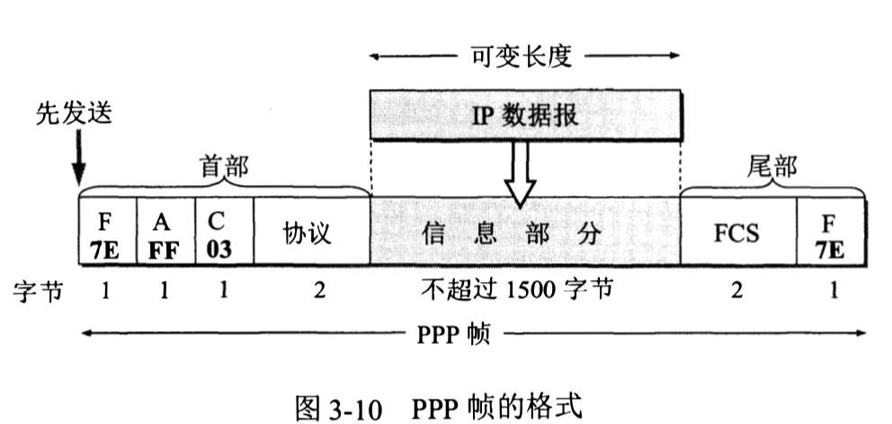
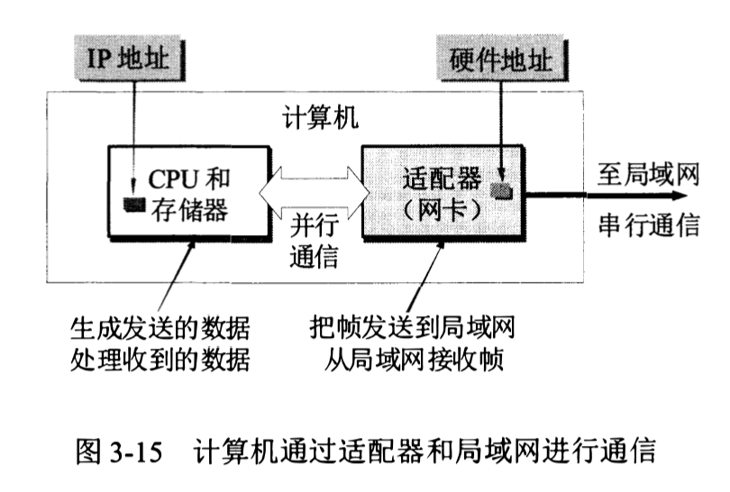
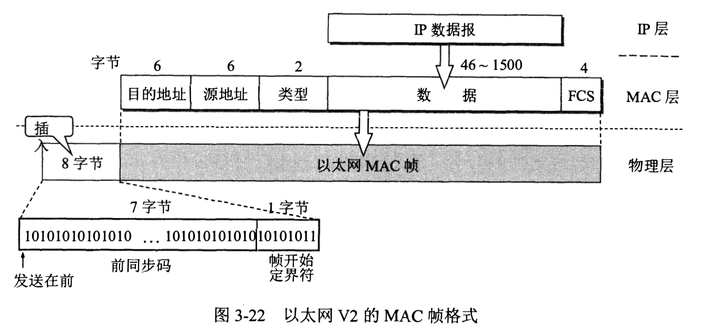

# 数据链路层

## 工作流程

- **链路**：从一个结点到相邻结点的物理线路(有线或无线)，并且中间没有其他的交换结点。

- **数据链路**：链路 + 实现控制数据传输协议的硬件、软件（网络适配器）。

数据链路层把网络层交下来的 IP 数据包封装在帧里并发送到链路上，以及把接收到的帧中的数据取出并上交给网络层。

1. 发送方把网络层交下来的 IP 数据报添加首部和尾部封装成帧。

2. 发送方把封装好的帧发送给接收方的数据链路层。

3. 若接收方收到的帧无差错，则从收到的帧中提取出 IP 数据报交给上面的网络层，否则丢弃这个帧。

## 解决的三个问题

### 封装成帧

- 在一段数据的前后分别添加首部和尾部，这样就构成了一个帧。以便接收方能够根据首部和尾部的标记从收到的比特流中识别帧的开始和结束。

- 一个帧的帧长等于帧的数据部分长度加上帧首部和帧尾部的长度。

- **最大传送单元MTU**：数据部分长度上限。

- 帧开始符：**SOH**（十六进制是 01）。帧结束符：**EOT**（十六进制是 04）。

### 透明传输

- 防止传输的数据部分中包括了控制字符，导致接收方无法正确识别帧的开始和结束。

- 对于数据部分中出现的控制字符，在它们前面插入转义字符 **ESC**（十六进制是 1B）。接收端的数据链路层在把数据送往网络层之前删除这个插入的转义字符。

### 差错检测

- 比特差错：比特在传输过程中可能会产生差错，比如 1 可能会变成 0, 而 0 也可能变成 1。

- 误码率：在一段时间内，传输错误的比特占所传输比特总数的比率。误码率不可能降低为 0。

- 循环冗余校验 CRC：

  - 原理：在待传送的数据 M 后面添加供差错检测用的 n 位冗余码。

  - 计算方法：用二进制的模2运算进行 2^n 乘 M 的运算（相当于在 M 后面添加 n 个 0），把得到的数 M1 除以收发双方事先商定的长度为 n+1 位的除数 P, 得到运算后的余数 R (n 位， 比 P 少一位)。 余数 R 就是冗余码，即**帧检验序列FCS**。（**用模2运算进行加法时不进位**）

  - 通常使用生成多项式来表示除数，例如 P = x^4 + x^2 + x + 1。那么除数为：10111。

- 接收端把接收到的数据以帧为单位进行 CRC检验，把收到的每一个帧都除以同样的除数 P(模2运算)，然后检查得到的余数R。 如果在传输过程中无差错，那么经过 CRC 检验后得出的余数 R 肯定是 0。如果 R 不等于 0，则说明这个帧有差错，但无法确定究竟是哪一位或哪几位出现了差错。

- 在数据链路层使用 CRC 检验，只能够实现无比特差错的传输。但这还不是可靠传输，因为可能发生其他的传输差错，比如帧丢失、帧重复、帧失序。

## 点对点协议 PPP

- PPP 协议：用户计算机和 ISP（互联网服务提供商）进行通信时所使用的数据链路层协议。互联网用户通常都要连接到某个 ISP 才能接入到互联网。 

- PPP 协议只支待全双工链路。

### PPP 协议的帧格式

- F：标志字段，标记一个帧的开始或结束。规定为 Ox7E（Ox 表示是十六进制），7E 的二进制表示是 01111110。

- A：地址字段。

- C：控制字段。

- FCS：使用 CRC 的帧检验序列。（除了协议字段和 FCS 字段是 2 字节外，其他字段都是 1 字节）

### PPP 协议的功能

  - 以简单作为首要需求，对数据链路层的帧，不需要纠错，不需要序号，也不需要流量控制。

  - 封装成帧。

  - 透明传输。

    - PPP 使用异步传输时，把转移字符定义为 Ox7D（01111101），并使用字节填充。数据部分中的 
      - 7E 填充为 7D 5E。
      - 7D 填充为 7D 5D。

    - PPP 使用同步传输时，使用零比特填充（发现 5 个连续的 1，就在其中填入一个 0。因为标志字段 F 二进制是 01111110，防止歧义）。

  - 差错检测。
  
  - 多种网络层协议，能够在同一条物理链路上同时支持多种网络层协议。

  - 能够在多种类型的链路上运行。例如串行的（一次只发送一个比特）或并行的（一次并行地发送多个比特），同步的或异步的，低速的或高速的，电的或光的，交换的(动态的) 或非交换的(静态的) 点对点链路。 

  - 检测连接状态，能够及时（不超过几分钟）自动检测出链路是否处于正常工作状态。

  - 最大传送单元，设置帧中数据部分最大的传送单元 MTU 的默认值（**1500 字节**）。如果高层协议发送的分组过长并超过 MTU 的数值 ， PPP 就要丢弃这样的帧并返回差错 。 

  - 网络层地址协商，使通信的两个网络层能够通过协商知道或能够配置彼此的网络层地址。

  - 数据压缩协商。

## 使用广播信道的数据链路层

### 适配器/网卡

- 计算机与外界局域网的连接是通过通信适配器进行的。

- 适配器和局域网之间的通信是通过电缆或双绞线以串行传输方进式行的，而适配器和计算机之间的通信则是通过计算机主板上的 I/O 总线以并行传输方式进行的。

- 当适配器收到有差错的帧时，就把这个帧直接丢弃而不必通知计算机。当适配器收到正确的帧时，它就使用中断来通知该计算机，并交付给协议栈中的网络层。当计算机要发送 IP 数据报时，就由协议栈把 IP 数据报向下交给适配器，组装成帧后发送到局域网。

- 计算机的硬件地址（MAC 地址）就在适配器的 ROM（只读）中，而计算机的软件地址 （IP地址），则在计算机的存储器中。

- 适配器的作用：

  - 进行数据串行传输和并行传输的转换。

  - 对数据进行缓存。

  - 安装设备驱动程序。

  - 实现以太网协议。

- 交换机是独占性以太网，用户在通信时不和其他网络用户共享传输媒体的带宽。而在共享型以太网中（比如集线器），每个用户则平均占有带宽。

### CSMA/CD 协议

- 广播通信方式（一对多）：当一台计算机发送数据时，总线上的所有计算机都能检测到这个数据。

- 实现一对一通信，在发送数据帧时，在帧的首部写明接收站的地址，仅当数据帧中的目的地址与适配器 ROM 中存放的硬件地址一致时，该适配器才能接收这个数据帧，否则就丢弃该数据帧。

- 以太网发送的数据使用曼彻斯特编码的信号，发送的每一位都有两个信号周期，所以码元速率是数据率的两倍。

- 背景：总线上只要有一台计算机在发送数据，总线的传输资源就会被占用。因此，在同一时间只能允许一台计算机发送数据，否则各计算机之间就会互相干扰，使得所发送数据被破坏。 而以太网采用最简单的随机接入（所有用户可以随机发送信息），所有需要由 CSMA/CD 协议（**载波监听多点接入/碰撞检测**） 来检测碰撞以减少冲突发生的概率（使用 CSMA/CD 协议的以太网只能进行双向交替通信）。

- 多点接入， 说明这是总线型网络，许多计算机以多点接入的方式连接在一根总线上。

- 载波监听，也就是检测信道，不管在发送前还是在发送中，每个站都必须不停地检测信道，必须要等到信道变为空闲时才能发送。

- 碰撞检测，在发送中检测信道，及时发现有没有其他站的发送和本站发送的碰撞。当几个站同时在总线上发送数据时，总线上的信号电压变化幅度将会增大(互相叠加）。一旦发现总线上出现了碰撞，适配器就要立即停止发送，免得继续进行无效的发送。

#### 争用期

- 最多只需要两倍单程端到端的传播时延（2t）就可以知道发送的数据是否发生了碰撞。如果在 2t 时间内，发送方没有接收到数据帧，就说明了在发送数据帧的这段时间内其他主机没有发送数据帧（没有发生碰撞）；反之若在 2t 之间内接收到了数据帧，则说明有其他主机也同时发送了数据帧（发生了碰撞）。

- 把端到端的往返时间 2t 称作**争用期**或**碰撞窗口**。

- 具体的争用期时间是 **51.2 us**，对于 10 Mbit/s 的以太网，在争用期内可发送 512 bit 即 64 字节。因此也可以说争用期是 512 比特时间，1 比特时间就是发送 1 比特所需的时间（数据率的倒数）。 所以也可以直接使用比特作为争用期的单位，争用期是 512 bit，即争用期是发送 512 bit 所需的时间。

#### 截断二进制指数退避算法

- 让发生碰撞的站在停止发送数据后，不是等待信道变为空闲后就立即再发送数据，而是推迟一个随机的时间再发送。

- 推迟时间，从离散的整数集合 [0, 1 , ..., (2^k - 1)] 中随机取出一个数，记为 r。重传应推后的时间就是 **r 倍的争用期**，参数 k = Min[重传次数，10]。

- 当重传达 16 次仍不能成功时（这表明同时打算发送数据的站太多， 以致连续发生冲突），则丢弃该帧并向高层报告。

- 使用截断二进制指数退避算法可以使重传需要推迟的平均时间随重传次数而增大，所以这也称为动态退避。

- 适配器每发送一个新的帧， 就要执行一次 CSMA/CD 算法。 适配器 对过去发生过的碰撞并无记忆功能。

- 以太网规定了一个**最短帧长 64 字节**， 即 512 bit。 如果要发送的数据非常少，那么必须加入一些填充字节，使帧长不小于 64 字节。

- 以太网在发送数据时（以帧为单位），如果在争用期(共发送了 64 字节)没有发生碰撞，那么后续发送的数据就一定不会发生冲突。凡接收到长度小于 64 字节的帧，都是由于冲突而异常中止的无效帧。

#### 强化碰撞

- 当发送数据的站一旦发现发生了碰撞时，除了立即停止发送数据外，还要再继续发送 32 比特或 48 比特的人为干扰信号，以便让所有用户都知道现在已经发生了碰撞。

- 以太网还规定了帧间最小间隔为 **9.6 μs**, 相当于 96 比特时间。这样做是为了使刚刚收到数据帧的站的接收缓存来得及清理，做好接收下一帧的准备。

### CSMA/CD 协议总结

工作流程：

1. 准备发送: 适配器从网络层获得一个分组，加上以太网的首部和尾部组成以太网帧。放入适配器的缓存中，但在发送之前必须先检测信道。

2. 检测信道: 若检测到信道忙，则应不停地检测，一直等待信道转为空闲。若检测到信道空闲，并在 96 比特时间内信道保持空闲（保证了帧间最小间隔），就发送这个帧。

3. 在发送过程中仍不停地检测信道，即网络适配器要边发送边监听。这里只有两种可能性:

  (1) 发送成功: 在争用期内一直未检测到碰撞。这个帧肯定能够发送成功。发送完毕后，其他什么也不做直接回到步骤 1。

  (2) 发送失败: 在争用期内检测到碰撞。这时立即停止发送数据，并按规定发送人为干扰信号。适配器接着就执行指数退避算法，等待 r 倍 512 比特时间后，返回到步骤 2 继续检测信道。但若重传次数达 16 仍不能成功，则停止重传而向上报错。

以太网每发送完一帧， 一定要把已发送的帧暂时保留一下。如果在争用期内检测出发生了碰撞，那么还要在推迟一段时间后再把这个暂时保留的帧重传一次。

## MAC 地址

### MAC 地址组成

- MAC 地址 / 硬件地址 / 物理地址 / 适配器地址：指局域网上的每一台计算机中固化在适配器的 ROM 中的地址（可以有多个）。

- MAC 地址基本上使用的是 6 字节（48 位），但也有 2 字节（16 位）的。

- MAC 地址分配：由 IEEE 的注册管理机构 RA 负责分配前三个字节(即高位 24 位)。这三个字节也叫做**地址块**、组织唯一标识符OUI、公司标识符。后三位字节则由厂家自行指派，称为扩展标识符。一个地址块可以生成 2^24 个不同的地址，用这种方式得到的 48 位地址称为 EUI-4（扩展的唯一标识符）。

### MAC 帧格式

- 目的地址和源地址都是指 MAC 地址而不是 IP 地址。

- 类型字段：用来标志上一层使用的是什么协议，以便把收到的 MAC 帧的数据上交给上一层的这个协议。

- 数据字段：长度在 46 ~ 1500 字节之间（因为数据帧最短是 64 字节，再减去 18 字节的首部和尾部；1500 字节是帧中数据部分最大的传送单元 MTU 的默认值）。所以 MAC 帧的长度在 64 ~ 1518 字节之间。

- 当数据字段小于 64 字节时，MAC 子层就会在数据字段的后面加入一个整数字节的填充字段。这时要计算有效的数据字段长，需要使用到 IP 数据报首部的总长度字段，此时总长度 + 填充字段长度 = MAC 帧数据字段的长度。

- MAC 帧前插入的八个字节

  - 原因：在传输媒体上实际传送的要比 MAC 帧还多 8 个字节，这是因为当一个站在刚开始接收 MAC 帧时，由于适配器的时钟尚未与到达的比特流达成同步，因此 MAC 帧的最前面的若干位就无法接收，导致整个的 MAC 成为无用的帧。

  - 解决方法：为了接收端迅速实现位同步，从 MAC 子层向下传到物理层时还要在帧的前面插入 8 字节(由硬件生成)。

  - 组成

    - 第一个字段是 7 个字节的前同步码（1 和 0 交替码），它的作用是使接收端的适配器在接收 MAC 帧时能够迅速调整其时钟频率，使它和发送端的时钟同步，也就是 实现位同步（即比特同步）。 

    - 第二个字段是帧开始定界符，定义为 10101011。它的前六位的作用和前同步码一样，最后的两个连续的 1 就是告诉接收端适配器开始传送正式的 MAC 帧信息了。
    
  - MAC 帧的 FCS 字段的检验范围不包括前同步码和帧开始定界符。顺便指出，在使用 SONET/SDH 进行同步传输时则不需要用前同步码，因为在同步传输时收发双方的位同步总是一直保持着的。

