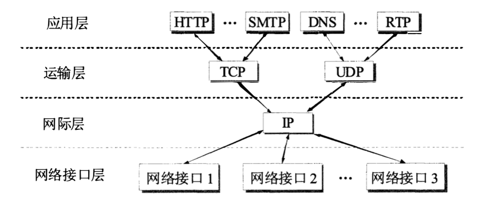

# 概述

## 网络的性能

- **速率/数据率/比特率**：数据的传送速率，单位是 bit/s (比特每秒)。

- **带宽**：网络中某通道传送数据的能力，即单位时间内网络中的某信道所能通过的 “最高数据率”，单位也是 bit/s。

- **吞吐量**：在单位时间内通过某个网络(或信道、 接口) 的实际的数据量。吞吐量受网络的带宽或网络的额定速率的限制，有时吞吐量还可用每秒传送的字节数或帧数来表示。

- **时延**：数据(一个报文或分组， 甚至比特)从网络/链路的一端传送到另一端所需的时间。

  - **发送时延**：主机或路由器发送数据帧所需要的时间，也就是从发送数据帧的第一个比特算起，到该帧的最后一个比特发送完毕所需的时间。发送时延 = 数据帧长度 / 发送速率。

  - **传播时延**：电磁波在信道中传播一定的距离需要花费的时间。 传播时延 = 数据帧长度 / 电磁波在信道上的传播速率。

  - **处理时延**：主机或路由器在收到分组时要花费一定的时间进行处理，例如分析分组的首部、从分组中提取数据部分、进行差错检验或查找适当的路由等。

  - **排队时延**：分组在经过网络传输时要经过许多路由器，但分组在进入路由器后要先在输入队列中排队等待处理。在路由器确定了转发接口后，还要在输出队列中排队等待转发。
  
  数据在网络中经历的总时延 = 发送时延 + 传播时延 + 处理时延 + 排队时延。

- **时延带宽积**：表示从发送端发出的但尚未到达接收端的比特数，又称为以比特为单位的链路长度。 时延带宽积 = 传播时延 * 带宽。

- **利用率**：利用率 U = 1 - D' / D。（ D'表示网络空闲时的时延， D表示网络当前的时延）

  - **信道利用率**：某信道有百分之几的时间是被利用的(有数据通过)，完全空闲的信道的利用率是零。信道利用率并非越高越好，因为当某信道的利用率增大时，该信道引起的时延也就迅速增加。
  
  - **网络利用率**：全网络的信道利用率的加权平均值。
  

## 计算机网络的体系结构

- **应用层**：为特定应用程序（进程）提供数据传输服务，例如 HTTP、DNS 等。数据单位为报文。

- **运输层**：为两台主机间的进程通信提供通用数据传输服务。由于一台主机可以同时运行多个线程，因此运输层有复用和分用的功能。复用就是指多个应用层进程可同时使用下面运输层的服务，分用则是运输层把收到的信息分别交付上面应用层中的相应进程。

- **网络层**：为主机之间提供数据传输服务。

- **数据链路层**：将网络层交下来的 IP 数据报组装成帧，在两个相邻节点间的链路上传送帧。

- **物理层**：实现相邻计算机节点之间比特流的透明传送，尽可能屏蔽掉具体传输介质和物理设备的差异。传送的数据单位是比特。

