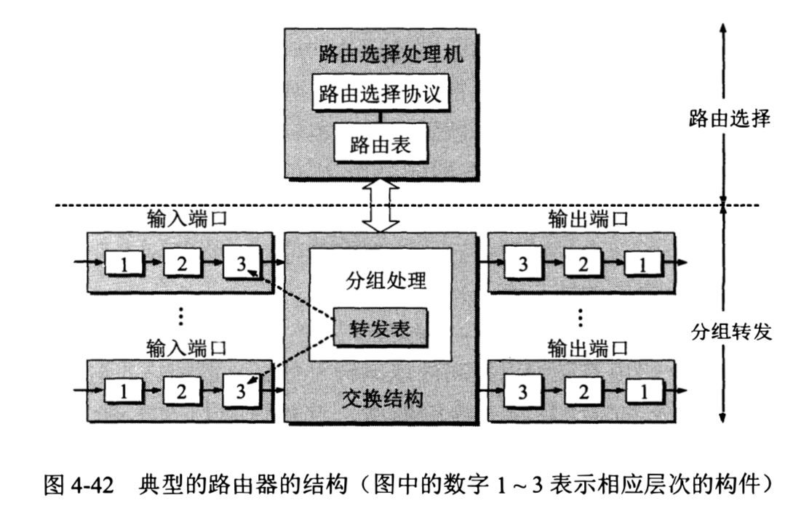

# 网络层

## IP 协议

- 路由器仅根据目的主机所连接的网络号来转发分组，从而减小了路由表中的项目数、路由表所占的存储空间和查找路由表的时间。

- 由于一个路由器至少应当连接到两个网络，因此一个路由器至少有两个不同的 IP 地址和硬件地址。 

- 在同一个局域网上的主机或路由器的 IP 地址中的网络号必须是一样的。 

- 多归属主机：一台主机同时连接到两个网络上时，该主机就必须同时具有两个相应的 IP 地址，其网络号必须是不同的。

- 无名网络 / 无编号网络：当两个路由器直接相连时（例如通过一条租用线路），在连线两端的接口处，可以分配也可以不分配 IP 地址。

- 网络层的复用和分用

  - 复用：发送方不同协议的数据都可以封装成 IP 数据包发送出去。

  - 分用：接收方的网络层根据 IP 首部中的协议字段进行分用，把剥去首部后的数据交付应当接收这些数据的协议。

### IP 地址组成

- 组成： IP 地址 = 网络号 + 主机号。网络号识别唯一一个网络，主机号在它网络号所指明的网络范围内唯一。

- IP 地址使用 8 字节（IPV4）32 位（IPV6 则是 128 位）。

### IP 地址分类

- A 类地址：共有 2^31 个地址，占整个 IP 地址空间的 50%。
  - 网络号：网络号占 1 字节（该字段的第 1 位已固定为 0，所以只有 7 位可用）。但可指派的网络号是 2^7 - 2 个(126)。 减 2 的原因是:
  
    - 网络号为 00000000 的 IP 地址是个保留地址，表示本网络。
    
    - 网络号为 01111111（127） 保留作为本地软件环回测试本主机的进程之间的通信。 若主机发送一个目的地址为环回地址（例如 127.0.0.1）的 IP 数据报， 则数据报会被自己接收，而不会把数据报发送到任何网络。目的地址为环回地址的 IP 数据报永远不会出现在任何网络上。（正常的数据报会从 IP 层进入链路层，然后发送到网络上；而给回环地址发送数据报，数据报会直接被发送主机的 IP 层获取，后面就没有链路层他们啥事了）

  - 主机号占 3 个字节，因此每一个 A 类网络中的最大主机数是 2^24 — 2。 这里减 2 的原因是：
    
    - 全 0 的主机号表示该 IP 地址是本主机所连接到的单个网络地址(例如， 一主机的 IP 地址为 5.6.7.8, 则该主机所在的网络地址就是 5.0.0.0), 
    
    - 全 1 的主机号表示该网络上的所有主机。
  
- B 类地址

- C 类地址

| 网络 | 最大可指派的网络数 | 第一个可指派的网络号 | 最后一个可指派的网络号 | 每个网络中的最大主机数 |
| :--: | :--: | :--: | :--: | :--: |
A | 2^7-2 | 1 | 126 | 2^24-2 | 2^24-2
B | 2^14-1 | 128.1 | 191.255 | 2^16-2
C | 2^21-1 | 192.0.1 | 223.255.255 | 2^8-2

#### localhost、127.0.0.1、0.0.0.0、本机 IP

- localhost 其实是域名，一般 windows 系统默认将 localhost 指向 127.0.0.1，但是 localhost 并不等于 127.0.0.1，localhost 指向的 IP 地址是可以配置的。

- 凡是以 127 开头的 IP 地址，都是回环地址，所以一般会通过 `ping 127.0.0.1` 来测试某台机器上的网络设备是否工作正常。

- 0.0.0.0 表示本机中所有的 IPV4 地址，它是不能被 ping 通的。监听 0.0.0.0 的端口，就是监听本机中所有 IP 的端口。如果一个主机有两个 IP 地址，并且该主机上的一个服务监听的地址是 0.0.0.0，那么通过这两个 IP 地址都能够访问到该服务（在路由中，0.0.0.0 表示的是默认路由）。

- 本机 IP 通常仅指在同一个局域网内，能同时被外部设备访问和本机访问的那些 IP 地址（可能不止一个）。本机 IP 是与具体的网络接口绑定的，比如以太网卡、无线网卡等。

### IP 地址和 MAC 地址

- 主机或路由器在收到 MAC 帧时，根据 MAC 帧首部中的 MAC 地址决定收下或丢弃该 MAC 帧。只有在剥去 MAC 帧的首部和尾部并把 MAC 层的数据上交给网络层后，网络层才能在 IP 数据报的首部中找到源 IP 地址和目的 IP 地址。

- 在不同网络上传送时，MAC 帧首部中的源地址和目的地址要发生变化。在数据链路层要丢弃原来的 MAC 帧的首部和尾部。转发时再重新添加上新的 MAC 帧的首部和尾部。

### ARP 地址解析协议

- 作用：根据 IP 地址查找其对应的 MAC 地址。

- 方法：在主机 ARP 高速缓存中存放一个从 IP 地址到硬件地址的映射表，并且这个映射表保持动态更新（新增或超时删除，每一个映射地址项目都设置了生存时间）。

- 如果在 ARP 高速缓存中没有找到相应的 MAC 地址映射，就在其所在的局域网上**广播**发送一个 ARP 请求分组（包括发送方自己的 IP 地址和 MAC 地址以及目的主机的 IP 地址）。局域网上其他主机都收到这个请求分组并把发送方的 IP 地址和 MAC 地址写进各自的 ARP 高速缓存中。如果自身的 IP 地址和查询的 IP 地址一致的话，目标主机就向发送方**单播**发送 ARP 响应分组。

### IP 数据报格式

- 版本：使用的 IP 协议版本。

- 总长度：首部和数据部分的长度和。如果有分片的话，则指分片后的每一个分片的首部长度与该分片的数据长度和（分片传送的数据报只要丢失一个，就无法组装成原来的数据报，整个数据报必须重传）。

  - 若所传送的数据报长度超过数据链路层的 MTU 值，就必须把过长的数据报进行分片处理。

- 标识：标志每一个 IP 数据报，对于同一个数据报的分组它们的标识相同，方便各数据报分片最后能正确地重装成为原来的数据报。

- 标志：目前只有两位有意义。

  - 最低位记为 MF，MF 为 1 表示后面还有数据报分片，MF 为 0 表示这是最后一个数据报分片了。
  
  - 标志字段中间一位记为 DF，标识不能分片，只有当 DF 为 0 时才允许分片。

- 片偏移：相对于用户数据字段的起点，该分片从何处开始。片偏移以 8 个字节为偏移单位，即每个分片的长度一定是 8 字节(64位) 的整数倍。

- 生存时间：指明数据报在互联网中至多可经过多少个路由器，防止无法交付的数据报无限制地在互联网中兜圈子。

- **协议**：指明这个 IP 数据报携带的数据部分使用了什么协议如 ICMP 或 RIP 等，以便目的主机的 IP 层知道要将数据部分上交给哪个协议。

- 首部检验和：只检验数据报的首部，而不校验数据部分。 这是因为数据报每经过一个路由器，路由器都要重新计算一下首部检验和(一些字段如生存时间、标志、片偏移等都可能发生变化)。 

  - 校验方法： 在发送方，先把 IP 数据报首部划分为许多 16 位字的序列，并把检验和字段置零。用反码算术运算把所有 16 位字相加后，将得到的和的反码写入检验和字段。接收方收到数据报后，将首部的所有 16 位字再使用反码算术运算相加一次。将得到的和取反码，即得出接收方检验和的计算结果。若首部未发生任何变化，则此结果必为 0, 就保留这个数据报， 否则认为出了差错要将此数据报丢弃。

### IP 分组转发

- **特定主机路由**：对特定的目的主机指定一个路由。

- **默认路由**：指明分组转发的默认路由出口。

- 分组转发算法：

1. 从数据报的首部提取目的主机的 IP 地址 D, 得出目的网络地址为 N。 

2. 若 N 就是与此路由器直接相连的某个网络地址，则进行直接交付，不需要再经过其他的路由器。直接把数据报交付目的主机，包括把目的主机地址 D 转换为具体的硬件地址，把数据报封装为 MAC 帧再发送此帧)。否则就是间接交付，执行步骤 3。

3. 若路由表中有目的地址为 D 的特定主机路由，则把数据报传送给路由表中所指明的下一跳路由器。否则执行步骤 4。

4. 若路由表中有到达网络 N 的路由，则把数据报传送给路由表中所指明的下一跳路由器。否则执行步骤 5。

5. 若路由表中有一个默认路由，则把数据报传送给路由表中所指明的默认路由器。否则执行步骤 6。

6. 报告转发分组出错。

## 划分子网/子网寻址/子网路由选择

- 为什么要划分子网：原来的二级 IP 地址

  - IP 地址空间的利用率有时很低。

  - 给每一个物理网络分配一个网络号会使路由表变得太大因而使网络性能变坏。

  - 两级 IP 不够灵活。

- 如何划分子网：从主机号借用若干位作为子网号（当然主机号也就相应减少了同样的位数），于是原来的两级 IP 地址在就变为三级 IP 地址。IP地址 = 网络号 + 子网号 + 主机号。

- 划分子网纯属一个单位内部的事情，本单位以外的网络看不见这个网络是由多少个子网组成，因为这个单位对外仍然表现为一个网络。

### 子网掩码

- 作用：用于获取一个 IP 地址的网络号。**将一个 IP 地址和它的子网掩码与运算，结果就是它的网络地址**（网络号 + 子网号）。即使不划分子网，使用子网掩码也能更便于查找路由表。

- 组成：通常使用连续的 1 表示网络号和子网号，连续的 0 表示主机号。（子网掩码使用连续的 1 是为了方便通过相与运算获取网络地址）。

- 默认子网掩码：默认子网掩码中 1 的位置和 IP 地址中的网络号字段正好相对应。这样用默认子网掩码和某个不划分子网的 IP 地址逐位相与，也能得到它的网络号，从而知道该地址的类别， 而不用再去查找该地址的类。

- 若一个网络的子网号位数是 n，则它的子网数是 2^n - 2（减去全 0 和全 1 两种情况）；每个子网的主机数是 2^(主机位数-n) - 2；

- 同样的 IP 地址和不同的子网掩码可以得出相同的网络地址。但是不同的子网掩码（取决于子网的位数）的效果是不同的。子网号位数越小，划分的子网数量就越少，每个子网上连接的主机数就越多。

### 使用子网时 IP 分组的转发

- 路由器在和相邻路由器交换路由信息时，必须把自己所在网络（或子网）的子网掩码告诉相邻路由器。因此路由器的路由表中的每一个项目，就包括了目的网络地址、下一跳地址、子网掩码。若一个路由器连接在两个子网上就拥有两个网络地址和两个子网掩码。

- 在划分子网的情况下， 路由器转发分组的算法如下:

1. 从收到的数据报的首部提取目的 IP 地址 D。

2. 先判断是否为直接交付。对路由器直接相连的网络逐个进行检查: 用各网络的子网掩码和 D 逐位相与，看结果是否和相应的网络地址匹配。若匹配则把分组进行直接交付(当然还需要把 D 转换成物理地址，把数据报封装成帧发送出去)，转发任务结束。否则就是间接交付执行步骤 3。

3. 若路由表中有目的地址为 D 的特定主机路由， 则把数据报传送给路由表中所指明的下一跳路由器。否则执行步骤 4。

4. 对路由表中的每一行(目的网络地址，子网掩码，下一跳地址)，用其中的子网掩码和 D 逐位相与，其结果为N。若 N 与该行的目的网络地址匹配，则把数
据报传送给该行指明的下一跳路由器。否则执行步骤 5。

5. 若路由表中有一个默认路由，则把数据报传送给路由表中所指明的默认路由器。否则执行步骤 6。

6. 报告转发分组出错。

### 无分类编址 CIDR (构造超网)

- 作用：

  - 减少路由表中的项目数。

  - 通过减少网络前缀的位数（原先的按 A、B、C 分类地址，网络号位数被固定了限制了地址数的增加）来增加可分配的地址数。

- 特点：

  - 消除了传统的 A 类、B 类和 C 类地址以及划分子网的的概念，因而能更加有效地分配 1Pv4 的地址空间。

  - 将 32 位的 IP 地址划分为前后两个部分。IP 地址 = 网络前缀 + 主机号（无分类的两级编址）。使用斜线记法（CIDR 记法），在 IP 地址后面加上斜线 /，后面写上网络前缀所占的位数。

- 地址掩码：由一串 1 和一串 0 组成，而 1 的个数就是网络前缀的长度。
 
- CIDR 并没有在 32 位地址中指明若干位作为子网字段。 但分配到一个 CIDR 地址块的单位仍然可以在本单位内根据需要划分出一些子 网，这些子网也都只有一个网络前缀和一台主机号字段，但子网的网络前缀比整个单位的网络前缀长些。

- 路由聚合 / 构成超网：在路由表中就利用 CIDR 地址块（网络前缀都相同的连续的 IP 地址）来查找目的网络。有利于减少路由器之间的路由选择信息的交换，从而提高了整个互联网的性能。

- CIDR 的其他记法：

  - 省略点分十进制中低位连续的 0，地址块 10.0.0.0/10 可简写为 10/10。
  
  - 在网络前缀的后面加一个星号 *，如 00001010 00*。表示在星号 * 之前是网络前缀，而星号 * 表示 IP 地址中的主机号，可以是任意值。

- **最长前缀匹配**：使用 CIDR 后，路由表中每个项目变成了由网络前缀和下一条地址组成，但这样在查找路由表时可能会得到多个匹配结果。应当从匹配结果中选择具有最长网络前缀的路由，这是因为网络前缀越长，其地址块就越小，路由也就越具体。

## 网际控制报文协议 ICMP

- 作用：允许主机或路由器报告差错情况和提供有关异常情况的报告。

- 应用：

  - 分组网间探测 ping：用来测试两台主机之间的连通性。ping 使用了 ICMP 回送请求与回送回答报文。ping 是应用层直接使用网络层 ICMP 的一个例子，它没有通过运输层的 TCP 或 UDP。

  - tarcerotue / tarcetr：用来跟踪一个分组从源点到终点的路径。

#### ICMP 报文格式

- ICMP 报文就是 IP 数据报的数据部分。

- 校验和：用来检验整个 ICMP 报文。IP 数据报首部的检验和并不检验 IP 数据报的数据部分，所以不能保证经过传输的 ICMP 报文不产生差错。

- ICMP 报文的种类和相关类型。

## 路由选择协议

- 自治系统：把整个互联网划分为许多较小的自治系统，记为 AS。自治系统是在单一技术管理下的一个或多个路由器，而这些路由器使用同一种路由选择协议，而不同的自治系统则可以使用不同的路由选择协议。

- 域内路由选择：在自治系统内部的路由选择。

- 域间路由选择：自治系统之间的路由选择。

- 路由选择协议的划分（这里的 IGP 和 EGP 是指协议类别而不是特指某一个协议）：

  - 内部网关协议 IGP：在一个自治系统内部使用的路由选择协议，如 RIP 和 OSPF 协议。

  - 外部网关协议 EGP：在不同的自治系统之间，当数据报传到一个自治系统的边界时，需要使用外部网关协议将路由选择信息传递到另一个自治系统中，比如 BGP 协议。

### 内部网关协议 RIP

- 基于距离向量的路由选择协议。RIP 协议要求网络中的每一个路由器都要维护从它自已到其他每一个目的网络的距离 / 跳数。这里的跳数指路径上经过的路由数量包括起始路由，所以直接交付的网络距离是 1。RIP 只允许一条路径上最多只能有 15 个路由器，也就是说**当跳数为 16 时表示不可达到**，因此 RIP 只适用于小型网络。

- RIP 选择一条具有最少路由器的路由（最短路由），即使还存在另一条高速（低时延）但路由器较多的路由。

- RIP 规定每一个路由器都要不断地和其他一些路由器交换路由信息，其特点是：

  - 仅和相邻路由器交换信息。

  - 路由器交换的信息是当前本路由器所知道的全部信息，即自己现在的路由表（到本自治系统中所有网络的最短距离，以及到每个网络应经过的下一跳路由器）。

  - 按固定的时间间隔交换路由信息。

- 设 X 是结点 A 到 B 的最短路径上的一个结点。若把路径 A->B 拆成两段路径 A->X 和 X->B， 则路径 A->X 和 X->B 也都分别是结点 A 到 X 和结点 X 到 B 的最短路径。

#### RIP 距离向量算法

对每一个相邻路由器发送过来的 RIP 报文， 进行以下步骤: 

- 对 IP 地址为 X 的相邻路由器发来的 RIP 报文，先修改此报文中的所有项目（表示本路由器可以通过该相邻路由器到达目的网络 N）：把下一跳字段中的地址都改为 X，并把所有的距离字段的值加 1。每一个项目都有三个关键数据，目的网络 N，距离 d，下一跳路由器 X。

- 对修改后的 RIP 报文中的每一个项目，进行以下步骤：

  - 若原来的路由表中没有目的网络 N, 则把该项目添加到路由表中(表明这是新的目的网络，应当加入到路由表中)。 
  
  - 否则表示路由表中已经有目的网络 N, 此时再查看下一跳路由器地址：

    - 若下一跳路由器地址是 X, 则用新路由表项目替换掉原路由表中的项目。不管距离是变大了还是变小了都要更新，需要以最新的消息为准（避免网络忽然出现故障导致原先的短距离路径走不通）。
    
    - 否则表示到达目的网络 N 的下一跳路由器不是 X，此时判断距离是变大了还是变小了：
    
      - 若新路由表项目中的距离小于源路由表中项目的距离，则进行更新。

      - 否则不更新路由表。

- 若 3 分钟还没有收到相邻路由器的更新路由表，则把此相邻路由器记为不可达的路由器（把距离置为 16）。

- 返回。

#### RIP 协议报文格式

- 一个 RIP 报文最多可包括 25 个路由，因而 RIP 报文的最大长度是 4 + 20 * 25 = 504 字节。如果超过的话必须再用一个 RIP 报文来传送。

- 命令：指出报文的意义。

-  地址族标识符 / 地址类别：标志所使用的地址协议。 

- 路由标记：填入自治系统号，这是考虑使 RIP 有可能收到本自治系统以外的路由选择信息。

#### RIP 协议的优缺点

- **好消息传播得快，而坏消息传播得慢**：当网络出现故障时，要经过比较长的时间才能将此信息传送到所有的路由器。因为所处网络出故障的路由器 A 还没来得及把出故障后的路由表信息传递给相邻路由器 B 扩散出去，就已经接受到相邻路由器 B 的路由表信息，使其以为可以通过该相邻路由器 A 达到故障网络。而该相邻路由器 B 又更新自己的路由表认为可以通过 A 到达故障网络，这样循环下去直到两者到故障网络的距离增大到 16 才明白过来原来故障网络不可达。

- 实现简单，开销较小，但也限制了网络的规模。

### 内部网关协议 OSPF

- 特点：

  - 向本自治系统中所有路由器发送信息。这里使用的方法是洪泛法，即路由器通过所有输出端口向所有相邻的路由器发送信息，而每一个相邻路由器又再将此信息发往其所有的相邻路由器（但不再发送给刚刚发来信息的那个路由器）。

  - 发送的信息就是与本路由器相邻的所有路由器的链路状态，包括本路由器都和哪些路由器相邻、该链路的距离。

  - 只有当链路状态发生变化时，路由器才向所有路由器用洪泛法发送此信息。

  - OSPF 允许管理员给每条路由指派不同的代价，OSPF 对于不同类型的业务可计算出不同的路由。

  - 如果到同一个目的网络有多条相同代价的路径，那么可以将通信量分配给这几条路径，这叫做多路径间的负载平衡。

  - 所有在 OSPF 路由器之间交换的分组都具有鉴别的功能，因而保证了仅在可信赖的路由器之间交换链路状态信息。

  - OSPF 支持可变长度的子网划分和无分类的编址 CIDR。

- 由于各路由器之间频繁地交换链路状态信息，因此所有的路由器最终都能建立一个链路状态数据库（也就是全网的拓扑结构图），这个拓扑结构图在全网范围内是一致的（这称为链路状态数据库的同步）。因此，**每一个路由器都知道全网共有多少个路由器，以及哪些路由器是相连的，其代价是多少等**。每一个路由器使用链路状态数据库中的数据，构造出自己的路由表（使用 Dijkstra 算法）。和 RIP 的区别在于，RIP 协议的每一个路由器虽然知道到所有的网络的距离以及下一跳路由器，但却不知道全网的拓扑结构（只有到了下一跳路由器，才能知道再下一跳应当怎样走）。

- OSPF 使用的是可靠的洪泛法，可靠的洪泛法是在收到更新分组后要发送确认（收到重复的更新分组只需要发送一次确认分组）。

- 若 N 个路由器连接在一个以太网上，则每个路由器要向其他 N-1 个路由器发送链路状态信息，所以共有 N * (N-1) 个链路状态要在这个以太网上传送。

- 将一个自治系统划分为多个区域

  - 作用：把利用洪泛法交换链路状态信息的范围局限于每一个区域而不是整个的自治系统，减少了整个网络上的通信量。在一个区域内部的路由器只知道本区域的完整网络拓扑，而不知道其他区域的网络拓扑的情况。

  - 层次结构的区域划分：

    - 主干区域：在上层的区域，用来连通其他在下层的区域。

    - 区域边界路由器：接受从其他区域来的信息，如下图的路由器 R3、R4 和 R7。

    - 主干路由器：在主干区域内的路由器，一个主干路由器可以同时是区域边界路由器。

    - 自治系统边界路由器：在主干区域内还有一个路由器专门和本自治系统外的其他自治系统交换路由信息，如 R6。

- OSPF 分组结构

  - 不用 UDP 而是直接用 IP 数据报传送（RIP 分组则使用了 UDP）。

  - 路由器标识符：标志发送该分组的路由器接口的 IP 地址。

- OSPF 的五种分组类型：

  - 问候分组，用来发现和维待邻站的可达性。OSPF 规定每两个相邻路由器每隔 10 秒钟要交换一次问候分组，以此确定哪些邻站是可达的。

  - 数据库描述分组，向邻站给出自己的链路状态数据库中的所有链路状态项目的摘要信息。

  - 链路状态请求分组，向对方请求发送某些链路状态项目的详细信息。

  - 链路状态更新分组，用洪泛法对全网更新链路状态。

  - 链路状态确认分组，对链路更新分组的确认。

  后四种分组都是用来进行链路状态数据库的同步的，所谓同步就是指不同路由器的链路状态数据库的内容是一样的，两个同步的路由器叫做完全邻接的路由器。 

### 外部网关协议 BGP

- 采用路径向量路由选择协议。每一个自治系统的管理员要选择至少一个路由器作为该自治系统的 BGP 发言人，代表整个自治系统与其他自治系统交换路由信息。每一个 BGP 发言人除了必须运行 BGP 协议外，还必须运行该自治系统所使用的内部网关协议如 OSPF 或 RIP。

- 一个 BGP 发言人与其他 AS 的 BGP发言人要交换路由信息，要先建立 TCP 连接（端口号为179）。然后在此连接上交换 BGP 报文以建立 BGP 会话，利用 BGP 会话交换路由信息，如增加了新的路由、撤销过时的路由、报告出差错的情况等。使用 TCP 连接能提供可靠的服务，也简化了路由选择协议。使用 TCP 连接交换路由信息的两个 BGP 发言人，彼此成为对方的邻站或对等站。

- BGP 所交换的网络可达性信息，指的是要到达某个网络所要经过的一系列自治系统。当 BGP 发言人互相交换了网络可达性信息后，各 BGP 发言人就根据所采用的策略从收到的路由信息中找出到达各自治系统的较好路由。BGP 交换路由信息的结点数量级是自治系统个数的量级。

- 因为 BGP 支持 CIDR, 因此 BGP 的路由表也就应当包括目的网络前缀、下一跳路由器、到达目的网络所要经过的自治系统序列。由于使用了路径向量的信息，就可以很容易地避免产生兜圈子的路由。如果一个 BGP 发言人收到了其他 BGP 发言人发来的路径通知，它就要检查一下本自治系统是否在此通知的路径中，如果在这条路径中就不能采用这条路径（因为会兜圈子）。

- 在 BGP 刚刚运行时，BGP 的邻站是交换整个的 BGP 路由表。但以后只需要在发生变化时更新有变化的部分，这样做可以节省网络带宽和减少路由器的处理开销。

#### BGP 的报文类型

- BGP 的四种报文：

  - OPEN(打开)报文，用来与相邻的另一个 BGP 发言人建立关系，使通信初始化。
  
  - UPDATE(更新)报文，用来通告某一路由的信息，以及新增一条路由和撤销多条路由。
  
  - KEEPALIVE(保活)报文，用来周期性地证实邻站的连通性。
  
  - NOTIFICATION(通知)报文，用来发送检测到的差错。

- 若两个邻站属于两个不同 AS，而其中一个邻站打算和另一个邻站定期地交换路由信息，这就应当有一个商谈的过程（因为很可能对方路由器的负荷已很重因而不愿意再加重负担）。因此一开始向邻站进行商谈时就必须发送 OPEN 报文。如果邻站接受这种邻站关系，就用 KEEPALIVE 报文响应，这样两个 BGP 发言人的邻站关系就建立了。一旦邻站关系建立了，这两个 BGP 发言人彼此要周期性地交换 KEEPALIVE报文（一般每隔30秒），以便确信对方是存在的。

- BGP 可以很容易地解决距离向量路由选择算法中的 “坏消息传播得慢” 问题。当某个路由器或链路出故障时，由于 BGP 发言人可以从不止一个邻站获得路由信息，因此很容易选择出新的路由。距离向量算法往往不能给出正确的选择，是因为这些算法不能指出哪些邻站到目的站的路由是独立的。

#### BGP 报文格式

## 路由器

- 路由器是一种具有多个输入端口和多个输出端口的专用计算机，其任务是转发分组。从路由器某个输入端口收到的分组，按照分组要去的目的网络，把该分组从路由器的某个合适的输出端口转发给下一跳路由器。下一跳路由器也按照这种方法处理分组，直到该分组到达终点为止。路由器的转发分组正是网络层的主要工作。

#### 路由器的组成

- 路由选择部分 / 控制部分

  - 路由选择处理机：根据所选定的路由选择协议构造出路由表，同时经常或定期地和相邻路由器交换路由信息而不断地更新和维护路由表。

- 分组转发部分

  - 交换结构：根据转发表对分组进行处理，将某个输入端口进入的分组从一个合适的输出端口转发出去。

    - 转发表：路由表一般仅包含从目的网络到下一跳 IP 地址的映射，而转发表是从路由表得出的。转发表必须包含完成转发功能所必需的信息，包括目的网络、输出端口、某些 MAC 地址信息（如下一跳的以太网地址）的映射。

      - 转发表和路由表使用不同的数据结构。这是因为在转发分组时，转发表的结构应当使查找过程最优化，而路由表则需要对网络拓扑变化的计算最优化。并且路由表总是用软件实现的，而转发表则甚至可用特殊的硬件来实现。

  - 输入输出接口：在路由器的线路接口卡上。

    - 上图方框中的 1、2、3 分别代表物理层、数据链路层、网络层的处理模块。物理层进行比特的接收。数据链路层则按照链路层协议接收传送分组的帧。在把帧的首部和尾部剥去后，分组就被送入网络层的处理模块。若接收到的分组是路由器之间交换路由信息的分组如 RIP 或 OSPF 分组等，则把这种分组送交路由器的路由选择部分中的路由选择处理机。若接收到的是数据分组，则按照分组首部中的目的地址查找转发表，根据得出的结果，分组就经过交换结构到达合适的输出端口。

    - 为了使交换功能分散化，往往把复制的转发表放在每一个输入端口中。路由选择处理机负责对各转发表的副本进行更新。

    - 在网络层的处理模块中设有一个缓冲区（实际上就是一个队列），当分组处理速率小于接受到分组的速率时，来不及处理的分组就必须暂时存放在这个队列中。如果队列的存储空间减少到 0，就造成了后面再进入队列的分组由于没有存储空间而只能被丢弃。

    

## IPv6

#### IPv6 数据报组成

#### IPv6 基本首部组成

#### IPv6 地址

- 占 128 位。使用冒号十六进制记法，如 68E6:8C64:FFFF:FFFF:0:1180:960A:FFFF（允许把数字前面的 0 省略）。允许把数字前面的 0 省略，如 FF05:0:0:0:0:0:0:B3 可压缩为 FF05::B3，但在任一地址中只能使用一次零压缩。

#### 从 IPv4 向 IPv6 过渡

- 新安装的 IPv6 系统能够向后兼容，即 IPv6 系统必须能够接收和转发 IPv4 分组，并且能够为 IPv4 分组选择路由。

- 双协议栈方法

  - 使用域名系统 DNS 来查询的目的主机是采用哪一种地址。若 DNS 返回的是 IPv4 地址，双协议栈的源主机就使用 IPv4 地址，反之则使用 IPv6 地址。

  - 在经过 IPv4 网络时，先把 IPv6 数据报首部转换为 IPv4 数据报首部后再发送给使用 IPv4 的路由器，进入 IPv6 网络后再恢复成原来的 IPv6 首部（然而 IPv6 首部中的某些字段会无法恢复）。

- 隧道技术

  - 在 IPv6 数据报要进入 IPv4 网络时，把 IPv6 数据报封装入 IPv4 数据报的数据部分，等进入 IPv6 网络后再把其数据部分提取出来。在隧道（使用 IPv4 的网络段）中传送的数据报的源地址和目的地址是隧道起点路由器和终点路由器的 IP 地址。

#### ICMPv6

- 不同于 ICMPv4，ICMPv6 将地址解析协议 ARP 和网际组管理协议 IGMP 的功能合并到 ICMPv6（面向报文的协议）中。

