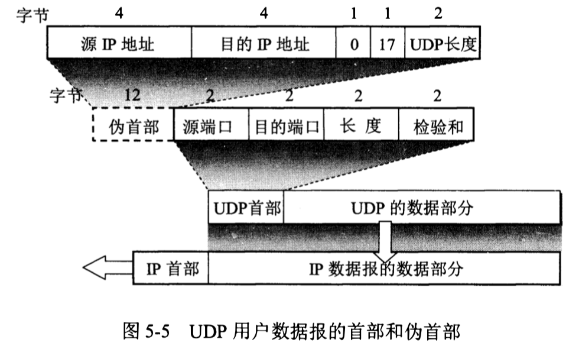
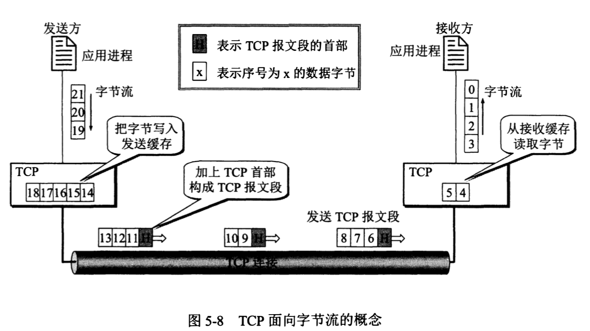
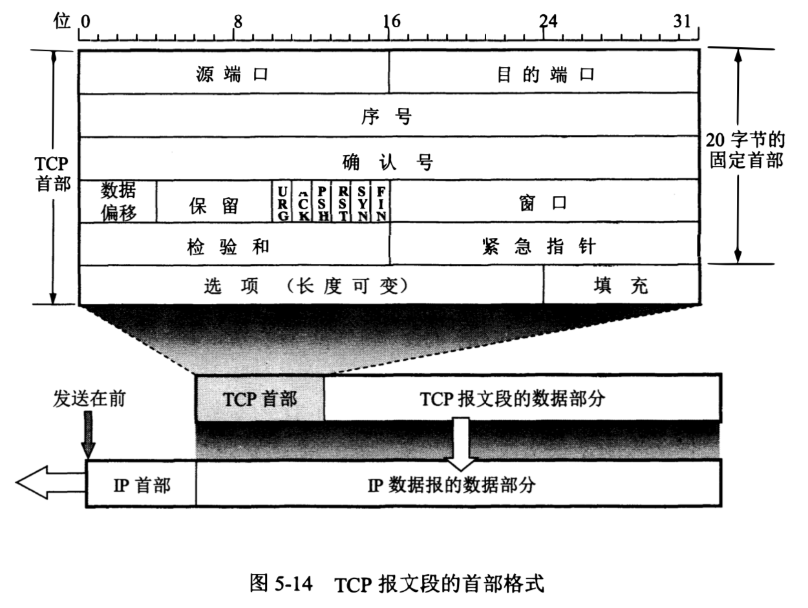
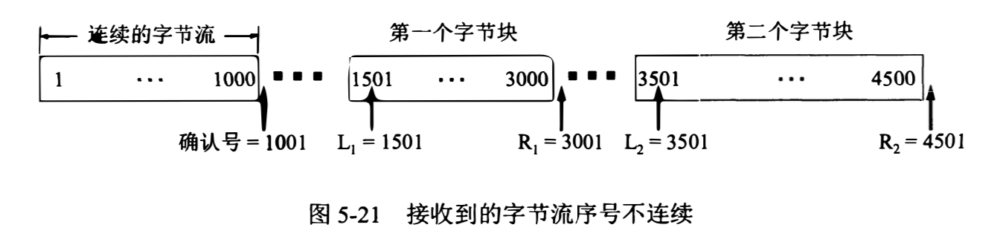

# 运输层

- 运输层通信是应用进程之间的通信（端到端），网络层通信是两台主机之间的通信（点到点）。

- 运输层的复用和分用

  - 复用：发送方不同应用进程之间都可以使用同一个运输层协议传送数据。

  - 分用：接收方的运输层在剥去报文的首部后能够把这些数据正确交付目的应用进程。

## 用户数据报协议 UDP

### UDP 的特点

- 无连接。

- 尽最大努力交付，不保证可靠交付。

- 面向报文。发送方的 UDP 对应用程序交下来（或 IP 层交上来）的报文，在添加（或去除）首部后就向下交付 IP 层（或向上交付给应用进程），既不合并也不拆分。即 UDP 一次交付一个完整的报文。

- 没有拥塞控制。因此 UDP 适合于一些实时通信。但也可能因为网络拥塞发生数据丢失。

- 支持一对一、一对多、多对一和多对多的交互通信。

- 首部开销小，只有 8 个字节，比 TCP 的 20 个字节的首部要短。

### UDP 报文格式

- 源端口号：在需要对方回信时选用，不需要时可用全 0。

- 目的端口号：在终点交付报文时必须使用。

  - 如果接收方 UDP 发现收到的报文中的目的端口号不正确（即不存在对应千该端口号的应用进程），就丢弃该报文，并由网际控制报文协议 ICMP 发送端口不可达差错报文给发送方。 

- 长度：UDP 用户数据报的长度，最小值是 8 (仅有首部)。

- 校验和：检测 UDP 用户数据报在传输中是否有错，有错就丢弃。

  - 在计算检验和时，要在 UDP 用户数据报之前增加 12 个字节的伪首部。伪首部并不是 UDP 用户数据报真正的首部，只是在计算检验和时临时添加在 UDP 用户数据报前面，得到一个临时的 UDP 用户数据报。检验和就是按照这个临时的 UDP 用户数据报来计算的。伪首部既不向下传送也不向上递交，仅仅是为了计算检验和。

  - UDP 的检验和是把首部和数据部分一起都检验。

## 传输控制协议 TCP

### TCP 的特点

- 面向连接。

  - 同一个 IP 地址可以有多个不同的 TCP 连接，而同一个端口号也可以出现在多个不同的 TCP 连接中。

- 只支持点到点通信。

  - TCP 连接的端点是套接字（IP 地址 + 端口号，即套接字 = IP 地址: 端口号），通信两端的套接字唯一确定了每一条 TCP 连接。

- 提供可靠交付的服务。通过 TCP 连接传送的数据，无差错、不丢失、不重复，并且按序到达。

- 提供全双工通信。 

- 面向字节流。

  - TCP 中的流指的是流入到进程或从进程流出的字节序列。面向字节流的含义是，虽然应用程序和 TCP 的交互是一次一个数据块（大小不等），但 TCP 把应用程序交下来的数据仅仅看成是一连串的无结构的字节流，TCP 并不知道所传送的字节流的含义。 

  - TCP 和 UDP 在发送报文时所采用的方式完全不同。TCP 根据通信对方给出的窗口值和当前网络拥塞的程度来决定一个报文段应包含多少个字节，而不理会应用进程发了多长的报文到 TCP 缓存中（UDP 发送的报文长度则是应用进程给出的）。如果应用进程传送到 TCP 缓存的数据块太长，TCP 就可以把它划分短一些再传送。如果应用进程一次只发来一个字节，TCP 也可以等待积累有足够多的字节后再构成报文段发送出去。

### TCP 报文格式

- TCP 报文段首部的前 20 个字节是固定的，后面有 4*n 字节（n 是整数）是根据需要而增加的选项，因此 TCP 首部的最小长度是 20 字节。

- 序号：指的是本报文段所发送数据的第一个字节的序号。占 4 字节，序号范围是 [0, 2^32 - 1]。序号增加到 2^32 - 1 后，下一个序号就又回到 0（即序号使用 mod 2^32 运算）。TCP 是面向字节流的，在一个 TCP 连接中传送的字节流中的每一个字节都按顺序编号，整个要传送的字节流的起始序号必须在连接建立时设置。

- 确认号：占 4 字节，指期望收到对方下一个报文段的第一个数据字节的序号。若确认号等于 N, 则表明到序号 N-1 为止的所有数据都已正确收到。

- 控制位

  - 紧急 URG：当 URG 等于 1 时，表明紧急指针字段有效。它告诉系统此报文段中有紧急数据，于是发送方 TCP 就把紧急数据插入到本报文段数据的最前面，而不是按原来的排队顺序来传送。 

  - 确认 ACK：仅当 ACK 等于 1 时确认号字段才有效，当 ACK 等于 O 时确认号无效。TCP 规定，在连接建立后所有传送的报文段都必须把 ACK 置 1。

  - 推送 PSH：接收方 TCP 收到 PSH 等于 1 的报文段，就尽快地交付给接收应用进程，而不再等到整个缓存都填满了后再向上交付。

  - 复位 RST：当 RST 等于 1 时，表明 TCP 连接中出现严重差错，必须释放连接后再重新建立运输连接。RST 置 1 还用来拒绝一个非法的报文段或拒绝打开一个连接，所以 RST 也叫做重建位或重置位。

  - 同步 SYN：在连接建立时用来同步序号。当 SYN 等于 1 且 ACK 等于 0 时，表明这是一个连接请求报文段。 

  - 终止 FIN：用来释放一个连接。当 FIN 等于 1 时，表明此报文段的发送方的数据已发送完毕，并要求释放运输连接。

- 窗口：占 2 字节。窗口值告诉对方，从本报文段首部中的确认号算起，接收方目前允许发送方发送的数据量（以字节为单位，囿于接收方的数据缓存空间是有限的）。窗口值经常在动态变化着。

- 校验和：占 2 字节。检验的范围包括首部和数据两部分。和 UDP 用户数据报一样，在计算检验和时要在 TCP 报文段的前面加上 12 字节的伪首部（两者的伪首部略有差别）。

- 紧急指针：占 2 字节。紧急指针仅在 URG 等于 1 时才有意义，它指出本报文段中的紧急数据的字节数（也就是紧急数据的末尾在报文段中的位置），窗口为 0 时也可发送紧急数据。

- 选项：长度可变，最长可达 40 字节。当没有使用选项字段时，TCP 的首部长度是 20 字节。

  - 最大报文段长度 MSS：TCP 报文段中数据部分的最大长度。

  - 窗口扩大选项。

  - 时间戳选项。

### 可靠传输的工作原理

#### 停止等待协议

- 每发送完一个分组就停止发送，等待对方的确认，在收到确认后再发送下一个分组。

- 超时重传。发送方只要超过了一段时间（设置一个超时计时器）没有收到确认，就认为刚才发送的分组丢失了，因而重传前面发送过的分组。

  - 发送方在发送完一个分组后，必须暂时保留已发送的分组的副本以便用于超时重传，只有收到相应的确认信号后才能清除分组副本。

  - 分组和确认分组都必须进行编号。这样才能明确是哪一个发送出去的分组收到了确认，哪一个分组还没有收到确认。

  - 超时计时器设置的重传时间应当比数据在分组传输的平均往返时间更长一些。

- 接受方发出的确认丢失、确认迟到时，发送方会超时重传。此时接收方要丢弃这个重复的分组并向发送方再次发送确认信号。

- 停止等待协议中，重传的请求是自动进行的，接收方不需要请求发送方重传某个出错的分组。也叫做自动重传请求 ARQ。

- 使用停止等待协议，当往返时间 RTT 远大于分组发送时间时，信道的利用率就会非常低。信道利用率 = 发送时间 / （发送时间 + RTT + 发送确认分组时间）。

#### 连续 ARQ 协议

- 维持一个窗口，位于窗口内的分组都可以连续发送出去且不需要对方确认。发送方每收到一个确认，就把发送窗口向前滑动一个分组的位置。

- 接收方一般都是采用累积确认的方式。也就是说接收方不必对收到的分组逐个发送确认，而是在收到几个分组后，对按序到达的最后一个分组发送确认，表示到这个分组为止的所有分组都已正确收到了。（发送确认 N，表示前 N-1 个分组已经收到了）

  - 累积确认容易实现，即使确认丢失也不必重传。但不能向发送方反映出接收方已经正确收到的所有分组的信息。

### 可靠传输的实现

#### 滑动窗口

#### 选择超时重传时间

- RTTs：加权平均往返时间 / 平滑往返时间

  - 第一次测量到 RTT 样本时，RTTs 值取为所测量到的 RTT 样本。

  - 以后每测量到一个新的 RTT 样本，**新的 RTTs = (1-a) * 旧的RTTs + a * 新的RTT样本**。按标准 a 取值 0.125。

- RTTd：RTT 偏差的加权平均值。

  - 当第一次测量时，RTTd 值取为测量到的 RTT 样本值的一半。

  - 以后的测量中，**新的 RTTd =（1-b) * 旧的RTTd + b * |RTTs - 新的RTT样本|**。b 取 0.25。

- 超时重传时间 **RTO = RTTs + 4 * RTTd**。

- 因为无法确认确认报文是对原来报文的确认，还是对后来重传报文的确认，而不同的判断影响到了 RTO 的计算值。所以规定报文段每重传一次，就把超时重传时间 RTO 取为旧的重传时间的 2 倍，当不再发生报文段重传时，才根据上面的公式计算超时重传时间。以此使运输层区分开有效的和无效的往返时间样本，从而改进了往返时间的估测。

#### 选择确认 SACK

对没有按序传送到接收方的数据，大多数方法是重传所有未被确认的数据块。但通过选择确认可以只重传缺少的数据，而不再传送已经被接收方接受的数据。

在 TCP 首部的选项中加入允许 SACK 选项，并报告已经接受到的字节块的左右边界。左边界表示字节块的第一个字节的序号，右边界减 1 才是字节块中的最后一个序号（如上图报告的第二个字节块的左右边界分别为 3501 和 4501）。

因为首部选项字段最多只有 40 字节，而使用选择确认的话，需要在选项字段中使用一个字节指明是 SACK 选项，一个字节指明这个选项要占用多少字节。并且一个边界就要用掉 4 字节（因为序号占了 32 位），所以最多只能报告 4 个字节块的边界信息。

