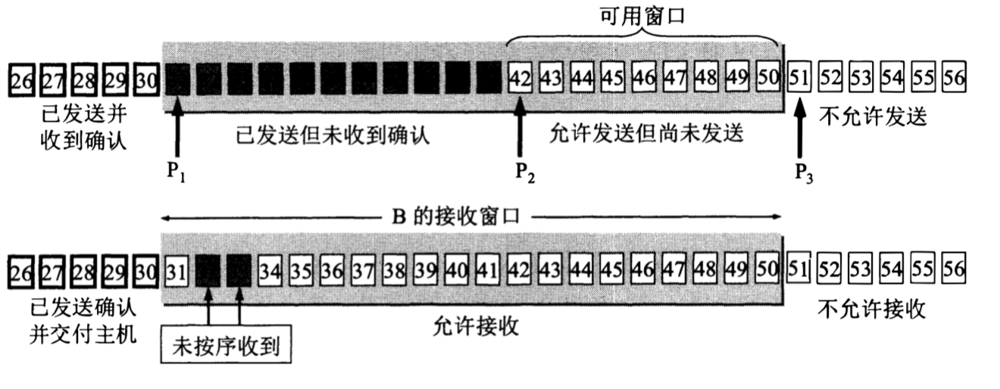
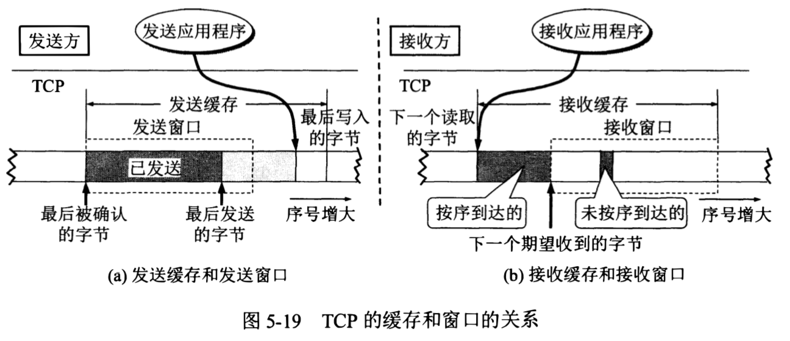
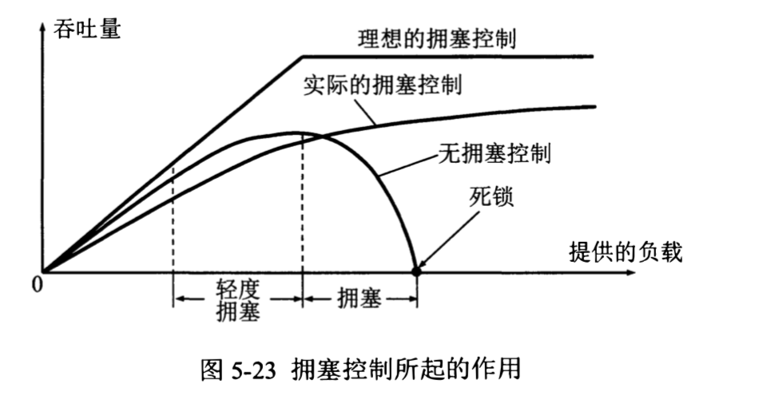
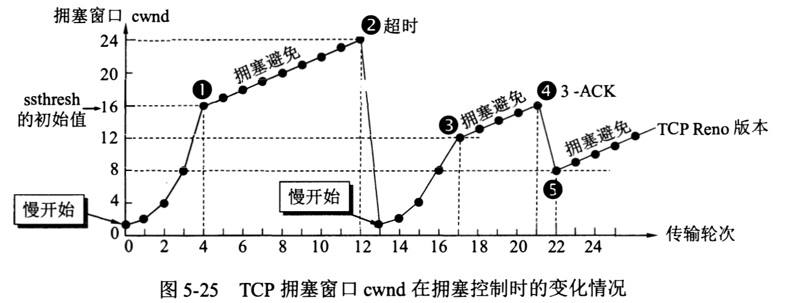
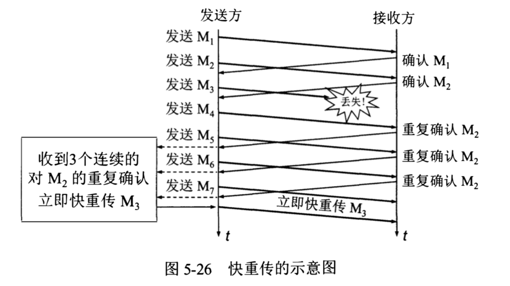
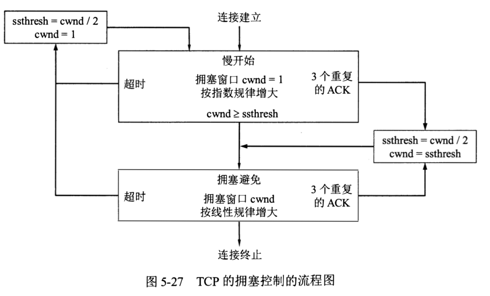
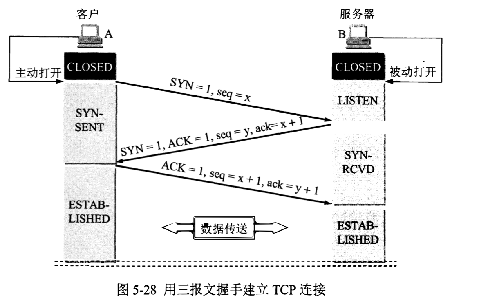
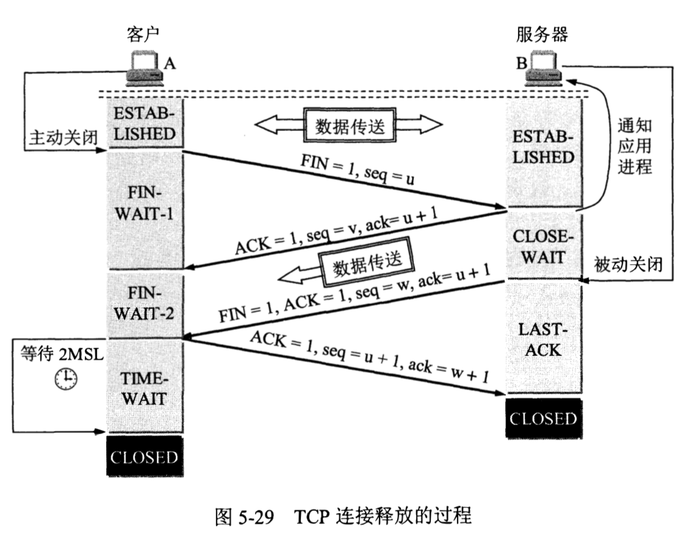

# 运输层

- 运输层通信是应用进程之间的通信（端到端），网络层通信是两台主机之间的通信（点到点）。

- 运输层的复用和分用

  - 复用：发送方不同应用进程之间都可以使用同一个运输层协议传送数据。

  - 分用：接收方的运输层在剥去报文的首部后能够把这些数据正确交付目的应用进程。

## 用户数据报协议 UDP

### UDP 的特点

- 无连接。

- 尽最大努力交付，不保证可靠交付。

- 面向报文。发送方的 UDP 对应用程序交下来（或 IP 层交上来）的报文，在添加（或去除）首部后就向下交付 IP 层（或向上交付给应用进程），既不合并也不拆分。即 UDP 一次交付一个完整的报文。

- 没有拥塞控制。因此 UDP 适合于一些实时通信。但也可能因为网络拥塞发生数据丢失。

- 支持一对一、一对多、多对一和多对多的交互通信。

- 首部开销小，只有 8 个字节，比 TCP 的 20 个字节的首部要短。

### UDP 报文格式

- 源端口号：在需要对方回信时选用，不需要时可用全 0（一个端口号占 16 位）。

- 目的端口号：在终点交付报文时必须使用。

  - 如果接收方 UDP 发现收到的报文中的目的端口号不正确（即不存在对应千该端口号的应用进程），就丢弃该报文，并由网际控制报文协议 ICMP 发送端口不可达差错报文给发送方。 

- 长度：UDP 用户数据报的长度，最小值是 8 (仅有首部)，最大是 65535 字节。

- 校验和：检测 UDP 用户数据报在传输中是否有错，有错就丢弃。

  - 在计算检验和时，要在 UDP 用户数据报之前增加 12 个字节的伪首部。伪首部并不是 UDP 用户数据报真正的首部，只是在计算检验和时临时添加在 UDP 用户数据报前面，得到一个临时的 UDP 用户数据报。检验和就是按照这个临时的 UDP 用户数据报来计算的。伪首部既不向下传送也不向上递交，仅仅是为了计算检验和。

  - UDP 的检验和是把首部和数据部分一起都检验。

## 传输控制协议 TCP

### TCP 的特点

- 面向连接。

  - 同一个 IP 地址可以有多个不同的 TCP 连接，而同一个端口号也可以出现在多个不同的 TCP 连接中。

- 只支持点到点通信。

  - TCP 连接的端点是套接字（IP 地址 + 端口号，即套接字 = IP 地址: 端口号），通信两端的套接字唯一确定了每一条 TCP 连接。

- 提供可靠交付的服务。通过 TCP 连接传送的数据，无差错、不丢失、不重复，并且按序到达。

- 提供全双工通信。 

- 面向字节流。

  - TCP 中的流指的是流入到进程或从进程流出的字节序列。面向字节流的含义是，虽然应用程序和 TCP 的交互是一次一个数据块（大小不等），但 TCP 把应用程序交下来的数据仅仅看成是一连串的无结构的字节流，TCP 并不知道所传送的字节流的含义。 

  - TCP 和 UDP 在发送报文时所采用的方式完全不同。TCP 根据通信对方给出的窗口值和当前网络拥塞的程度来决定一个报文段应包含多少个字节，而不理会应用进程发了多长的报文到 TCP 缓存中（UDP 发送的报文长度则是应用进程给出的）。如果应用进程传送到 TCP 缓存的数据块太长，TCP 就可以把它划分短一些再传送。如果应用进程一次只发来一个字节，TCP 也可以等待积累有足够多的字节后再构成报文段发送出去。

### TCP 报文格式

- TCP 报文段首部的前 20 个字节是固定的，后面有 4*n 字节（n 是整数）是根据需要而增加的选项，因此 TCP 首部的最小长度是 20 字节。

- 序号：指的是本报文段所发送数据的第一个字节的序号。占 4 字节，序号范围是 [0, 2^32 - 1]。序号增加到 2^32 - 1 后，下一个序号就又回到 0（即序号使用 mod 2^32 运算）。TCP 是面向字节流的，在一个 TCP 连接中传送的字节流中的每一个字节都按顺序编号，整个要传送的字节流的起始序号必须在连接建立时设置。

- 确认号：占 4 字节，指期望收到对方下一个报文段的第一个数据字节的序号。若确认号等于 N, 则表明到序号 N-1 为止的所有数据都已正确收到。

- 控制位

  - 紧急 URG：当 URG 等于 1 时，表明紧急指针字段有效。它告诉系统此报文段中有紧急数据，于是发送方 TCP 就把紧急数据插入到本报文段数据的最前面，而不是按原来的排队顺序来传送。 

  - 确认 ACK：仅当 ACK 等于 1 时确认号字段才有效，当 ACK 等于 O 时确认号无效。TCP 规定，在连接建立后所有传送的报文段都必须把 ACK 置 1。

  - 推送 PSH：接收方 TCP 收到 PSH 等于 1 的报文段，就尽快地交付给接收应用进程，而不再等到整个缓存都填满了后再向上交付。

  - 复位 RST：当 RST 等于 1 时，表明 TCP 连接中出现严重差错，必须释放连接后再重新建立运输连接。RST 置 1 还用来拒绝一个非法的报文段或拒绝打开一个连接，所以 RST 也叫做重建位或重置位。

  - 同步 SYN：在连接建立时用来同步序号。当 SYN 等于 1 且 ACK 等于 0 时，表明这是一个连接请求报文段。 

  - 终止 FIN：用来释放一个连接。当 FIN 等于 1 时，表明此报文段的发送方的数据已发送完毕，并要求释放运输连接。

- 窗口：占 2 字节。窗口值告诉对方，从本报文段首部中的确认号算起，接收方目前允许发送方发送的数据量（以字节为单位，囿于接收方的数据缓存空间是有限的）。窗口值经常在动态变化着。

- 校验和：占 2 字节。检验的范围包括首部和数据两部分。和 UDP 用户数据报一样，在计算检验和时要在 TCP 报文段的前面加上 12 字节的伪首部（两者的伪首部略有差别）。

- 紧急指针：占 2 字节。紧急指针仅在 URG 等于 1 时才有意义，它指出本报文段中的紧急数据的字节数（也就是紧急数据的末尾在报文段中的位置），窗口为 0 时也可发送紧急数据。

- 选项：长度可变，最长可达 40 字节。当没有使用选项字段时，TCP 的首部长度是 20 字节。

  - 最大报文段长度 MSS：TCP 报文段中数据部分的最大长度。

  - 窗口扩大选项。

  - 时间戳选项。

### 可靠传输的工作原理

#### 停止等待协议

- 每发送完一个分组就停止发送，等待对方的确认，在收到确认后再发送下一个分组。

- 超时重传。发送方只要超过了一段时间（设置一个超时计时器）没有收到确认，就认为刚才发送的分组丢失了，因而重传前面发送过的分组。

  - 发送方在发送完一个分组后，必须暂时保留已发送的分组的副本以便用于超时重传，只有收到相应的确认信号后才能清除分组副本。

  - 分组和确认分组都必须进行编号。这样才能明确是哪一个发送出去的分组收到了确认，哪一个分组还没有收到确认。

  - 超时计时器设置的重传时间应当比数据在分组传输的平均往返时间更长一些。

- 接受方发出的确认丢失、确认迟到时，发送方会超时重传。此时接收方要丢弃这个重复的分组并向发送方再次发送确认信号。

- 停止等待协议中，重传的请求是自动进行的，接收方不需要请求发送方重传某个出错的分组。也叫做自动重传请求 ARQ。

- 使用停止等待协议，当往返时间 RTT 远大于分组发送时间时，信道的利用率就会非常低。信道利用率 = 发送时间 / （发送时间 + RTT + 发送确认分组时间）。

#### 连续 ARQ 协议

- 维持一个窗口，位于窗口内的分组都可以连续发送出去且不需要对方确认。发送方每收到一个确认，就把发送窗口向前滑动一个分组的位置。

- 接收方一般都是采用累积确认的方式。也就是说接收方不必对收到的分组逐个发送确认，而是在收到几个分组后，对按序到达的最后一个分组发送确认，表示到这个分组为止的所有分组都已正确收到了。（发送确认 N，表示前 N-1 个分组已经收到了）

  - 累积确认容易实现，即使确认丢失也不必重传。但不能向发送方反映出接收方已经正确收到的所有分组的信息。

### 可靠传输的实现

#### 滑动窗口

- 单位是字节，而不是报文段。

- 虽然发送窗口是根据接收方的接收窗口设置的，但发送方还可以根据网络当时的拥塞情况适当减小自己的发送窗口数值。

- TCP 通常对不按序到达的数据是先临时存放在接收窗口中，等到字节流中所缺少的字节收到后，再按序交付上层的应用进程。

- 接收方可以在合适的时候发送确认，也可以在自己有数据要发送时把确认信息顺便捎带上（累计确认，减小传输开销）。但不能长时间推迟发送，不应超过 0.5 秒。

- 发送方的应用进程把字节流写入 TCP 的发送缓存，接收方的应用进程从 TCP 的接收缓存中读取字节流。

- 发送缓存用来暂时存放：

  - 发送应用程序传送给发送方 TCP 准备发送的数据。
  
  - TCP 已发送出但尚未收到确认的数据。

- 接收缓存用来暂时存放：

  - 按序到达的、但尚未被接收应用程序读取的数据。

  - 未按序到达的数据。

#### 选择超时重传时间

- RTTs：加权平均往返时间 / 平滑往返时间

  - 第一次测量到 RTT 样本时，RTTs 值取为所测量到的 RTT 样本。

  - 以后每测量到一个新的 RTT 样本，**新的 RTTs = (1-a) * 旧的RTTs + a * 新的RTT样本**。按标准 a 取值 0.125。

- RTTd：RTT 偏差的加权平均值。

  - 当第一次测量时，RTTd 值取为测量到的 RTT 样本值的一半。

  - 以后的测量中，**新的 RTTd =（1-b) * 旧的RTTd + b * |RTTs - 新的RTT样本|**。b 取 0.25。

- 超时重传时间 **RTO = RTTs + 4 * RTTd**。

- 因为无法确认确认报文是对原来报文的确认，还是对后来重传报文的确认，而不同的判断影响到了 RTO 的计算值。所以规定报文段每重传一次，就把超时重传时间 RTO 取为旧的重传时间的 2 倍，当不再发生报文段重传时，才根据上面的公式计算超时重传时间。以此使运输层区分开有效的和无效的往返时间样本，从而改进了往返时间的估测。

#### 选择确认 SACK

对没有按序传送到接收方的数据，大多数方法是重传所有未被确认的数据块。但通过选择确认可以只重传缺少的数据，而不再传送已经被接收方接受的数据。

在 TCP 首部的选项中加入允许 SACK 选项，并报告已经接受到的字节块的左右边界。左边界表示字节块的第一个字节的序号，右边界减 1 才是字节块中的最后一个序号（如上图报告的第二个字节块的左右边界分别为 3501 和 4501）。

因为首部选项字段最多只有 40 字节，而使用选择确认的话，需要在选项字段中使用一个字节指明是 SACK 选项，一个字节指明这个选项要占用多少字节。并且一个边界就要用掉 4 字节（因为序号占了 32 位），所以最多只能报告 4 个字节块的边界信息。

### 流量控制

- 流量控制：抑制发送端发送数据的速率，以便接收端来得及接受。

- 由接收方告诉发送方自己的接受窗口大小，发送方的发送窗口不能大于接收方接收窗口。

- 如果 TCP 连接的一方收到对方的零窗口通知，就启动持续计时器。持续计时器设置的时间到期后，就发送一个零窗口探测报文段（仅携带 1 字节的数据）。而对方就在确认这个探测报文段时给出了现在的窗口值。如果窗口仍然是零，那么收到这个报文段的一方就重新设置持续计时器。通过持续计时器可以打破进入零窗口后发送非零窗口的通知一直丢包的僵局。

- 应用进程把数据传送到 TCP 的发送缓存后，剩下的发送任务就由 TCP 来控制了。何时发送报文段由 TCP 使用的机制决定：

  - MSS：最大报文段长度。只要缓存中存放的数据达到 MSS 字节时，就组装成一个 TCP 报文段发送出去。

  - 发送方的应用进程指明要求发送报文段，对应 TCP 首部中的推送 PSH。

  - 发送方的一个计时器期限到了。

- 接收方接受到数据后，等待一段时间或者让接受缓存有一半的空闲空间后，再发出确认报文并向发送方通知当前的窗口大小。同样发送方也不要发送太小的报文段，而是把数据积累成足够大的报文段，或达到接收方缓存的空间的一半大小时再发送。这样可以使得发送方不发送很小的报文段，接收方也不要在缓存刚刚有了一点小的空间就急忙把这个很小的窗口大小信息通知给发送方，以此避免使网络的效率变低。

### 拥塞控制

- 拥塞：在某段时间，若对网络中某一资源的需求超过了该资源所能提供的可用部分，网络的性能就会变坏。

- 拥塞控制：防止过多的数据注入到网络中，这样可以使网络中的路由器或链路不致过载。拥塞控制是一个全局性的过程，涉及到所有的主机、所有的路由器以及与降低网络传输性能有关的所有因素。

- 网络拥塞的实质往往是整个系统各个部分不匹配。只有所有的部分都平衡了，问题才会得到解决。如果只是单单提高某一部分的话可能会加重网络负担。比如只增加接收缓存的容量，可能会造成因链路速度和处理机速度跟不上，导致接收到的数据一致堆砌在接受缓存里造成它们超时重发。

**拥塞控制的方法：**

- 拥塞窗口 cwnd：发送方维持一个叫做拥塞窗口的状态变量。拥塞窗口的大小取决于网络的拥塞程度，并且动态地在变化。发送方让自己的发送窗口等于拥塞窗口。只要网络没有出现拥塞，拥塞窗口就可以再增大一些以便把更多的分组发送出去，这样就可以提高网络的利用率。但只要网络出现拥塞或有可能出现拥塞，就必须把拥塞窗口减小一些，以减少注入到网络中的分组数，以便缓解网络出现的拥塞。

- 判断网络拥塞的依据就是出现了超时。

#### 1.慢开始

- 由小到大逐渐增大拥塞窗口数值。在刚刚开始发送报文段时，先把初始拥塞窗口设置为 1 至 2 个发送方的最大报文段 SMSS。在每收到一个对新的报文段的确认后，可以把拥塞窗口增加最多一个 SMSS 的数值。**拥塞窗口每次的增加量 = Math.min(刚被确认接受的字节数, SMSS)**。（为了方便，下面使用报文段的个数作为窗口大小的单位）

- 每经过一个传输轮次（把拥塞窗口所允许发送的报文段都连续发送出去，并收到了对已发送的最后一个字节的确认），拥塞窗口就加倍。并且发送方只要收到一个对新报文段的确认，其拥塞窗口就立即加 1 并可以马上发送新的报文段，而不需要等这个轮次中所有的确认都收到后再发送新的报文段。

- 慢开始门限 ssthresh：

  - 当 cwnd < ssthresh 时，使用慢开始算法。
  - 当 cwnd > ssthresh 时，停止使用慢开始算法而改用拥塞避免算法。
  - 当 cwnd = ssthersh 时，既可使用慢开始算法，也可使用拥塞避免算法。

#### 2.拥塞避免

- 让拥塞窗口缓慢地增大，即每经过一个往返时间 RTT 就把发送方的拥塞窗口加 1，而不是像慢开始阶段那样加倍增长。

- 拥塞避免并非完全能够避免了拥塞。拥塞避免只是把拥塞窗口控制为按线性规律增长，使网络比较不容易出现拥塞。

- 当拥塞窗口等于 24 时网络出现了超时，发送方判断为网络拥塞。于是调整门限值为当前拥塞窗口的一半即 12，同时设置拥塞窗口为 1，再次进入慢开始阶段。

#### 3.快重传

- 要求接收方不要等待自已发送数据时才进行捎带确认，而是要立即发送确认，即使收到了失序的报文段也要立即发出对已收到的报文段的重复确认。通过快重传可以让发送方尽早知道发生了个别报文段的丢失。

- 如下图，因为发送方发送的 M3 丢失，通过快重传可以使接收方在接收到后续的 M4、M5、M6 时立即发送对 M2 的重复确认。而快重传算法规定发送方只要一连收到 3 个重复确认（对应上图的点 ④），就知道接收方没有收到报文段 M3，因而应当立即进行重传 M3，这样就不会出现超时，发送方也就不会误认为出现了网络拥塞。

#### 4.快恢复

当发送方连续收到 3 个重复确认，就知道了是有报文段丢失了而不是发生了网络拥塞，所以此时不启动慢开始而是执行快恢复算法。这时发送方调整门限值等于当前拥塞窗口的一半即 8，并同时设置拥塞窗口等于门限值后，开始执行拥塞避免算法（对应上图的点 ⑤）。

#### 整体的拥塞控制流程图

- 发送方发送窗口的上限值 = Math.min(拥塞窗口, 接收方接收窗口)。

### 主动队列管理 AQM

- 路由器对某些分组的处理时间特别长，导致发送方超时重传，并误以为是发生了网络拥塞。

- 尾部丢弃策略：路由器的队列通常都是按照先进先出的规则处理到来的分组。由于队列长度总是有限的，因此当队列已满时，以后再到达的所有分组将都被丢弃。

- 路由器的尾部丢弃往往会导致一连串分组的丢失，导致发送方出现超时重传并使 TCP 进入拥塞控制的慢开始状态。更为严重的是，在网络中通常有很多的 TCP 连接（它们有不同的源点和终点），这些连接中的报文段通常是复用在网络层的 IP 数据报中传送。在这种情况下，若发生了路由器中的尾部丢弃，就可能会同时影响到很多条 TCP 连接，结果使这许多 TCP 连接在同一时间突然都进入到慢开始状态，这被称为全局同步。

- 为了避免发生网络中的全局同步现象，就需要使用主动队列管理 AQM。即不要等到路由器的队列长度已经达到最大值时才不得不丢弃后面到达的分组，而是应当在队列长度达到某个值得警惕的数值时（即当网络拥塞有了某些拥塞征兆时）就主动丢弃到达的分组。这样就提醒了发送方放慢发送的速率，因而有可能使网络拥塞的程度减轻，甚至不出现网络拥塞。 

- 随机早期检测 RED：使路由器维持两个参数，队列长度最小门限和最大门限。当每一个分组到达时，RED 就按照规定的算法先计算当前的平均队列长度：(1) 若平均队列长度小于最小门限，则把新到达的分组放入队列进行排队。(2) 若平均队列长度超过最大门限，则把新到达的分组丢弃。(3) 若平均队列长度在最小门限和最大门限之间，则按照某一丢弃概率 p 把新到达的分组丢弃。通过 RED 可以让拥塞控制只在个别的 TCP 连接上进行，因而避免发生全局性的拥塞控制。

### 三次握手

- 在 TCP 连接建立过程中要解决的问题：

  - 要使每一方能够确知对方的存在。
  - 要允许双方协商一些参数（如最大窗口值、是否使用窗口扩大选项和时间戳选项以及服务质量等）。
  - 能够对运输实体资源（如缓存大小、连接表中的项目等）进行分配。

- 序号位 seq 等于前面已传送过的数据的最后一个字节的序号加 1。

- 只有 ACK 位置为 1 了，ack 确认号才有意义，ack 的值是上一个 seq 的值加 1。

- 第三次握手时可以把 HTTP 请求报文做为报文数据发送给服务器。

- 半连接状态：指第二次握手后，服务器在等待客户端发送确认。此时可能会发生 SYN 攻击（DDOS 攻击），即攻击者伪造了大量的 IP 地址向服务器发送建立连接的请求，服务器向它们发送确认包等待确认。但因为这些请求时伪造的所以服务器一直等不到确认于是重发确认请求，导致浪费了服务器大量的资源。针对这种情况，可以设置最大的超时时间、设置最大的接收建立连接次数、设置最大的确认请求重传次数等。

- **是否可以四次握手**：第二次握手，服务器向客户端发送的报文段也可拆成两个报文段分次发送。可以先发送一个确认报文段（ACK = 1, ack = x+1），然后再发送一个同步报文段（SYN = 1, seq = y）。这样就变成了四次握手，但效果跟三次握手是一样的。

- **客户端为什么最后要发送一次确认**：

  - 防止已失效的连接请求报文段突然又传送到了服务器，因而产生错误。

    - 解释：假如客户端发送了一个连接请求报文，但因为网络问题一直滞留在网络中。后来客户端又发送了一个连接请求报文并成功和服务器建立了连接，之后双方开始传送数据并在完成后关闭了连接。如果此时第一个连接请求报文到达了服务器（但该连接请求已经失效了），服务器会误以为是客户端又发出了一次新的连接请求，于是就向客户端发送确认连接报文。假定客户端最后不再发送一次确认的话，此时新的连接就会被直接建立了。

  - 确认双方都能够正常收发数据。

    - 解释：第一次握手后，Server 只能确认 Server 接受功能正常和 Client 发送功能正常。第二次握手后，Client 可以确认 Client 和 Server 的收发功能都正常，但这时候 Server 还不知道 Server 的发送功能和 Client 的接受功能是否正常，所以需要第三次握手来确认。

### 四次挥手

- 半关闭状态：第二次挥手后，只是关闭客户端 -> 服务器这个方向的通信而已，服务器仍然可以向客户端发送数据。若服务器已经没有要向客户端发送的数据时，其应用进程再通知 TCP 释放连接。

- 第二次挥手和第三次挥手都需要发送 ack = u+1 的确认。如果服务端不再发送数据的话，可以合并两者直接发送 FIN + ACK 报文段。否则的话第二次挥手必须发送 ack = u+1 确认，不然客户端会以为刚才发送的 FIN 报文丢失了而超时重传。

- 四次挥手后，TCP 连接 还没有释放掉。必须经过时间等待计时器设置的时间 2 * MSL 后，客户端才进入到 CLOSED 状态。MSL 叫做最长报文段寿命。原因：

  - 为了保证客户端发送的最后一个 ACK 报文段能够到达服务端，使服务端也进入 CLOSED 状态。
  
    - 解释：因为这个 ACK 报文段有可能丢失，服务器收不到该确认的话就会超时重传 FNI + ACK 报文段，而客户端就能在 2 * MSL 时间内收到这个重传的 FNI + ACK 报文段。接着客户端会重传一次确认，并启动 2 * MSL 计时器。如果客户端在发送完 ACK 报文段后就立即释放连接的话，那么就无法收到服务器重传的 FIN + ACK 报文段了。

  - 防止已失效的连接断开报文段出现在本连接中。
  
    - 解释：客户端在发送完最后一个 ACK 报文段后再经过时间 2 * MSL 时间就可以使本连接持续时间内所产生的所有报文段都从网络中消失，可以保证下一个新的连接中不会出现旧的连接断开报文段。

- 保活计时器

  - 作用：防止和服务器建立连接后的客户端突然出故障，导致服务器一直在等待客户端。

  - 方法：服务器每收到一次客户的数据就重新设置保活计时器（通常是两小时）。若在这个时间内没有收到客户端发送的数据，服务器就发送一个探测报文段，以后则每隔 75 秒钟发送一次。若一连发送 10 个探测报文段后仍无客户端的响应，服务器就认为客户端出了故障并关闭这个连接。

### 收录

> [面试官，不要再问我三次握手和四次挥手](https://zhuanlan.zhihu.com/p/86426969)
